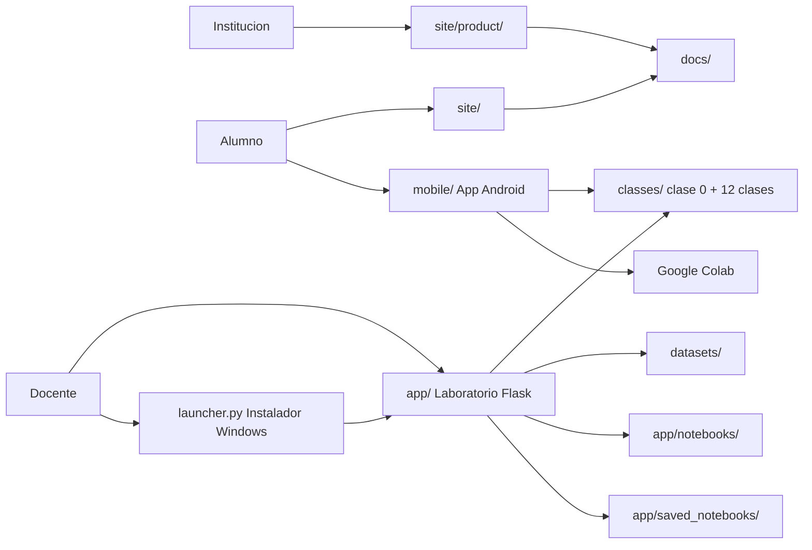

# 🧭 Python Data Science Bootcamp

[](https://github.com/vladimiracunadev-create/python-data-science-bootcamp/actions/workflows/ci.yml)
[](https://github.com/vladimiracunadev-create/python-data-science-bootcamp/actions/workflows/security.yml)


Base de capacitación técnica para Python y Data Science orientada a clases reales, laboratorios guiados y despliegue progresivo en contexto educativo.

No es solo un repo de materiales. Reúne curriculum modular, laboratorio interactivo local, portal del alumno, presentación institucional y una familia documental que separa producto, operación, seguridad y audiencias.

---

## 🧭 Estado actual del producto

> Estado: base operativa  
> Superficies públicas: portal del alumno + vista institucional  
> Superficie local: laboratorio Flask con runner y notebooks  
> Postura de despliegue: local-first, no internet abierta sin capas adicionales

## ✨ Qué resuelve hoy este repositorio

- una ruta concreta para enseñar Python y Data Science con progresión real;
- un entorno local de clase para visualizar materiales, cargar notebooks y ejecutar código;
- una superficie pública para alumnos y otra para stakeholders;
- una base reusable para entrevistas, propuestas y futuras cohortes;
- una postura documental más cercana a producto que a inventario de archivos.

---

## 👥 Rutas recomendadas según perfil

| Perfil | Documento de entrada | Qué mirar primero |
|---|---|---|
| Institución / evaluador | [docs/GUIA_EVALUACION.md](docs/GUIA_EVALUACION.md) | valor, evidencia y límites reales |
| Stakeholder técnico | [docs/ARQUITECTURA_PRODUCTO.md](docs/ARQUITECTURA_PRODUCTO.md) | capas, flujos y fronteras |
| Producto / maintainer | [docs/CATALOGO_PRODUCTO.md](docs/CATALOGO_PRODUCTO.md) | superficies, artefactos y reglas de comunicación |
| Docente | [docs/herramientas-pedagogicas-de-aula.md](docs/herramientas-pedagogicas-de-aula.md) | mediación, problemas de aula y ritmo |
| Alumno | [docs/student-guide.md](docs/student-guide.md) | uso del curso y expectativas |
| Operación | [RUNBOOK.md](RUNBOOK.md) | arranque, smoke checks y apagado |
| Seguridad | [SECURITY.md](SECURITY.md) | postura actual y riesgos aceptados |

Si no sabes por donde entrar, usa [docs/INDEX.md](docs/INDEX.md).

---

## ⏱ Cómo leer este repo según tiempo disponible

| Tiempo | Secuencia recomendada | Resultado esperado |
|---|---|---|
| 5 minutos | `README` -> `docs/GUIA_EVALUACION.md` | entender que producto es, que demuestra y que no promete |
| 15 minutos | `README` -> `docs/CATALOGO_PRODUCTO.md` -> `docs/ARQUITECTURA_PRODUCTO.md` | ver superficies, arquitectura y criterio de operación |
| 30 minutos | secuencia anterior + `docs/implementación-v1-skillnest-san-nicolas.md` + `docs/despliegue-seguro-y-operacion.md` | entender como aterriza en colegio, con límites y growth path |

Eso evita leer la carpeta `docs/` como una colección plana. La documentación esta pensada como sistema y no como inventario.

---

## 🧱 Superficies del producto

| Superficie | Rol | Estado |
|---|---|---|
| Laboratorio interactivo (`app/`) | entorno local de clase, notebooks y runner | operativo |
| Portal del alumno (`site/`) | punto de entrada oficial para estudiantes | operativo |
| Vista institucional (`site/product/`) | presentación visual del producto | operativa |
| Curriculum modular (`classes/`) | base pedagógica reusable — clase 0 diagnóstica + 12 clases troncales con notebooks documentados | operativo |
| Instalador Windows (`launcher.py` + `bootcamp.spec` + `installer/`) | empaqueta el laboratorio como .exe instalable sin Python | listo para build |
| App Android (`mobile/`) | app Expo/React Native con contenido embebido + integración Colab | listo para build |
| PDFs (`docs/pdfs/`) | apoyo para reunión, evaluación e impresion | operativo |

La fuente de verdad para esta taxonomia vive en [docs/CATALOGO_PRODUCTO.md](docs/CATALOGO_PRODUCTO.md).

---

## 🏗 Arquitectura en una mirada



La arquitectura completa, con flujos y fronteras, esta en [docs/ARQUITECTURA_PRODUCTO.md](docs/ARQUITECTURA_PRODUCTO.md).

---

## 🚀 Capacidades actuales

### 📚 Curriculum y pedagogia

- clase 0 diagnóstica + 12 clases modulares;
- ejercicios, tareas, notebooks y soluciones;
- datasets sinteticos para práctica;
- guías de instructor, metodología y evaluación;
- ruta inicial acotada para contexto escolar.

### 💻 Laboratorio interactivo

- app Flask con visualización de clases;
- carga de notebooks base;
- ejecución de código Python en navegador;
- guardado de notebooks de práctica;
- endpoints `GET /health` y `GET /ready`.

### 🖼 Presentación y evaluación

- landing pública para alumnos en GitHub Pages;
- vista institucional HTML separada del portal del alumno;
- PDFs listos para preparación personal y muestra del producto;
- guía de evaluación rápida para entrevista o revision externa.

---

## ⚡ Inicio rápido

### Opción A - entorno virtual

```bash
python -m venv .venv
.venv\Scripts\activate
pip install -r requirements.txt
python run_bootcamp.py
```

Abrir `http://127.0.0.1:8000`.

### Opción B - Docker local

```bash
docker compose up --build
```

### Opción C - compose más endurecido

```bash
docker compose -f docker-compose.prod.yml up -d --build
```

---

## 🔁 Validación y CI/CD

```bash
pytest
pip install ruff
ruff check .
```

Workflows visibles:

- [`.github/workflows/ci.yml`](.github/workflows/ci.yml)
- [`.github/workflows/security.yml`](.github/workflows/security.yml)
- [`.github/workflows/deploy-pages.yml`](.github/workflows/deploy-pages.yml)

Eso cubre:

- lint;
- tests;
- build de contenedor;
- auditoria básica de dependencias;
- escaneo estatico de seguridad;
- despliegue del portal del alumno a GitHub Pages.

---

## 🔐 Seguridad y límites

Protecciones actuales:

- validación de entradas;
- límites de payload y longitud de código;
- timeout por ejecución;
- eviction de sesiones antiguas;
- headers HTTP de seguridad;
- defaults locales por `127.0.0.1`;
- compose enlazado a localhost;
- documentación explicita de riesgos aceptados.

Límites actuales:

- no hay autenticacion integrada;
- no hay sandbox fuerte para código no confiable;
- no hay rate limiting de red;
- no hay TLS nativo;
- el runner sigue siendo una superficie local de aula.

Ver detalle en [SECURITY.md](SECURITY.md).

---

## 🗺 Mapa documental

| Documento | Rol |
|---|---|
| [docs/INDEX.md](docs/INDEX.md) | indice completo por audiencia y objetivo |
| [docs/CATALOGO_PRODUCTO.md](docs/CATALOGO_PRODUCTO.md) | fuente de verdad de superficies y artefactos |
| [docs/ARQUITECTURA_PRODUCTO.md](docs/ARQUITECTURA_PRODUCTO.md) | arquitectura funcional con diagramas |
| [docs/GUIA_EVALUACION.md](docs/GUIA_EVALUACION.md) | ruta ejecutiva de 10 minutos |
| [docs/metodología-docente.md](docs/metodologia-docente.md) | marco pedagógico del producto |
| [docs/instructor-guide.md](docs/instructor-guide.md) | playbook de ejecución docente |
| [docs/student-guide.md](docs/student-guide.md) | guía de onboarding del alumno |
| [docs/plan-evaluación.md](docs/plan-evaluacion.md) | criterios de evaluación y retroalimentación |
| [docs/portal-estudiante-y-app-móvil.md](docs/portal-estudiante-y-app-movil.md) | portal público, laboratorio y evolución móvil |
| [docs/despliegue-seguro-y-operación.md](docs/despliegue-seguro-y-operacion.md) | postura técnica y CI/CD |
| [RUNBOOK.md](RUNBOOK.md) | operación diaria |
| [SECURITY.md](SECURITY.md) | postura de seguridad y hardening |

> La documentación de preparación para entrevista y las notas internas del maintainer viven en `docs/entrevista/` y `docs/maintainer/` respectivamente. Ver [docs/INDEX.md](docs/INDEX.md) para el mapa completo.

---

## ✅ Lo que este repo si es

- una base seria de capacitación técnica;
- un sistema que integra contenido, práctica y presentación;
- una muestra de criterio pedagógico y operacional;
- una propuesta que puede empezar acotada y crecer sin rehacerse.

## 🚫 Lo que este repo no vende

- una plataforma multiusuario endurecida para internet abierta;
- una app móvil ya operativa;
- una promesa de personalización infinita antes de cerrar condiciones;
- una profundidad total en todas las direcciones desde la primera versión escolar.

---

## 💡 Idea fuerza

El valor de este proyecto no depende de competir contra una tecnología puntual. Su valor esta en traducir herramientas a aprendizaje real, con secuencia pedagógica, criterio docente, operación responsable y una base documental que permite evaluarlo como producto.
