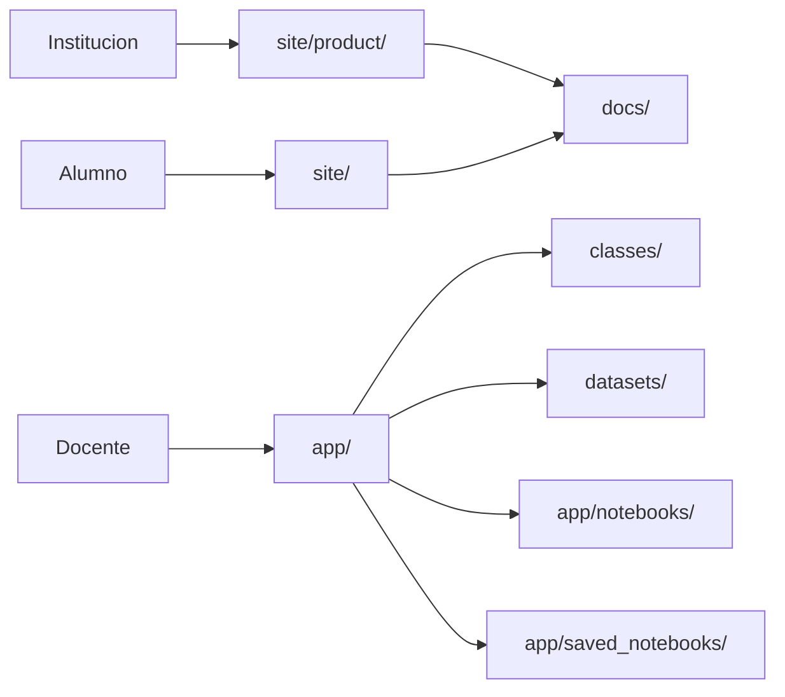

# Python Data Science Bootcamp

[](https://github.com/vladimiracunadev-create/python-data-science-bootcamp/actions/workflows/ci.yml)
[](https://github.com/vladimiracunadev-create/python-data-science-bootcamp/actions/workflows/security.yml)


Base de capacitacion tecnica para Python y Data Science orientada a clases reales, laboratorios guiados y despliegue progresivo en contexto educativo.

No es solo un repo de materiales. Reune curriculum modular, laboratorio interactivo local, portal del alumno, presentacion institucional y una familia documental que separa producto, operacion, seguridad y audiencias.

---

## Estado actual del producto

> Estado: base operativa  
> Superficies publicas: portal del alumno + vista institucional  
> Superficie local: laboratorio Flask con runner y notebooks  
> Postura de despliegue: local-first, no internet abierta sin capas adicionales

## Que resuelve hoy este repositorio

- una ruta concreta para ensenar Python y Data Science con progresion real;
- un entorno local de clase para visualizar materiales, cargar notebooks y ejecutar codigo;
- una superficie publica para alumnos y otra para stakeholders;
- una base reusable para entrevistas, propuestas y futuras cohortes;
- una postura documental mas cercana a producto que a inventario de archivos.

---

## Rutas recomendadas segun perfil

| Perfil | Documento de entrada | Que mirar primero |
|---|---|---|
| Institucion / evaluador | [docs/GUIA_EVALUACION.md](docs/GUIA_EVALUACION.md) | valor, evidencia y limites reales |
| Stakeholder tecnico | [docs/ARQUITECTURA_PRODUCTO.md](docs/ARQUITECTURA_PRODUCTO.md) | capas, flujos y fronteras |
| Producto / maintainer | [docs/CATALOGO_PRODUCTO.md](docs/CATALOGO_PRODUCTO.md) | superficies, artefactos y reglas de comunicacion |
| Docente | [docs/herramientas-pedagogicas-de-aula.md](docs/herramientas-pedagogicas-de-aula.md) | mediacion, problemas de aula y ritmo |
| Alumno | [docs/student-guide.md](docs/student-guide.md) | uso del curso y expectativas |
| Operacion | [RUNBOOK.md](RUNBOOK.md) | arranque, smoke checks y apagado |
| Seguridad | [SECURITY.md](SECURITY.md) | postura actual y riesgos aceptados |

Si no sabes por donde entrar, usa [docs/INDEX.md](docs/INDEX.md).

---

## Como leer este repo segun tiempo disponible

| Tiempo | Secuencia recomendada | Resultado esperado |
|---|---|---|
| 5 minutos | `README` -> `docs/GUIA_EVALUACION.md` | entender que producto es, que demuestra y que no promete |
| 15 minutos | `README` -> `docs/CATALOGO_PRODUCTO.md` -> `docs/ARQUITECTURA_PRODUCTO.md` | ver superficies, arquitectura y criterio de operacion |
| 30 minutos | secuencia anterior + `docs/implementacion-v1-skillnest-san-nicolas.md` + `docs/despliegue-seguro-y-operacion.md` | entender como aterriza en colegio, con limites y growth path |

Eso evita leer la carpeta `docs/` como una coleccion plana. La documentacion esta pensada como sistema y no como inventario.

---

## Superficies del producto

| Superficie | Rol | Estado |
|---|---|---|
| Laboratorio interactivo (`app/`) | entorno local de clase, notebooks y runner | operativo |
| Portal del alumno (`site/`) | punto de entrada oficial para estudiantes | operativo |
| Vista institucional (`site/product/`) | presentacion visual del producto | operativa |
| Curriculum modular (`classes/`) | base pedagogica reusable | operativo |
| PDFs (`docs/pdfs/`) | apoyo para reunion, evaluacion e impresion | operativo |
| Ruta movil | evolucion futura | planificada |

La fuente de verdad para esta taxonomia vive en [docs/CATALOGO_PRODUCTO.md](docs/CATALOGO_PRODUCTO.md).

---

## Arquitectura en una mirada



La arquitectura completa, con flujos y fronteras, esta en [docs/ARQUITECTURA_PRODUCTO.md](docs/ARQUITECTURA_PRODUCTO.md).

---

## Capacidades actuales

### Curriculum y pedagogia

- 12 clases modulares;
- ejercicios, tareas, notebooks y soluciones;
- datasets sinteticos para practica;
- guias de instructor, metodologia y evaluacion;
- ruta inicial acotada para contexto escolar.

### Laboratorio interactivo

- app Flask con visualizacion de clases;
- carga de notebooks base;
- ejecucion de codigo Python en navegador;
- guardado de notebooks de practica;
- endpoints `GET /health` y `GET /ready`.

### Presentacion y evaluacion

- landing publica para alumnos en GitHub Pages;
- vista institucional HTML separada del portal del alumno;
- PDFs listos para preparacion personal y muestra del producto;
- guia de evaluacion rapida para entrevista o revision externa.

---

## Inicio rapido

### Opcion A - entorno virtual

```bash
python -m venv .venv
.venv\Scripts\activate
pip install -r requirements.txt
python run_bootcamp.py
```

Abrir `http://127.0.0.1:8000`.

### Opcion B - Docker local

```bash
docker compose up --build
```

### Opcion C - compose mas endurecido

```bash
docker compose -f docker-compose.prod.yml up -d --build
```

---

## Validacion y CI/CD

```bash
pytest
pip install ruff
ruff check .
```

Workflows visibles:

- [`.github/workflows/ci.yml`](.github/workflows/ci.yml)
- [`.github/workflows/security.yml`](.github/workflows/security.yml)
- [`.github/workflows/deploy-pages.yml`](.github/workflows/deploy-pages.yml)

Eso cubre:

- lint;
- tests;
- build de contenedor;
- auditoria basica de dependencias;
- escaneo estatico de seguridad;
- despliegue del portal del alumno a GitHub Pages.

---

## Seguridad y limites

Protecciones actuales:

- validacion de entradas;
- limites de payload y longitud de codigo;
- timeout por ejecucion;
- eviction de sesiones antiguas;
- headers HTTP de seguridad;
- defaults locales por `127.0.0.1`;
- compose enlazado a localhost;
- documentacion explicita de riesgos aceptados.

Limites actuales:

- no hay autenticacion integrada;
- no hay sandbox fuerte para codigo no confiable;
- no hay rate limiting de red;
- no hay TLS nativo;
- el runner sigue siendo una superficie local de aula.

Ver detalle en [SECURITY.md](SECURITY.md).

---

## Mapa documental

| Documento | Rol |
|---|---|
| [docs/INDEX.md](docs/INDEX.md) | indice principal por audiencia |
| [docs/CATALOGO_PRODUCTO.md](docs/CATALOGO_PRODUCTO.md) | fuente de verdad de superficies y artefactos |
| [docs/ARQUITECTURA_PRODUCTO.md](docs/ARQUITECTURA_PRODUCTO.md) | arquitectura funcional y documental |
| [docs/GUIA_EVALUACION.md](docs/GUIA_EVALUACION.md) | ruta ejecutiva de 10 minutos |
| [docs/metodologia-docente.md](docs/metodologia-docente.md) | marco pedagogico del producto |
| [docs/instructor-guide.md](docs/instructor-guide.md) | playbook de ejecucion docente |
| [docs/student-guide.md](docs/student-guide.md) | guia de onboarding del alumno |
| [docs/plan-evaluacion.md](docs/plan-evaluacion.md) | criterio de evaluacion y retroalimentacion |
| [docs/portal-estudiante-y-app-movil.md](docs/portal-estudiante-y-app-movil.md) | separacion entre portal publico, laboratorio y ruta movil |
| [docs/despliegue-seguro-y-operacion.md](docs/despliegue-seguro-y-operacion.md) | postura tecnica y CI/CD del repo |
| [RUNBOOK.md](RUNBOOK.md) | operacion diaria |
| [SECURITY.md](SECURITY.md) | postura y hardening |
| [docs/portfolio-high-standard.md](docs/portfolio-high-standard.md) | patron de estandar alto del portafolio |
| [docs/estandar-alto-gap-bootcamp.md](docs/estandar-alto-gap-bootcamp.md) | brecha puntual de este repo |

---

## Lo que este repo si es

- una base seria de capacitacion tecnica;
- un sistema que integra contenido, practica y presentacion;
- una muestra de criterio pedagogico y operacional;
- una propuesta que puede empezar acotada y crecer sin rehacerse.

## Lo que este repo no vende

- una plataforma multiusuario endurecida para internet abierta;
- una app movil ya operativa;
- una promesa de personalizacion infinita antes de cerrar condiciones;
- una profundidad total en todas las direcciones desde la primera version escolar.

---

## Idea fuerza

El valor de este proyecto no depende de competir contra una tecnologia puntual. Su valor esta en traducir herramientas a aprendizaje real, con secuencia pedagogica, criterio docente, operacion responsable y una base documental que permite evaluarlo como producto.
