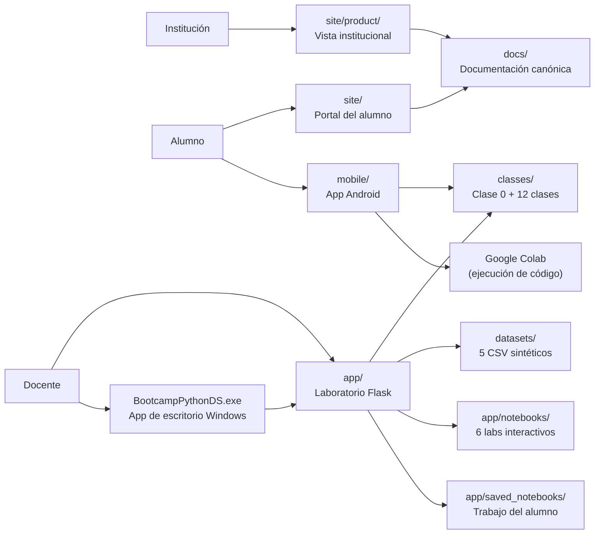

# 🧭 Python Data Science Bootcamp

[](https://github.com/vladimiracunadev-create/python-data-science-bootcamp/actions/workflows/ci.yml)
[](https://github.com/vladimiracunadev-create/python-data-science-bootcamp/actions/workflows/security.yml)
[](https://github.com/vladimiracunadev-create/python-data-science-bootcamp/actions/workflows/deploy-pages.yml)


Base de capacitación técnica para Python y Data Science orientada a clases reales, laboratorios guiados y despliegue progresivo en contexto educativo.

No es solo un repo de materiales. Reúne curriculum modular, laboratorio interactivo local, portal del alumno, presentación institucional, app de escritorio nativa para Windows, app Android y una familia documental que separa producto, operación, seguridad y audiencias.

---

## Estado actual del producto

> **Versión:** v1.0.0 — primera versión operativa  
> **Superficies públicas:** portal del alumno + vista institucional en GitHub Pages  
> **App de escritorio:** ventana nativa Windows con Edge WebView2 (sin navegador)  
> **Laboratorio:** 13 clases, 6 notebooks interactivos, ejecución Python en tiempo real  
> **Postura de despliegue:** local-first, no internet abierta sin capas adicionales

---

## Rutas recomendadas según perfil

| Perfil | Documento de entrada | Qué mirar primero |
|---|---|---|
| Institución / evaluador | [docs/GUIA_EVALUACION.md](docs/GUIA_EVALUACION.md) | valor, evidencia y límites reales |
| Reclutador técnico | [RECRUITER.md](RECRUITER.md) | evidencia técnica rápida en 5 minutos |
| Stakeholder técnico | [docs/ARQUITECTURA_PRODUCTO.md](docs/ARQUITECTURA_PRODUCTO.md) | capas, flujos y fronteras |
| Producto / maintainer | [docs/CATALOGO_PRODUCTO.md](docs/CATALOGO_PRODUCTO.md) | superficies, artefactos y reglas de comunicación |
| Docente | [docs/herramientas-pedagogicas-de-aula.md](docs/herramientas-pedagogicas-de-aula.md) | mediación, problemas de aula y ritmo |
| Alumno | [docs/student-guide.md](docs/student-guide.md) | uso del curso y expectativas |
| Operación | [RUNBOOK.md](RUNBOOK.md) | arranque, smoke checks y apagado |
| Seguridad | [SECURITY.md](SECURITY.md) | postura actual y riesgos aceptados |

Si no sabes por donde entrar, usa [docs/INDEX.md](docs/INDEX.md).

---

## Cómo leer este repo según tiempo disponible

| Tiempo | Secuencia recomendada | Resultado esperado |
|---|---|---|
| 5 minutos | `README` → `RECRUITER.md` | evidencia rápida de qué funciona hoy |
| 15 minutos | `README` → `docs/GUIA_EVALUACION.md` → `docs/CATALOGO_PRODUCTO.md` | entender superficies, arquitectura y criterio de operación |
| 30 minutos | secuencia anterior + `docs/implementacion-v1-skillnest-san-nicolas.md` + `docs/ARQUITECTURA_PRODUCTO.md` | ver cómo aterriza en colegio, con límites y growth path |

La documentación está pensada como sistema, no como inventario de archivos.

---

## Superficies del producto

| Superficie | Rol | Estado |
|---|---|---|
| Laboratorio interactivo (`app/`) | entorno local de clase — notebooks, runner, ejecución Python | operativo |
| Portal del alumno (`site/`) | punto de entrada oficial para estudiantes | operativo |
| Vista institucional (`site/product/`) | presentación visual del producto | operativa |
| Curriculum modular (`classes/`) | clase 0 diagnóstica + 30 clases (13 módulos: Python, NumPy, SQL, visualización, estadística, ML, clustering, PCA, series de tiempo, NLP, anomalías, redes neuronales, despliegue, ética) | operativo |
| App de escritorio Windows (`launcher.py` + `bootcamp.spec` + `installer/`) | ventana nativa con Edge WebView2 — sin navegador, sin Python en el PC del alumno | v1.0.0 publicada |
| App Android (`mobile/`) | Expo/React Native con contenido embebido + integración Google Colab | v1.0.0 publicada |
| PDFs (`docs/pdfs/`) | apoyo para reunión, evaluación, estudio e impresión | operativo |
| Presentaciones (`docs/presentaciones/`) | decks `.pptx` listos para exposición por clase | operativo |

La fuente de verdad de esta taxonomía vive en [docs/CATALOGO_PRODUCTO.md](docs/CATALOGO_PRODUCTO.md).

---

## 📚 Materiales listos para usar

### Material por clase

Estos archivos se generan desde el contenido real de cada carpeta en `classes/` y quedan accesibles desde el entorno local de clase y desde este `README`.

| Clase | Guía PDF | Presentación PPTX |
|---|---|---|
| Clase 00 | [classes/00-diagnostico-inicial/clase-00-diagnostico-inicial-guia-explicativa.pdf](classes/00-diagnostico-inicial/clase-00-diagnostico-inicial-guia-explicativa.pdf) | [classes/00-diagnostico-inicial/clase-00-diagnostico-inicial-presentacion.pptx](classes/00-diagnostico-inicial/clase-00-diagnostico-inicial-presentacion.pptx) |
| Clase 01 | [classes/01-python-fundamentos/clase-01-python-fundamentos-guia-explicativa.pdf](classes/01-python-fundamentos/clase-01-python-fundamentos-guia-explicativa.pdf) | [classes/01-python-fundamentos/clase-01-python-fundamentos-presentacion.pptx](classes/01-python-fundamentos/clase-01-python-fundamentos-presentacion.pptx) |
| Clase 02 | [classes/02-pandas-limpieza-datos/clase-02-pandas-limpieza-datos-guia-explicativa.pdf](classes/02-pandas-limpieza-datos/clase-02-pandas-limpieza-datos-guia-explicativa.pdf) | [classes/02-pandas-limpieza-datos/clase-02-pandas-limpieza-datos-presentacion.pptx](classes/02-pandas-limpieza-datos/clase-02-pandas-limpieza-datos-presentacion.pptx) |
| Clase 03 | [classes/03-visualizacion-exploratoria/clase-03-visualizacion-exploratoria-guia-explicativa.pdf](classes/03-visualizacion-exploratoria/clase-03-visualizacion-exploratoria-guia-explicativa.pdf) | [classes/03-visualizacion-exploratoria/clase-03-visualizacion-exploratoria-presentacion.pptx](classes/03-visualizacion-exploratoria/clase-03-visualizacion-exploratoria-presentacion.pptx) |
| Clase 04 | [classes/04-estadistica-descriptiva/clase-04-estadistica-descriptiva-guia-explicativa.pdf](classes/04-estadistica-descriptiva/clase-04-estadistica-descriptiva-guia-explicativa.pdf) | [classes/04-estadistica-descriptiva/clase-04-estadistica-descriptiva-presentacion.pptx](classes/04-estadistica-descriptiva/clase-04-estadistica-descriptiva-presentacion.pptx) |
| Clase 05 | [classes/05-visualizacion-con-matplotlib/clase-05-visualizacion-con-matplotlib-guia-explicativa.pdf](classes/05-visualizacion-con-matplotlib/clase-05-visualizacion-con-matplotlib-guia-explicativa.pdf) | [classes/05-visualizacion-con-matplotlib/clase-05-visualizacion-con-matplotlib-presentacion.pptx](classes/05-visualizacion-con-matplotlib/clase-05-visualizacion-con-matplotlib-presentacion.pptx) |
| Clase 06 | [classes/06-texto-fechas-y-transformaciones/clase-06-texto-fechas-y-transformaciones-guia-explicativa.pdf](classes/06-texto-fechas-y-transformaciones/clase-06-texto-fechas-y-transformaciones-guia-explicativa.pdf) | [classes/06-texto-fechas-y-transformaciones/clase-06-texto-fechas-y-transformaciones-presentacion.pptx](classes/06-texto-fechas-y-transformaciones/clase-06-texto-fechas-y-transformaciones-presentacion.pptx) |
| Clase 07 | [classes/07-mini-proyecto-guiado/clase-07-mini-proyecto-guiado-guia-explicativa.pdf](classes/07-mini-proyecto-guiado/clase-07-mini-proyecto-guiado-guia-explicativa.pdf) | [classes/07-mini-proyecto-guiado/clase-07-mini-proyecto-guiado-presentacion.pptx](classes/07-mini-proyecto-guiado/clase-07-mini-proyecto-guiado-presentacion.pptx) |
| Clase 08 | [classes/08-presentacion-de-hallazgos/clase-08-presentacion-de-hallazgos-guia-explicativa.pdf](classes/08-presentacion-de-hallazgos/clase-08-presentacion-de-hallazgos-guia-explicativa.pdf) | [classes/08-presentacion-de-hallazgos/clase-08-presentacion-de-hallazgos-presentacion.pptx](classes/08-presentacion-de-hallazgos/clase-08-presentacion-de-hallazgos-presentacion.pptx) |
| Clase 09 | [classes/09-machine-learning-intro/clase-09-machine-learning-intro-guia-explicativa.pdf](classes/09-machine-learning-intro/clase-09-machine-learning-intro-guia-explicativa.pdf) | [classes/09-machine-learning-intro/clase-09-machine-learning-intro-presentacion.pptx](classes/09-machine-learning-intro/clase-09-machine-learning-intro-presentacion.pptx) |
| Clase 10 | [classes/10-modelos-supervisados/clase-10-modelos-supervisados-guia-explicativa.pdf](classes/10-modelos-supervisados/clase-10-modelos-supervisados-guia-explicativa.pdf) | [classes/10-modelos-supervisados/clase-10-modelos-supervisados-presentacion.pptx](classes/10-modelos-supervisados/clase-10-modelos-supervisados-presentacion.pptx) |
| Clase 11 | [classes/11-evaluacion-y-pipelines/clase-11-evaluacion-y-pipelines-guia-explicativa.pdf](classes/11-evaluacion-y-pipelines/clase-11-evaluacion-y-pipelines-guia-explicativa.pdf) | [classes/11-evaluacion-y-pipelines/clase-11-evaluacion-y-pipelines-presentacion.pptx](classes/11-evaluacion-y-pipelines/clase-11-evaluacion-y-pipelines-presentacion.pptx) |
| Clase 12 | [classes/12-proyecto-final-y-cierre/clase-12-proyecto-final-y-cierre-guia-explicativa.pdf](classes/12-proyecto-final-y-cierre/clase-12-proyecto-final-y-cierre-guia-explicativa.pdf) | [classes/12-proyecto-final-y-cierre/clase-12-proyecto-final-y-cierre-presentacion.pptx](classes/12-proyecto-final-y-cierre/clase-12-proyecto-final-y-cierre-presentacion.pptx) |
| Clase 13 | [classes/13-que-es-la-ciencia-de-datos/clase-13-que-es-la-ciencia-de-datos-guia-explicativa.pdf](classes/13-que-es-la-ciencia-de-datos/clase-13-que-es-la-ciencia-de-datos-guia-explicativa.pdf) | [classes/13-que-es-la-ciencia-de-datos/clase-13-que-es-la-ciencia-de-datos-presentacion.pptx](classes/13-que-es-la-ciencia-de-datos/clase-13-que-es-la-ciencia-de-datos-presentacion.pptx) |
| Clase 14 | [classes/14-numpy-arrays-y-calculo/clase-14-numpy-arrays-y-calculo-guia-explicativa.pdf](classes/14-numpy-arrays-y-calculo/clase-14-numpy-arrays-y-calculo-guia-explicativa.pdf) | [classes/14-numpy-arrays-y-calculo/clase-14-numpy-arrays-y-calculo-presentacion.pptx](classes/14-numpy-arrays-y-calculo/clase-14-numpy-arrays-y-calculo-presentacion.pptx) |
| Clase 15 | [classes/15-sql-basico-con-python/clase-15-sql-basico-con-python-guia-explicativa.pdf](classes/15-sql-basico-con-python/clase-15-sql-basico-con-python-guia-explicativa.pdf) | [classes/15-sql-basico-con-python/clase-15-sql-basico-con-python-presentacion.pptx](classes/15-sql-basico-con-python/clase-15-sql-basico-con-python-presentacion.pptx) |
| Clase 16 | [classes/16-seaborn-visualizacion-estadistica/clase-16-seaborn-visualizacion-estadistica-guia-explicativa.pdf](classes/16-seaborn-visualizacion-estadistica/clase-16-seaborn-visualizacion-estadistica-guia-explicativa.pdf) | [classes/16-seaborn-visualizacion-estadistica/clase-16-seaborn-visualizacion-estadistica-presentacion.pptx](classes/16-seaborn-visualizacion-estadistica/clase-16-seaborn-visualizacion-estadistica-presentacion.pptx) |
| Clase 17 | [classes/17-estadistica-inferencial/clase-17-estadistica-inferencial-guia-explicativa.pdf](classes/17-estadistica-inferencial/clase-17-estadistica-inferencial-guia-explicativa.pdf) | [classes/17-estadistica-inferencial/clase-17-estadistica-inferencial-presentacion.pptx](classes/17-estadistica-inferencial/clase-17-estadistica-inferencial-presentacion.pptx) |
| Clase 18 | [classes/18-feature-engineering/clase-18-feature-engineering-guia-explicativa.pdf](classes/18-feature-engineering/clase-18-feature-engineering-guia-explicativa.pdf) | [classes/18-feature-engineering/clase-18-feature-engineering-presentacion.pptx](classes/18-feature-engineering/clase-18-feature-engineering-presentacion.pptx) |
| Clase 19 | [classes/19-regresion-lineal-y-multiple/clase-19-regresion-lineal-y-multiple-guia-explicativa.pdf](classes/19-regresion-lineal-y-multiple/clase-19-regresion-lineal-y-multiple-guia-explicativa.pdf) | [classes/19-regresion-lineal-y-multiple/clase-19-regresion-lineal-y-multiple-presentacion.pptx](classes/19-regresion-lineal-y-multiple/clase-19-regresion-lineal-y-multiple-presentacion.pptx) |
| Clase 20 | [classes/20-arboles-y-random-forest/clase-20-arboles-y-random-forest-guia-explicativa.pdf](classes/20-arboles-y-random-forest/clase-20-arboles-y-random-forest-guia-explicativa.pdf) | [classes/20-arboles-y-random-forest/clase-20-arboles-y-random-forest-presentacion.pptx](classes/20-arboles-y-random-forest/clase-20-arboles-y-random-forest-presentacion.pptx) |
| Clase 21 | [classes/21-gradient-boosting/clase-21-gradient-boosting-guia-explicativa.pdf](classes/21-gradient-boosting/clase-21-gradient-boosting-guia-explicativa.pdf) | [classes/21-gradient-boosting/clase-21-gradient-boosting-presentacion.pptx](classes/21-gradient-boosting/clase-21-gradient-boosting-presentacion.pptx) |
| Clase 22 | [classes/22-clustering-y-segmentacion/clase-22-clustering-y-segmentacion-guia-explicativa.pdf](classes/22-clustering-y-segmentacion/clase-22-clustering-y-segmentacion-guia-explicativa.pdf) | [classes/22-clustering-y-segmentacion/clase-22-clustering-y-segmentacion-presentacion.pptx](classes/22-clustering-y-segmentacion/clase-22-clustering-y-segmentacion-presentacion.pptx) |
| Clase 23 | [classes/23-reduccion-dimensionalidad-pca/clase-23-reduccion-dimensionalidad-pca-guia-explicativa.pdf](classes/23-reduccion-dimensionalidad-pca/clase-23-reduccion-dimensionalidad-pca-guia-explicativa.pdf) | [classes/23-reduccion-dimensionalidad-pca/clase-23-reduccion-dimensionalidad-pca-presentacion.pptx](classes/23-reduccion-dimensionalidad-pca/clase-23-reduccion-dimensionalidad-pca-presentacion.pptx) |
| Clase 24 | [classes/24-series-de-tiempo/clase-24-series-de-tiempo-guia-explicativa.pdf](classes/24-series-de-tiempo/clase-24-series-de-tiempo-guia-explicativa.pdf) | [classes/24-series-de-tiempo/clase-24-series-de-tiempo-presentacion.pptx](classes/24-series-de-tiempo/clase-24-series-de-tiempo-presentacion.pptx) |
| Clase 25 | [classes/25-ajuste-de-hiperparametros/clase-25-ajuste-de-hiperparametros-guia-explicativa.pdf](classes/25-ajuste-de-hiperparametros/clase-25-ajuste-de-hiperparametros-guia-explicativa.pdf) | [classes/25-ajuste-de-hiperparametros/clase-25-ajuste-de-hiperparametros-presentacion.pptx](classes/25-ajuste-de-hiperparametros/clase-25-ajuste-de-hiperparametros-presentacion.pptx) |
| Clase 26 | [classes/26-nlp-texto-como-datos/clase-26-nlp-texto-como-datos-guia-explicativa.pdf](classes/26-nlp-texto-como-datos/clase-26-nlp-texto-como-datos-guia-explicativa.pdf) | [classes/26-nlp-texto-como-datos/clase-26-nlp-texto-como-datos-presentacion.pptx](classes/26-nlp-texto-como-datos/clase-26-nlp-texto-como-datos-presentacion.pptx) |
| Clase 27 | [classes/27-deteccion-de-anomalias/clase-27-deteccion-de-anomalias-guia-explicativa.pdf](classes/27-deteccion-de-anomalias/clase-27-deteccion-de-anomalias-guia-explicativa.pdf) | [classes/27-deteccion-de-anomalias/clase-27-deteccion-de-anomalias-presentacion.pptx](classes/27-deteccion-de-anomalias/clase-27-deteccion-de-anomalias-presentacion.pptx) |
| Clase 28 | [classes/28-etica-sesgo-y-privacidad/clase-28-etica-sesgo-y-privacidad-guia-explicativa.pdf](classes/28-etica-sesgo-y-privacidad/clase-28-etica-sesgo-y-privacidad-guia-explicativa.pdf) | [classes/28-etica-sesgo-y-privacidad/clase-28-etica-sesgo-y-privacidad-presentacion.pptx](classes/28-etica-sesgo-y-privacidad/clase-28-etica-sesgo-y-privacidad-presentacion.pptx) |
| Clase 29 | [classes/29-redes-neuronales-intro/clase-29-redes-neuronales-intro-guia-explicativa.pdf](classes/29-redes-neuronales-intro/clase-29-redes-neuronales-intro-guia-explicativa.pdf) | [classes/29-redes-neuronales-intro/clase-29-redes-neuronales-intro-presentacion.pptx](classes/29-redes-neuronales-intro/clase-29-redes-neuronales-intro-presentacion.pptx) |
| Clase 30 | [classes/30-despliegue-basico-de-modelos/clase-30-despliegue-basico-de-modelos-guia-explicativa.pdf](classes/30-despliegue-basico-de-modelos/clase-30-despliegue-basico-de-modelos-guia-explicativa.pdf) | [classes/30-despliegue-basico-de-modelos/clase-30-despliegue-basico-de-modelos-presentacion.pptx](classes/30-despliegue-basico-de-modelos/clase-30-despliegue-basico-de-modelos-presentacion.pptx) |

### PDFs de entrevista y estudio

PDFs listos para imprimir o compartir en contexto de entrevista, evaluación o preparación docente. Viven en `docs/pdfs/` y son independientes del flujo de clases.

**PDFs canónicos de entrevista**

| Documento | Descripción |
|---|---|
| [muestra-producto-para-skillnest.pdf](docs/pdfs/muestra-producto-para-skillnest.pdf) | Muestra imprimible del producto para contexto de institución o reunión comercial |
| [guia-estudio-repositorio.pdf](docs/pdfs/guia-estudio-repositorio.pdf) | Ruta de lectura rápida del repo para evaluador técnico o reclutador |

**Guía ampliada de estudio**

| Documento | Descripción |
|---|---|
| [guia-total-python-data-science.pdf](docs/pdfs/guia-total-python-data-science.pdf) | Guía de estudio extendida para el docente o alumno avanzado: Python, pandas, visualización y ML |

---

## Arquitectura en una mirada



La arquitectura completa, con flujos y fronteras, está en [docs/ARQUITECTURA_PRODUCTO.md](docs/ARQUITECTURA_PRODUCTO.md).

---

## Capacidades actuales

### Curriculum y pedagogía

- clase 0 diagnóstica (quiz de 30 preguntas) + 30 clases modulares (01–30);
- `teoria.md`, `slides.md`, `ejercicios.md`, `homework.md`, `preguntas.md`, `tecnologias.md`, `guia-codigo.md` por clase;
- notebooks Jupyter para el alumno + soluciones para el instructor;
- 6 datasets sintéticos para práctica (ventas, clientes, soporte, transporte, estudiantes, comentarios);
- guías de instructor, metodología, ética y criterios de evaluación;
- currículo organizado en 13 módulos temáticos: fundamentos, datos, visualización, estadística, ML supervisado y no supervisado, series de tiempo, NLP, redes neuronales, despliegue y ética.

### Laboratorio interactivo

- app Flask con visualización de las 13 clases;
- 6 notebooks interactivos precargados (básicos → ML → pipelines);
- ejecución de código Python por celdas con persistencia de sesión;
- captura de gráficos matplotlib como PNG inline;
- guardado de notebooks en JSON;
- endpoints `GET /health` y `GET /ready` para healthchecks.

### App de escritorio Windows (v1.0.0)

- ventana nativa con Edge WebView2 — **sin abrir el navegador**;
- Flask corre internamente en un puerto libre elegido automáticamente;
- pantalla de carga animada mientras el entorno inicia;
- portable (ZIP) + instalador (Inno Setup) disponibles;
- sin dependencias en el PC del usuario final.

### Presentación y evaluación

- landing pública para alumnos en GitHub Pages;
- vista institucional HTML con narrativa de producto;
- PDFs listos para preparación personal y muestra del producto;
- guía de evaluación rápida para entrevista o revisión externa.

---

## Inicio rápido

### Opción A — app de escritorio Windows (usuarios finales)

Descarga `BootcampPythonDS_windows_portable_v1.0.0.zip` desde [Releases](https://github.com/vladimiracunadev-create/python-data-science-bootcamp/releases/tag/v1.0.0), descomprime y ejecuta `BootcampPythonDS.exe`.

Requiere: Edge WebView2 Runtime (preinstalado en Windows 10 v2004+ y Windows 11).

### Opción B — modo desarrollo (entorno virtual)

```bash
python -m venv .venv
.venv\Scripts\activate        # Windows
# source .venv/bin/activate   # macOS / Linux
pip install -r requirements.txt
python run_bootcamp.py
```

Abre automáticamente `http://127.0.0.1:8000` en el navegador.

### Opción C — Docker local

```bash
docker compose up --build
```

### Opción D — Docker endurecido

```bash
docker compose -f docker-compose.prod.yml up -d --build
```

---

## Build de distribución

```bash
# Instala dependencias de build
pip install pywebview pyinstaller

# Genera bundle + ZIP portable + instalador (requiere Inno Setup 6)
build_windows.bat
```

Ver [docs/BUILD_INSTALLER.md](docs/BUILD_INSTALLER.md) para instrucciones completas.

---

## Validación y CI/CD

```bash
pytest                   # suite completa
ruff check .             # lint
python -m bandit -r app  # seguridad estática
```

Workflows activos:

| Workflow | Qué cubre |
|---|---|
| [ci.yml](.github/workflows/ci.yml) | tests, lint, build de contenedor |
| [security.yml](.github/workflows/security.yml) | auditoría de dependencias, SAST |
| [deploy-pages.yml](.github/workflows/deploy-pages.yml) | despliegue de `site/` a GitHub Pages |

---

## Seguridad y límites

**Protecciones activas:**

- validación de slugs e identificadores (regex, evita path traversal);
- límite de payload por request (1 MB);
- límite de longitud de código (20 KB);
- timeout de ejecución por celda (30 s) + reinicio de sesión;
- eviction de sesiones antiguas (100 sesiones máx, TTL 1 hora);
- CSP estricto sin dependencias CDN externas;
- defaults de arranque a `127.0.0.1`;
- nosec justificado para falsos positivos de Bandit en polling loops.

**Límites conocidos:**

- no hay autenticación integrada;
- no hay sandbox fuerte para código no confiable;
- no hay rate limiting de red;
- no hay TLS nativo;
- el runner es para uso local en aula, no para internet abierta.

Ver [SECURITY.md](SECURITY.md) para detalle completo.

---

## Mapa documental

| Documento | Rol |
|---|---|
| [RECRUITER.md](RECRUITER.md) | evidencia técnica rápida para evaluadores |
| [CHANGELOG.md](CHANGELOG.md) | historial de cambios por versión |
| [CONTRIBUTING.md](CONTRIBUTING.md) | cómo contribuir al proyecto |
| [ROADMAP.md](ROADMAP.md) | dirección futura del producto |
| [RUNBOOK.md](RUNBOOK.md) | operación diaria |
| [SECURITY.md](SECURITY.md) | postura de seguridad y límites |
| [docs/INDEX.md](docs/INDEX.md) | índice completo por audiencia y objetivo |
| [docs/CATALOGO_PRODUCTO.md](docs/CATALOGO_PRODUCTO.md) | fuente de verdad de superficies y artefactos |
| [docs/ARQUITECTURA_PRODUCTO.md](docs/ARQUITECTURA_PRODUCTO.md) | arquitectura funcional con diagramas |
| [docs/GUIA_EVALUACION.md](docs/GUIA_EVALUACION.md) | ruta ejecutiva de 10 minutos |
| [docs/BUILD_INSTALLER.md](docs/BUILD_INSTALLER.md) | cómo generar el instalador Windows |
| [docs/MOBILE_APP.md](docs/MOBILE_APP.md) | cómo construir y distribuir la app Android |
| [docs/entorno-interactivo.md](docs/entorno-interactivo.md) | el laboratorio Flask y su funcionamiento |
| [docs/metodologia-docente.md](docs/metodologia-docente.md) | marco pedagógico del producto |
| [docs/instructor-guide.md](docs/instructor-guide.md) | playbook de ejecución docente |
| [docs/student-guide.md](docs/student-guide.md) | guía de onboarding del alumno |
| [docs/despliegue-seguro-y-operacion.md](docs/despliegue-seguro-y-operacion.md) | CI/CD, Docker y hardening |

> Los documentos de preparación para entrevista y las notas internas del maintainer viven en `docs/entrevista/` y `docs/maintainer/` respectivamente.

---

## Lo que este repo sí es

- una base seria de capacitación técnica en Python y Data Science;
- un sistema que integra contenido, práctica interactiva y presentación;
- una app de escritorio nativa para distribución en aula sin configuración;
- una muestra de criterio pedagógico, operacional y de seguridad;
- una propuesta que puede empezar acotada y crecer sin rehacerse.

## Lo que este repo no vende

- una plataforma multiusuario endurecida para internet abierta;
- una app móvil ya en producción (el APK es versión debug v1.0.0);
- una promesa de personalización infinita antes de cerrar condiciones;
- profundidad total en todas las direcciones desde la primera versión.

---

## Idea fuerza

El valor de este proyecto no depende de competir contra una tecnología puntual. Su valor está en traducir herramientas a aprendizaje real, con secuencia pedagógica, criterio docente, operación responsable y una base documental que permite evaluarlo como producto.
