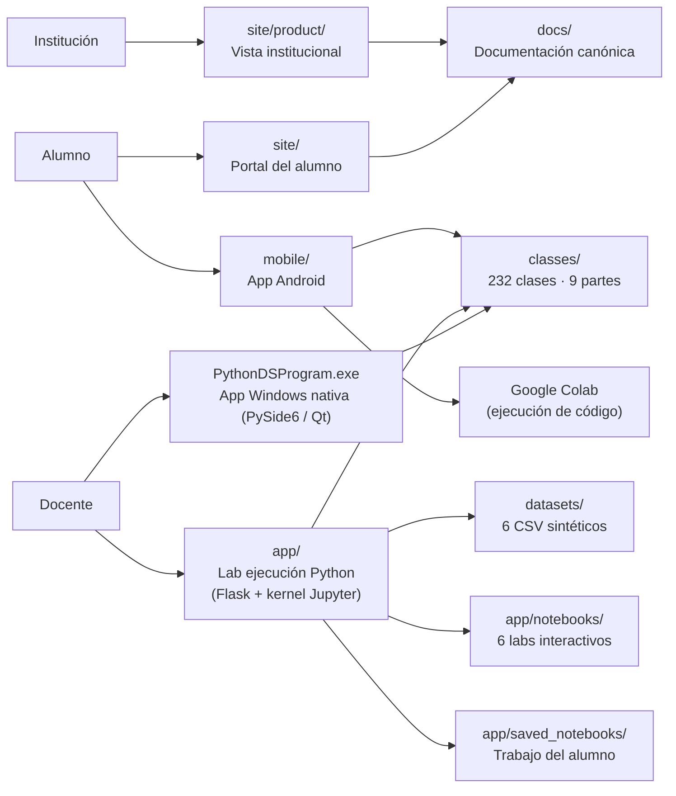
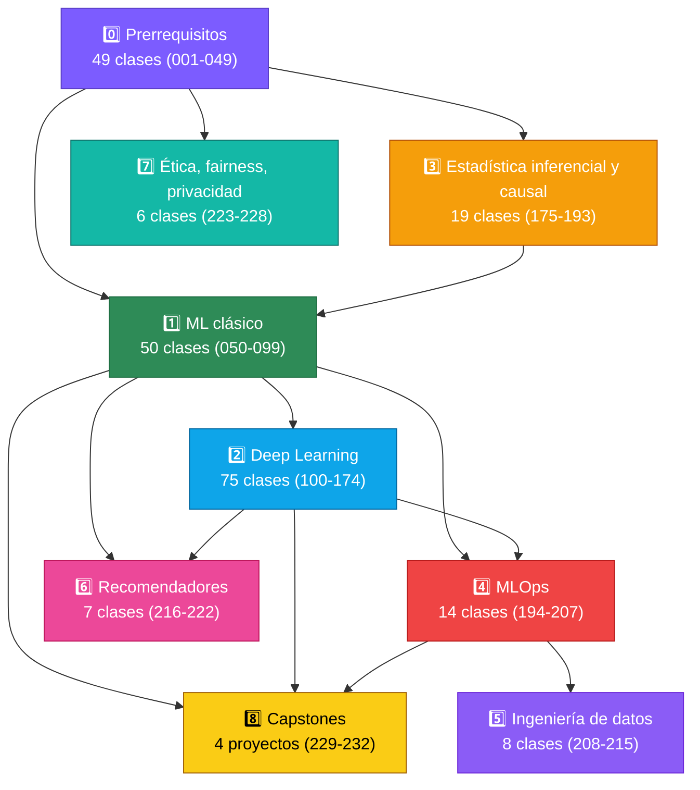

<div align="center">

# 🧭 Python Data Science Program

### **232 clases · 9 partes · pauta avanzada y completa (expansión 2026)**

**Curso completo de Python y Data Science — desde fundamentos hasta despliegue de modelos en producción**

<br>

[](https://github.com/vladimiracunadev-create/python-data-science-program/actions/workflows/ci.yml)
[](https://github.com/vladimiracunadev-create/python-data-science-program/actions/workflows/security.yml)
[](https://github.com/vladimiracunadev-create/python-data-science-program/actions/workflows/deploy-pages.yml)

[](CHANGELOG.md)
[](classes/README.md)
[](classes/parte-0-prerrequisitos/README.md)
[](classes/parte-1-machine-learning-clasico/README.md)
[](classes/parte-2-deep-learning/README.md)
[](classes/parte-3-estadistica-inferencial/README.md)
[](classes/parte-4-mlops/README.md)
[](classes/parte-5-ingenieria-de-datos/README.md)
[](classes/parte-6-sistemas-de-recomendacion/README.md)
[](classes/parte-7-etica-fairness-privacidad/README.md)
[](classes/parte-8-capstones/README.md)
[](LICENSE)

[](https://www.python.org/)
[](https://jupyter.org/)
[](https://flask.palletsprojects.com/)
[](https://pandas.pydata.org/)
[](https://scikit-learn.org/)
[](Dockerfile)
[](docs/BUILD_INSTALLER.md)
[](mobile/)

[📚 Índice de clases](classes/README.md) · [📖 Syllabus](docs/syllabus.md) · [🏗️ Arquitectura](docs/ARQUITECTURA_PRODUCTO.md) · [🎯 Evaluación](docs/GUIA_EVALUACION.md)

</div>

---

Integra currículo modular extenso, laboratorio interactivo local, portal del alumno, app de escritorio nativa para Windows y app Android.

📖 **¿Qué significa "pauta derivada"?** Cada parte del temario sigue explícitamente la secuencia y los énfasis de cinco libros referentes:

- 🧠 **Géron** ([*Hands-On ML*, 3ª ed.](https://www.oreilly.com/library/view/hands-on-machine-learning/9781098125967/)) → estructura de las partes 1 (ML clásico) y 2 (Deep Learning)
- 📊 **VanderPlas** ([*Python Data Science Handbook*](https://jakevdp.github.io/PythonDataScienceHandbook/)) → parte 0 (NumPy, pandas, matplotlib)
- 🏭 **Huyen** ([*Designing ML Systems*](https://www.oreilly.com/library/view/designing-machine-learning/9781098107956/)) → parte 4 (MLOps en producción)
- 📈 **ISLP** ([*Statistical Learning with Python*](https://www.statlearning.com/)) → parte 3 (estadística inferencial) + rigor matemático de la parte 1
- ⚖️ **Barocas/Hardt/Narayanan** ([*Fairness and ML*](https://fairmlbook.org/)) → parte 7 (ética, fairness, privacidad)

> Detalle completo (qué aporta cada uno, cómo se adapta) en [docs/syllabus.md § Fuentes y pauta](docs/syllabus.md#-fuentes-y-pauta).

> 💡 **Origen y orientación del proyecto:** este repositorio nació como **muestra de habilidades técnicas y pedagógicas**, y hoy se desarrolla como **recurso personal de aprendizaje, enseñanza y mejora continua del propio producto**. Es público y abierto a cualquier persona que quiera aprender, enseñar o contribuir.

---

## 📊 Estado actual del producto

| 🎯 Aspecto | Estado |
|---|---|
| 🏷️ **Versión** | `v3.8.0` (junio 2026 — **app Windows nativa con PySide6 (Qt, sin web, sin localhost) · 🎓 232/232 clases · 232/232 notebooks ejecutables · cobertura 100% real · lab con kernel Jupyter real ejecuta los 232 notebooks**) |
| 📚 **Clases** | **232 en 9 partes** · numeración secuencial limpia 001-232 |
| 🗂️ **Estructura** | ✅ **las 232 clases con `README.md` pedagógico + `notebook.ipynb` ejecutable (cobertura 100%)** |
| ✍️ **Contenido pedagógico** | 🟢 **Las 9 partes (232/232 = 100%) — completas y modernizadas** con Definiciones · Errores comunes · FAQ en cada clase + 35 clases dedicadas a temas modernos 2024-2026 + stack completo de MLOps (DVC, MLflow, Feast, K8s, FastAPI, drift, shadow/canary, SHAP, Great Expectations, behavioral tests) + data engineering (Airflow, Prefect/Dagster, PySpark, Polars, DuckDB/BQ/Snowflake, Kafka, Parquet/Avro, star schemas) + recomendadores (CF, SVD/ALS, content+FAISS, LightFM, métricas top-N, cold-start) + ética/fairness/privacidad (DP/EO/calibration, DP-SGD, FedAvg, GDPR + AI Act 2024/1689, reproducibilidad) + **4 capstones integradores** (tabular E2E con MLflow+FastAPI+Streamlit, NLP o series con backtesting cuantil, visión transfer learning con ONNX, portafolio público en GitHub Pages con MkDocs/Quarto) |
| 🧭 **Descubribilidad Pages** | ✅ tabla de contenidos automática + badges por clase + banner global de progreso |
| 🧪 **Laboratorio de ejecución Python** | ✅ Flask shell + kernel Jupyter real (`jupyter_client` + `ipykernel`), lee los `classes/**/notebook.ipynb` reales, outputs ricos (HTML, imágenes, errores con traceback) — **herramienta separada** del viewer nativo, pensada para ejecutar código sobre los notebooks |
| 🖥️ **App Windows** | ✅ **app Qt nativa** (PySide6) — sin web, sin localhost · [binario publicado en release v3.8.0](https://github.com/vladimiracunadev-create/python-data-science-program/releases/tag/v3.8.0) (`PythonDSProgram_windows_portable_v3.8.0.zip`, 274 MB) |
| 📱 **App Android** | ✅ código operativo · [APK debug publicado en release v3.8.0](https://github.com/vladimiracunadev-create/python-data-science-program/releases/tag/v3.8.0) (`PythonDSProgram_android_v3.8.0_debug.apk`, 139 MB, Expo SDK 51, versionCode 38) |
| 🛡️ **Postura** | local-first — no internet abierta sin capas adicionales |

### 📥 Descarga rápida — Release v3.8.0 (2026-06-19)

Binarios y bundles oficiales del programa. Verificación de integridad en [`SHA256SUMS_v3.8.0.txt`](https://github.com/vladimiracunadev-create/python-data-science-program/releases/download/v3.8.0/SHA256SUMS_v3.8.0.txt).

| 📦 Asset | Tamaño | Descripción |
|---|---:|---|
| [`PythonDSProgram_windows_portable_v3.8.0.zip`](https://github.com/vladimiracunadev-create/python-data-science-program/releases/download/v3.8.0/PythonDSProgram_windows_portable_v3.8.0.zip) | 274 MB | App Windows Qt nativa (PySide6) — bundle **slim**, sin PDFs/PPTX embebidos; el viewer abre la URL raw del repo cuando el archivo local no existe |
| [`PythonDSProgram_android_v3.8.0_debug.apk`](https://github.com/vladimiracunadev-create/python-data-science-program/releases/download/v3.8.0/PythonDSProgram_android_v3.8.0_debug.apk) | 139 MB | APK Android debug (Expo SDK 51 · versionCode 38 · versionName 3.8.0) |
| [`curso-completo.pdf`](https://github.com/vladimiracunadev-create/python-data-science-program/releases/download/v3.8.0/curso-completo.pdf) | 1.9 MB | Currículo completo en PDF (232 clases · 9 partes) |
| [`curso-completo.pptx`](https://github.com/vladimiracunadev-create/python-data-science-program/releases/download/v3.8.0/curso-completo.pptx) | 2.0 MB | Currículo completo en PPTX |

> 🔗 [Página completa del release v3.8.0](https://github.com/vladimiracunadev-create/python-data-science-program/releases/tag/v3.8.0)

### 🗺️ Las 9 partes del currículo

Cada parte tiene su **propio README** con narrativa completa: de qué trata, qué problemas resuelve, resultados de aprendizaje, estructura temática y enlaces a las clases.

| # | Parte | Clases | Foco | README |
|---|---|---:|---|---|
| 0️⃣ | Prerrequisitos ✅ | 49 (001-049) | Python aplicado, NumPy, pandas, Polars, Parquet/Arrow/DuckDB, viz, SQL, NoSQL, APIs, async | [📘 leer](classes/parte-0-prerrequisitos/README.md) |
| 1️⃣ | ML clásico ✅ | 50 (050-099) | Regresión, clasificación, ensembles, no supervisado, Optuna, SHAP, calibración, Model Cards | [📘 leer](classes/parte-1-machine-learning-clasico/README.md) |
| 2️⃣ | Deep Learning ✅ | 75 (100-174) | Keras + PyTorch + Lightning, CNN (SAM/YOLOv11), Transformers + Flash/RoPE/GQA, LLMs (LoRA/DPO/vLLM), multimodal (CLIP/Whisper), MCP/agentes, SDXL+ControlNet, RL, ONNX/JAX, despliegue | [📘 leer](classes/parte-2-deep-learning/README.md) |
| 3️⃣ | Estadística inferencial y causal ✅ | 19 (175-193) | Hipótesis + effect size, BCa bootstrap, A/B (CUPED+sequential), DoubleML, Synthetic Controls, Bayes (PyMC v5+NumPyro+ArviZ) | [📘 leer](classes/parte-3-estadistica-inferencial/README.md) |
| 4️⃣ | MLOps ✅ | 14 (194-207) | DVC, MLflow, Feast, GH Actions+CML, Docker, FastAPI, K8s, serverless, drift (PSI/CBPE), Prefect, shadow/canary, SHAP, Great Expectations, behavioral tests | [📘 leer](classes/parte-4-mlops/README.md) |
| 5️⃣ | Ingeniería de datos ✅ | 8 (208-215) | Airflow TaskFlow, Prefect/Dagster, PySpark (AQE/skew), Polars (lazy/streaming), DuckDB/BQ/Snowflake, Kafka+Kinesis, Parquet/Avro, star schema SCD2 | [📘 leer](classes/parte-5-ingenieria-de-datos/README.md) |
| 6️⃣ | Recomendadores ✅ | 7 (216-222) | CF user/item-based, SVD+ALS implicit, content (TF-IDF+sentence-transformers+FAISS), hybrid LightFM, métricas top-N (NDCG/MAP/recall), cold-start (Bayes+bandits) | [📘 leer](classes/parte-6-sistemas-de-recomendacion/README.md) |
| 7️⃣ | Ética, fairness, privacidad ✅ | 6 (223-228) | Sesgos (Suresh-Guttag), métricas DP/EO/calibration + impossibility theorem, privacidad diferencial (Laplace/Gauss/DP-SGD), federated learning (FedAvg + leakage), GDPR + AI Act EU 2024/1689, reproducibilidad (seeds/lock files/model cards) | [📘 leer](classes/parte-7-etica-fairness-privacidad/README.md) |
| 8️⃣ | Capstones ✅ | 4 (229-232) | Tabular E2E (EDA+ColumnTransformer+GBM+Optuna+MLflow+FastAPI+Streamlit+SHAP), NLP/series (rama A: DistilBERT/RAG · rama B: forecasting con baselines+SARIMA+ML+backtesting+cuantiles), Visión transfer learning (ConvNeXt/EfficientNetV2/ViT + RandAugment/MixUp + ONNX), Portafolio público (MkDocs Material/Quarto + GitHub Pages + demos hosted + deck + CV técnico) | [📘 leer](classes/parte-8-capstones/README.md) |

### 🎓 Programa completo

**232/232 clases desarrolladas (100%)** con patrón pedagógico v3.0 — Definiciones · Resultados · Temas · Dataset · Ejercicios · Homework verificable · Errores comunes · FAQ · Referencias + notebook ejecutable + PDF + PPTX. PDFs y PPTX por clase, por parte y unificados ya están generados (`docs/pdfs/`, `docs/presentaciones/`). Siguiente foco del repo: migrar el catálogo del currículo a la UI Android (`mobile/src/data/classes.js` sigue stub), mejoras al laboratorio de ejecución Python (ver [ROADMAP.md](ROADMAP.md)).

---

## 🧭 Rutas recomendadas según perfil

| 👤 Perfil | 📖 Documento de entrada | 🎯 Qué mirar primero |
|---|---|---|
| 🏛️ Institución / evaluador | [docs/GUIA_EVALUACION.md](docs/GUIA_EVALUACION.md) | valor, evidencia y límites reales |
| 🎯 Reclutador técnico | [RECRUITER.md](RECRUITER.md) | evidencia técnica rápida en 5 minutos |
| 🏗️ Stakeholder técnico | [docs/ARQUITECTURA_PRODUCTO.md](docs/ARQUITECTURA_PRODUCTO.md) | capas, flujos y fronteras |
| 📦 Producto / maintainer | [docs/CATALOGO_PRODUCTO.md](docs/CATALOGO_PRODUCTO.md) | superficies, artefactos y reglas de comunicación |
| 👩‍🏫 Docente | [docs/herramientas-pedagogicas-de-aula.md](docs/herramientas-pedagogicas-de-aula.md) | mediación, problemas de aula y ritmo |
| 🎓 Alumno | [docs/student-guide.md](docs/student-guide.md) | uso del curso y expectativas |
| ⚙️ Operación | [RUNBOOK.md](RUNBOOK.md) | arranque, smoke checks y apagado |
| 🔐 Seguridad | [SECURITY.md](SECURITY.md) | postura actual y riesgos aceptados |

> Si no sabes por dónde entrar, usa [docs/INDEX.md](docs/INDEX.md).

---

## ⏱️ Cómo leer este repo según tiempo disponible

| ⏰ Tiempo | Secuencia recomendada | 🎯 Resultado esperado |
|---|---|---|
| 5 min | `README` → `RECRUITER.md` | evidencia rápida de qué funciona hoy |
| 15 min | `README` → `docs/GUIA_EVALUACION.md` → `docs/CATALOGO_PRODUCTO.md` | entender superficies, arquitectura y criterio de operación |
| 30 min | secuencia anterior + `docs/syllabus.md` + `docs/ARQUITECTURA_PRODUCTO.md` | entender el currículo completo, capas y growth path |

> 📚 La documentación está pensada como sistema, no como inventario de archivos.

---

## 🎛️ Superficies del producto

| Superficie | Rol | Estado |
|---|---|---|
| 🧪 Laboratorio de ejecución Python (`app/`) | shell Flask + kernel Jupyter real (`jupyter_client` + `ipykernel`) que ejecuta los notebooks del currículo | ✅ operativo |
| 🌐 Portal del alumno (`site/`) | punto de entrada oficial para estudiantes | ✅ operativo |
| 🏛️ Vista institucional (`site/product/`) | presentación visual del producto | ✅ operativa |
| 📚 Currículo modular (`classes/`) | **232 clases** en 9 partes (numeración secuencial 001-232): Prerrequisitos, ML clásico, Deep Learning, Estadística inferencial y causal, MLOps, Ingeniería de datos, Recomendadores, Ética, Capstones | 🟢 **Las 9 partes (232/232 = 100%) completas y modernizadas** — 35 clases dedicadas a temas 2024-2026 + stack MLOps + data engineering + recomendadores + ética/fairness/privacidad + 4 capstones integradores end-to-end |
| 🖥️ App de escritorio Windows (`launcher.py` + `app_desktop/` + `program.spec` + `installer/`) | ventana Qt nativa (PySide6) — sin web, sin localhost, sin WebView, sin Python en el PC del alumno | ✅ binario v3.8.0 publicado en release |
| 📱 App Android (`mobile/`) | Expo/React Native con integración Google Colab | ✅ APK debug v3.8.0 publicado · contenido pendiente de migración |
| 📄 PDFs (`docs/pdfs/`) | guías por clase + bundles por parte + curso completo | ✅ generados (232 por clase + 9 por parte + 1 unificado) |
| 📊 Presentaciones (`docs/presentaciones/`) | decks `.pptx` por clase + bundles por parte + curso completo | ✅ generados (232 por clase + 9 por parte + 1 unificado) |

La fuente de verdad de esta taxonomía vive en [docs/CATALOGO_PRODUCTO.md](docs/CATALOGO_PRODUCTO.md).

---

## 📚 Materiales listos para usar

### 🗂️ Currículo (232 clases)

- 🧭 **Índice navegable:** [classes/README.md](classes/README.md)
- 📖 **Pauta completa:** [docs/syllabus.md](docs/syllabus.md)
- 📝 Cada clase incluye `README.md` (ficha pedagógica) + `notebook.ipynb` (ejecutable) + `clase-NNN-...-guia-explicativa.pdf` + `clase-NNN-...-presentacion.pptx` para descarga directa desde la carpeta de la clase.

### 📥 Material consolidado del curso

| 📦 Bundle | PDF | PPTX |
|---|---|---|
| 🎓 **Curso completo** (232 clases · 9 partes) | [curso-completo.pdf](docs/pdfs/curso-completo.pdf) (1.9 MB) | [curso-completo.pptx](docs/presentaciones/curso-completo.pptx) (2.0 MB) |
| Parte 0 — Prerrequisitos | [parte-0…-completa.pdf](docs/pdfs/parts/parte-0-prerrequisitos-completa.pdf) | [parte-0…-completa.pptx](docs/presentaciones/parts/parte-0-prerrequisitos-completa.pptx) |
| Parte 1 — ML clásico | [parte-1…-completa.pdf](docs/pdfs/parts/parte-1-machine-learning-clasico-completa.pdf) | [parte-1…-completa.pptx](docs/presentaciones/parts/parte-1-machine-learning-clasico-completa.pptx) |
| Parte 2 — Deep Learning | [parte-2…-completa.pdf](docs/pdfs/parts/parte-2-deep-learning-completa.pdf) | [parte-2…-completa.pptx](docs/presentaciones/parts/parte-2-deep-learning-completa.pptx) |
| Parte 3 — Estadística inferencial | [parte-3…-completa.pdf](docs/pdfs/parts/parte-3-estadistica-inferencial-completa.pdf) | [parte-3…-completa.pptx](docs/presentaciones/parts/parte-3-estadistica-inferencial-completa.pptx) |
| Parte 4 — MLOps | [parte-4…-completa.pdf](docs/pdfs/parts/parte-4-mlops-completa.pdf) | [parte-4…-completa.pptx](docs/presentaciones/parts/parte-4-mlops-completa.pptx) |
| Parte 5 — Ingeniería de datos | [parte-5…-completa.pdf](docs/pdfs/parts/parte-5-ingenieria-de-datos-completa.pdf) | [parte-5…-completa.pptx](docs/presentaciones/parts/parte-5-ingenieria-de-datos-completa.pptx) |
| Parte 6 — Recomendadores | [parte-6…-completa.pdf](docs/pdfs/parts/parte-6-sistemas-de-recomendacion-completa.pdf) | [parte-6…-completa.pptx](docs/presentaciones/parts/parte-6-sistemas-de-recomendacion-completa.pptx) |
| Parte 7 — Ética / Fairness / Privacidad | [parte-7…-completa.pdf](docs/pdfs/parts/parte-7-etica-fairness-privacidad-completa.pdf) | [parte-7…-completa.pptx](docs/presentaciones/parts/parte-7-etica-fairness-privacidad-completa.pptx) |
| Parte 8 — Capstones | [parte-8…-completa.pdf](docs/pdfs/parts/parte-8-capstones-completa.pdf) | [parte-8…-completa.pptx](docs/presentaciones/parts/parte-8-capstones-completa.pptx) |

> Generación: `python scripts/generate_class_assets_v3.py` (por clase) y `python scripts/generate_part_bundles.py` (bundles por parte + unificado).

### 📄 PDFs de estudio adicionales

PDFs listos para imprimir o compartir. Viven en `docs/pdfs/` y son independientes del flujo de clases.

| 📑 Documento | Descripción |
|---|---|
| [guia-estudio-repositorio.pdf](docs/pdfs/guia-estudio-repositorio.pdf) | 🗺️ Ruta de lectura rápida del repo para evaluador o reclutador |
| [guia-total-python-data-science.pdf](docs/pdfs/guia-total-python-data-science.pdf) | 📘 Guía ampliada de Python con Data Science investigada con fuentes oficiales |

---

## 🏗️ Arquitectura en una mirada


```mermaid
graph LR
    INST["Institución"] --> PRODUCT["site/product/\nVista institucional"]
    ALUM["Alumno"] --> PORTAL["site/\nPortal del alumno"]
    ALUM --> MOBILE["mobile/\nApp Android"]
    DOC["Docente"] --> LAB["app/\nLab ejecución Python\n(Flask + kernel Jupyter)"]
    DOC --> WIN["PythonDSProgram.exe\nApp Windows nativa (PySide6 / Qt)"]

    PRODUCT --> DOCS["docs/\nDocumentación canónica"]
    PORTAL --> DOCS
    MOBILE --> CLASSES["classes/\n232 clases · 9 partes"]
    MOBILE --> COLAB["Google Colab\n(ejecución de código)"]
    LAB --> CLASSES
    LAB --> DATA["datasets/\n6 CSV sintéticos"]
    LAB --> NOTEBOOKS["app/notebooks/\n6 labs interactivos"]
    LAB --> SAVED["app/saved_notebooks/\nTrabajo del alumno"]
    WIN --> CLASSES
```

> 🖥️ La app Windows nativa (`PythonDSProgram.exe`) lee directamente `classes/` con widgets Qt — **no levanta Flask ni se conecta al laboratorio**. El laboratorio (`app/`) es una herramienta separada, opcional, para ejecutar código de los notebooks.

La arquitectura completa, con flujos y fronteras, está en [docs/ARQUITECTURA_PRODUCTO.md](docs/ARQUITECTURA_PRODUCTO.md).

### 🗺️ Mapa del currículo (9 partes · 232 clases · v3.8.0 · 🎓 232/232 README + 232/232 notebooks ejecutables · 100% real)


```mermaid
graph TD
    P0["0️⃣ Prerrequisitos<br/>49 clases (001-049)"]:::found
    P1["1️⃣ ML clásico<br/>50 clases (050-099)"]:::ml
    P2["2️⃣ Deep Learning<br/>75 clases (100-174)"]:::dl
    P3["3️⃣ Estadística inferencial y causal<br/>19 clases (175-193)"]:::stats
    P4["4️⃣ MLOps<br/>14 clases (194-207)"]:::ops
    P5["5️⃣ Ingeniería de datos<br/>8 clases (208-215)"]:::data
    P6["6️⃣ Recomendadores<br/>7 clases (216-222)"]:::rec
    P7["7️⃣ Ética, fairness, privacidad<br/>6 clases (223-228)"]:::eth
    P8["8️⃣ Capstones<br/>4 proyectos (229-232)"]:::cap

    P0 --> P1
    P0 --> P3
    P1 --> P2
    P1 --> P4
    P3 --> P1
    P2 --> P4
    P4 --> P5
    P1 --> P6
    P2 --> P6
    P0 --> P7
    P1 --> P8
    P2 --> P8
    P4 --> P8

    classDef found fill:#7c5cff,stroke:#5b3fc7,color:#fff
    classDef ml fill:#2e8b57,stroke:#1f6f43,color:#fff
    classDef dl fill:#0ea5e9,stroke:#0369a1,color:#fff
    classDef stats fill:#f59e0b,stroke:#b45309,color:#fff
    classDef ops fill:#ef4444,stroke:#b91c1c,color:#fff
    classDef data fill:#8b5cf6,stroke:#6d28d9,color:#fff
    classDef rec fill:#ec4899,stroke:#be185d,color:#fff
    classDef eth fill:#14b8a6,stroke:#0f766e,color:#fff
    classDef cap fill:#facc15,stroke:#a16207,color:#000
```

---

## ⚙️ Capacidades actuales

### 📚 Currículo y pedagogía

- **Currículo (v3.8.0):** **232 clases** en 9 partes (numeración secuencial 001-232) — Prerrequisitos (49), ML clásico (50), Deep Learning (75), Estadística inferencial y causal (19), MLOps (14), Ingeniería de datos (8), Recomendadores (7), Ética (6), Capstones (4). **Las 9 partes (232/232 = 100%) completas y modernizadas 2024-2026**;
- pauta derivada de **Hands-On ML** (Géron 3ª ed.), **Python Data Science Handbook** (VanderPlas), **Designing ML Systems** (Huyen), **ISLP** (James et al), **Fairness and ML** (Barocas/Hardt/Narayanan);
- cada clase: `README.md` pedagógico (Definiciones · Errores comunes · FAQ · Referencias) + `notebook.ipynb` ejecutable + `clase-NNN-...-guia-explicativa.pdf` + `clase-NNN-...-presentacion.pptx`;
- **6 datasets** sintéticos: ventas_tienda, retencion_clientes, soporte_tickets, transporte, estudiantes, comentarios_productos;
- guías de instructor, metodología, criterios de evaluación y ética de datos.

### 🧪 Laboratorio de ejecución Python

- shell Flask + kernel Jupyter real (`jupyter_client` + `ipykernel`) — un kernel por sesión, con interrupt/restart;
- descubre y ejecuta los `classes/**/notebook.ipynb` reales del currículo (no templates);
- outputs ricos: HTML, imágenes PNG/JPEG base64, errores con traceback, streams stdout/stderr;
- atajos estilo Jupyter (Ctrl+Enter ejecutar, Shift+Enter ejecutar y avanzar);
- guardado de notebooks en JSON local (`app/saved_notebooks/`);
- endpoints `GET /health` y `GET /ready` para healthchecks.

### 🖥️ App Windows nativa (PySide6)

- ventana Qt nativa con `QTreeView` del currículo y tabs README / Notebook — **sin web, sin localhost, sin WebView, sin Flask de fondo**;
- READMEs renderizados con `QTextBrowser.setMarkdown()`; notebooks renderizados celda por celda con outputs (imágenes base64 → `QPixmap`);
- toolbar con "Abrir PDF/PPTX/Carpeta" — en el bundle frozen abre la URL raw del repo (los PDFs/PPTX no van empaquetados);
- bundle slim distribuido como ZIP portable (274 MB) **y como instalador Inno Setup `PythonDSProgram_Setup_v3.8.0.exe` (181 MB)** en el [release v3.8.0](https://github.com/vladimiracunadev-create/python-data-science-program/releases/tag/v3.8.0);
- sin dependencias Python en el PC del usuario final.

### 📱 App Android

- Expo/React Native (SDK 51, RN 0.74.5, versionCode 38, versionName 3.8.0);
- integración con Google Colab para ejecución de código sin Python local;
- seguimiento de progreso local con AsyncStorage;
- APK debug `v3.8.0` publicado · catálogo (`mobile/src/data/classes.js`) sigue stub vacío, pendiente migrar las 232 clases a la UI.

### 📊 Presentación y distribución de materiales

- PDFs y PPTX por clase generados en `docs/pdfs/classes/` y `docs/presentaciones/classes/` (232 + 232);
- bundles por parte (9 PDFs + 9 PPTX) y unificados (`curso-completo.pdf`, `curso-completo.pptx`);
- landing pública para alumnos en GitHub Pages (`site/`);
- vista institucional HTML con narrativa de producto (`site/product/`);
- PDFs adicionales de estudio en `docs/pdfs/`.

---

## 🚀 Inicio rápido

### 🅰️ Opción A — app de escritorio Windows (usuarios finales)

Descarga `PythonDSProgram_windows_portable_v3.8.0.zip` (274 MB) desde el [release v3.8.0](https://github.com/vladimiracunadev-create/python-data-science-program/releases/tag/v3.8.0), descomprime y ejecuta `PythonDSProgram.exe`. Es una app Qt nativa (PySide6): no abre navegador, no levanta servidor HTTP, no requiere Python ni Edge WebView2 instalados. Para construir el `.exe` desde fuente ver [docs/BUILD_INSTALLER.md](docs/BUILD_INSTALLER.md).

### 🅱️ Opción B — modo desarrollo (entorno virtual)

```bash
python -m venv .venv
.venv\Scripts\activate        # Windows
# source .venv/bin/activate   # macOS / Linux
pip install -r requirements.txt
python run_program.py
```

Abre automáticamente `http://127.0.0.1:8000` en el navegador.

### 🐳 Opción C — Docker local

```bash
docker compose up --build
```

### 🛡️ Opción D — Docker endurecido

```bash
docker compose -f docker-compose.prod.yml up -d --build
```

---

## 📦 Build de distribución

```bash
# Instala dependencias de build (la app Windows es Qt nativa con PySide6)
pip install "PySide6>=6.6" pyinstaller

# Genera bundle + ZIP portable + instalador (requiere Inno Setup 6)
build_windows.bat
```

Ver [docs/BUILD_INSTALLER.md](docs/BUILD_INSTALLER.md) para instrucciones completas.

---

## ✅ Validación y CI/CD

```bash
pytest                   # suite completa
ruff check .             # lint
python -m bandit -r app run_program.py launcher.py app_desktop -x app/saved_notebooks  # seguridad estática
```

Workflows activos:

| ⚙️ Workflow | Qué cubre |
|---|---|
| 🧪 [ci.yml](.github/workflows/ci.yml) | tests, lint, build de contenedor |
| 🔒 [security.yml](.github/workflows/security.yml) | auditoría de dependencias, SAST |
| 🚀 [deploy-pages.yml](.github/workflows/deploy-pages.yml) | despliegue de `site/` a GitHub Pages |

---

## 🔐 Seguridad y límites

### 🛡️ Protecciones activas

- ✅ validación de slugs e identificadores (regex, evita path traversal);
- ✅ límite de payload por request (1 MB);
- ✅ límite de longitud de código (20 KB);
- ✅ timeout de ejecución por celda (30 s) + reinicio de sesión;
- ✅ eviction de sesiones antiguas (100 sesiones máx, TTL 1 hora);
- ✅ CSP estricto sin dependencias CDN externas;
- ✅ defaults de arranque a `127.0.0.1`;
- ✅ nosec justificado para falsos positivos de Bandit en polling loops.

### ⚠️ Límites conocidos

- ❌ no hay autenticación integrada;
- ❌ no hay sandbox fuerte para código no confiable;
- ❌ no hay rate limiting de red;
- ❌ no hay TLS nativo;
- ❌ el runner es para uso local en aula, no para internet abierta.

> 📖 Ver [SECURITY.md](SECURITY.md) para detalle completo.

---

## 🗺️ Mapa documental

| 📄 Documento | Rol |
|---|---|
| 🎯 [RECRUITER.md](RECRUITER.md) | evidencia técnica rápida para evaluadores |
| 📜 [CHANGELOG.md](CHANGELOG.md) | historial de cambios por versión |
| 🤝 [CONTRIBUTING.md](CONTRIBUTING.md) | cómo contribuir al proyecto |
| 🛣️ [ROADMAP.md](ROADMAP.md) | dirección futura del producto |
| ⚙️ [RUNBOOK.md](RUNBOOK.md) | operación diaria |
| 🔐 [SECURITY.md](SECURITY.md) | postura de seguridad y límites |
| 🧭 [docs/INDEX.md](docs/INDEX.md) | índice completo por audiencia y objetivo |
| 📦 [docs/CATALOGO_PRODUCTO.md](docs/CATALOGO_PRODUCTO.md) | fuente de verdad de superficies y artefactos |
| 🏗️ [docs/ARQUITECTURA_PRODUCTO.md](docs/ARQUITECTURA_PRODUCTO.md) | arquitectura funcional con diagramas |
| ✅ [docs/GUIA_EVALUACION.md](docs/GUIA_EVALUACION.md) | ruta ejecutiva de 10 minutos |
| 🖥️ [docs/BUILD_INSTALLER.md](docs/BUILD_INSTALLER.md) | cómo generar el instalador Windows |
| 📱 [docs/MOBILE_APP.md](docs/MOBILE_APP.md) | cómo construir y distribuir la app Android |
| 🧪 [docs/entorno-interactivo.md](docs/entorno-interactivo.md) | el laboratorio de ejecución Python y su funcionamiento |
| 🧠 [docs/metodologia-docente.md](docs/metodologia-docente.md) | marco pedagógico del producto |
| 👩‍🏫 [docs/instructor-guide.md](docs/instructor-guide.md) | playbook de ejecución docente |
| 🎓 [docs/student-guide.md](docs/student-guide.md) | guía de onboarding del alumno |
| 🚢 [docs/despliegue-seguro-y-operacion.md](docs/despliegue-seguro-y-operacion.md) | CI/CD, Docker y hardening |
| ☁️ [docs/MIGRACION_AWS.md](docs/MIGRACION_AWS.md) | migración a la nube AWS — arquitectura, costos y paso a paso |

> 🗂️ Las notas internas del maintainer viven en `docs/maintainer/`.

---

## 🎯 Qué es y qué no es este repo

<table>
<tr>
<td valign="top" width="50%">

### ✅ Lo que este repo sí es

- 📚 una base seria de capacitación técnica en Python y Data Science;
- 🧩 un sistema que integra contenido, práctica interactiva y presentación;
- 🖥️ una app de escritorio nativa para distribución en aula sin configuración;
- 🎓 una muestra de criterio pedagógico, operacional y de seguridad;
- 🌱 una propuesta que puede empezar acotada y crecer sin rehacerse.

</td>
<td valign="top" width="50%">

### ❌ Lo que este repo no vende

- 🚫 una plataforma multiusuario endurecida para internet abierta;
- 🚫 una app móvil ya en producción (el APK debug v3.8.0 está publicado pero el catálogo de clases en la UI sigue pendiente de migrar);
- 🚫 una promesa de personalización infinita antes de cerrar condiciones;
- 🚫 profundidad total en todas las direcciones desde la primera versión.

</td>
</tr>
</table>

---

## 💡 Idea fuerza

> El valor de este proyecto no depende de competir contra una tecnología puntual. Su valor está en **traducir herramientas a aprendizaje real**, con secuencia pedagógica, criterio docente, operación responsable y una base documental que permite evaluarlo como producto.

---

<div align="center">

**¿Te resulta útil? ⭐ Dale una estrella al repo.**

[](https://github.com/vladimiracunadev-create/python-data-science-program/stargazers)
[](https://github.com/vladimiracunadev-create/python-data-science-program/network/members)
[](https://github.com/vladimiracunadev-create)

Hecho con 🧠 y ☕ por [Vladimir Acuña](https://github.com/vladimiracunadev-create)

</div>
