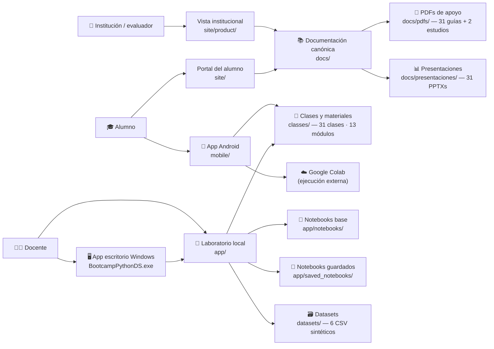
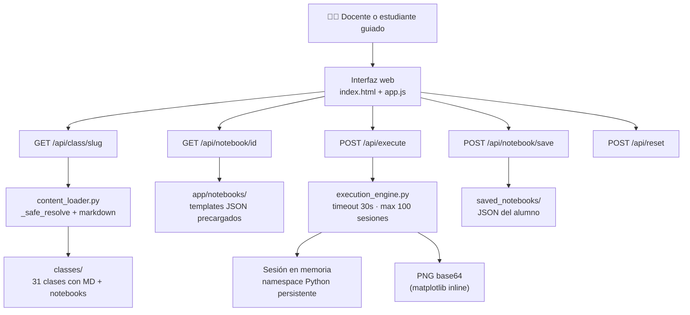
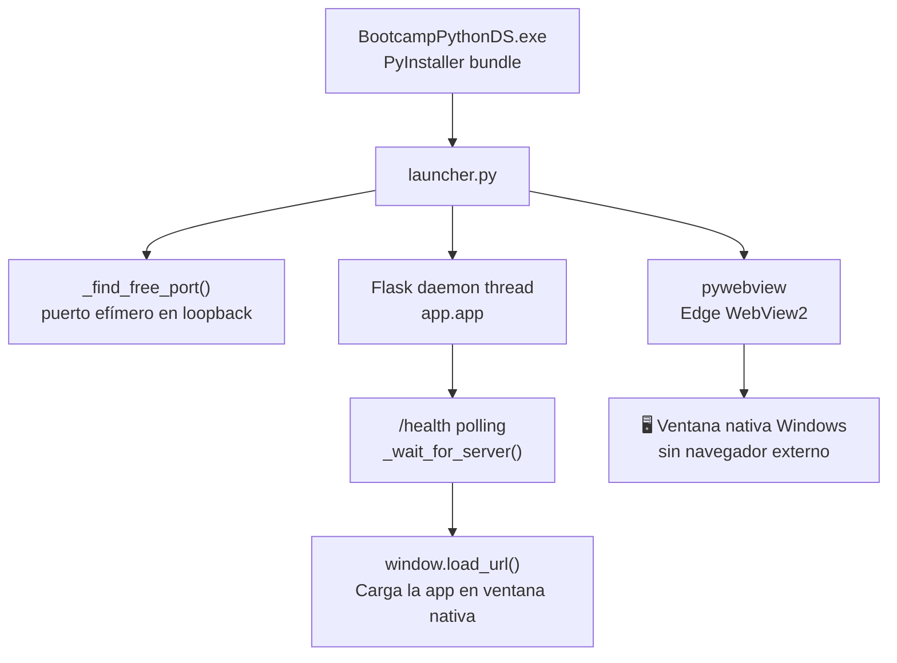
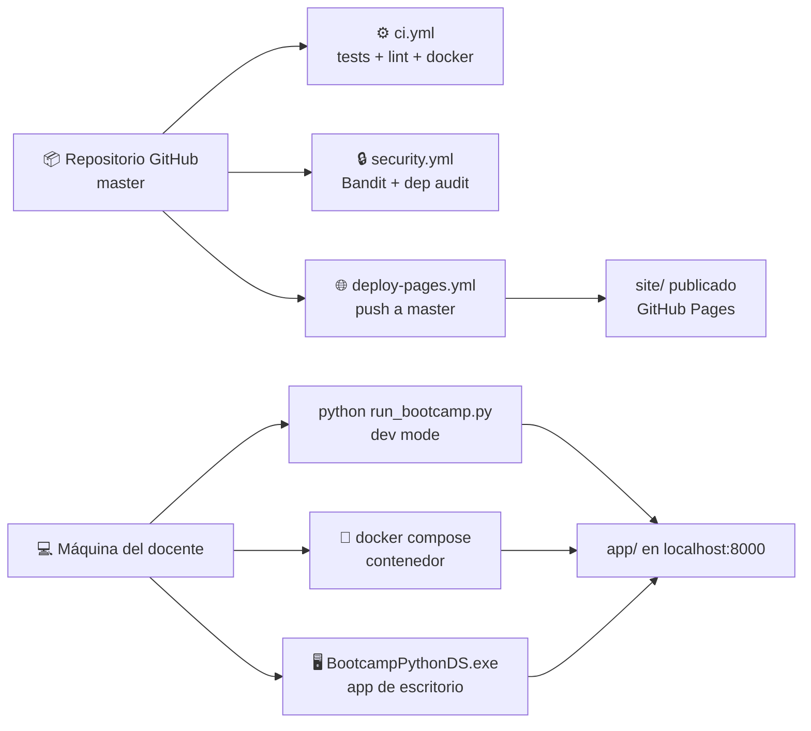

# 🏗️ Arquitectura del producto

> Vista de alto nivel del bootcamp, sus superficies, límites operativos y la relación entre contenido, laboratorio y publicación.

---

## 🔭 Visión general

El producto se organiza en tres capas coordinadas:

- una **capa pedagógica reusable** (`classes/`, `datasets/`) — 31 clases, 6 datasets, 30 notebooks;
- una **capa operativa local** para el laboratorio (`app/`, `launcher.py`, `mobile/`);
- una **capa pública** para alumnos e institución (`site/`, GitHub Pages).

---

## 🗺️ Mapa de alto nivel

---

## 🔬 Flujo funcional del laboratorio

---

## 🖥️ Flujo de la app de escritorio Windows

---

## 🚀 Publicación y despliegue

---

## 🧩 Componentes y responsabilidades

### `app/` — Laboratorio Flask

- renderiza la experiencia local de clase con acceso a las **31 clases**;
- sirve endpoints de clases, notebooks y ejecución (`/api/class/`, `/api/notebook/`, `/api/execute`);
- agrega headers de seguridad y endpoints de salud (`/health`, `/ready`);
- mantiene el motor de ejecución con sesiones, timeout (30 s) y captura de salida.

### `launcher.py` — Ventana nativa Windows

- abre una ventana Edge WebView2 sin navegador del sistema;
- gestiona el ciclo de vida de Flask (arranque, healthcheck, apagado);
- elige un puerto libre automáticamente para evitar conflictos.

### `classes/` — Curriculum modular

Concentra el contenido de las **31 clases** en 13 módulos:

| Módulo | Clases | Temas |
|---|---|---|
| Fundamentos Python | 00–01 | Diagnóstico · Python base |
| Datos con pandas | 02 | Limpieza · transformaciones |
| Visualización base | 03 · 05 | Matplotlib · exploración |
| Estadística descriptiva | 04 | Medidas · distribuciones |
| Texto y fechas | 06 | str · datetime · regex |
| Mini proyecto | 07–08 | Proyecto guiado · presentación |
| Fundamentos DS | 13–14 | ¿Qué es DS? · NumPy |
| Datos extendidos | 15–16 | SQL básico · Seaborn |
| Estadística inferencial | 17 | Hipótesis · p-value · scipy.stats |
| Feature engineering | 18 | Encoding · escala · selección |
| ML supervisado | 09–12 · 19–21 | Intro ML · regresión · árboles · RF · GBM · pipelines |
| ML no supervisado | 22–23 · 27 | Clustering · PCA · anomalías |
| Temas avanzados | 24–30 | Series tiempo · NLP · redes neuronales · ética · despliegue |

Cada clase incluye: `README.md`, `slides.md`, `teoria.md`, `ejercicios.md`, `homework.md`, `notebook.ipynb`, `soluciones.ipynb`, PDF y PPTX.  
Clases 13–30 también incluyen: `preguntas.md`, `tecnologias.md`, `guia-codigo.md`.

### `app/notebooks/` — Labs interactivos

- templates JSON con celdas editables y ejecutables;
- desde Python básico hasta ML con pipelines;
- se guardan en `app/saved_notebooks/` con nombre y fecha.

### `mobile/` — App Android

- Expo/React Native con contenido de las **31 clases** embebido;
- integración con Google Colab para ejecución de código;
- seguimiento de progreso local con AsyncStorage.

### `datasets/` — Datos sintéticos

| Dataset | Uso principal |
|---|---|
| ventas_tienda.csv | clases 01–05 · 07 · 09 · 11 |
| retencion_clientes.csv | clases 03 · 08 · 10 |
| soporte_tickets.csv | clases 02 · 06 |
| transporte.csv | clases 04 · 06 |
| estudiantes.csv | clases 04 · 09 · 10 |
| comentarios_productos.csv | clase 26 (NLP) |

### `site/` — Portales públicos

- `site/`: portal del alumno desplegado en GitHub Pages;
- `site/product/`: vista institucional con narrativa de producto;
- evita que la única entrada pública sea un README técnico.

### `docs/` — Documentación canónica

- ordena la narrativa de producto por audiencias;
- separa operación, seguridad, pedagogía y evaluación;
- **31 PDFs guía-explicativa** en `docs/pdfs/classes/`;
- **31 PPTXs presentación** en `docs/presentaciones/classes/`;
- documentos de proceso de selección en `docs/entrevista/` (histórico);
- notas del maintainer en `docs/maintainer/`.

### `scripts/` — Automatización

| Script | Función |
|---|---|
| `generate_class_docs.py` | genera PDFs y PPTXs para clases 13–30 |
| `generate_class_assets.py` | genera assets por clase |
| `generate_interview_pdfs.py` | regenera PDFs de entrevista |
| `generate_extended_study_pdf.py` | regenera guía ampliada de estudio |
| `generar_pdf_documento.py` | generación genérica de PDFs |
| `rebuild_curriculum.py` | reconstruye estructura del curriculum |

---

## ⚖️ Fronteras importantes

| Frontera | Decisión actual | Motivo |
|---|---|---|
| Portal público vs runner | separados | el alumno no necesita exposición directa al runner |
| Vista institucional vs README | separados pero coherentes | una superficie vende la idea, la otra documenta el repo |
| Laboratorio vs internet abierta | local-first | el runner no está endurecido para exposición externa |
| PDFs vs docs canónicas | PDFs son derivados | la fuente de verdad vive en el repo, no en binarios |
| App de escritorio vs browser | pywebview (Edge WebView2) | evita dependencia del navegador instalado |
| Android vs ejecución nativa | Google Colab como backend | mantiene el APK liviano, sin runtime Python en el dispositivo |

---

## 🧠 Trade-offs conscientes

- se privilegia **claridad pedagógica** por sobre multiusuario endurecido;
- se privilegia **operación local segura** por sobre exposición rápida a internet;
- se privilegia **separación de audiencias** por sobre una sola portada gigantesca;
- se usa pywebview (Edge WebView2) en lugar de Electron para mantener bundle liviano;
- se acepta que la ruta móvil tiene APK debug como v1.0.0 — producción es roadmap.

---

## 🛣️ Camino de evolución

Ver [ROADMAP.md](../ROADMAP.md) para el detalle completo. Las mejoras naturales de la arquitectura son:

1. autenticación básica para modo servidor local de aula;
2. observabilidad mayor si el laboratorio evoluciona a multiusuario;
3. app de escritorio para macOS y Linux (pywebview soporta ambas plataformas);
4. panel de progreso del alumno visible al instructor;
5. build de producción firmado para la app Android.
