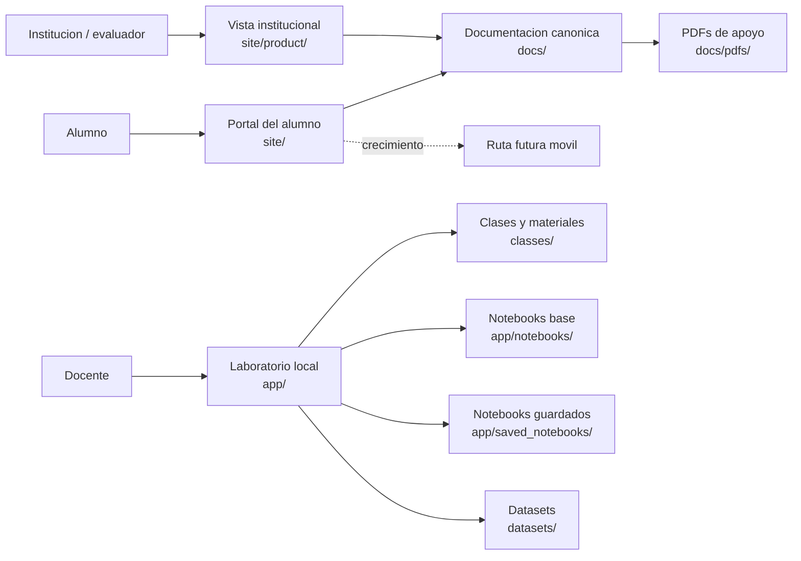
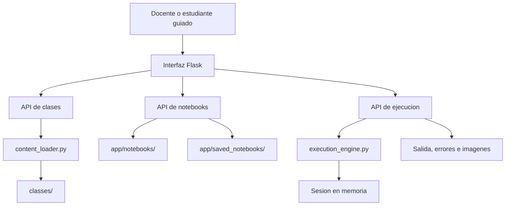
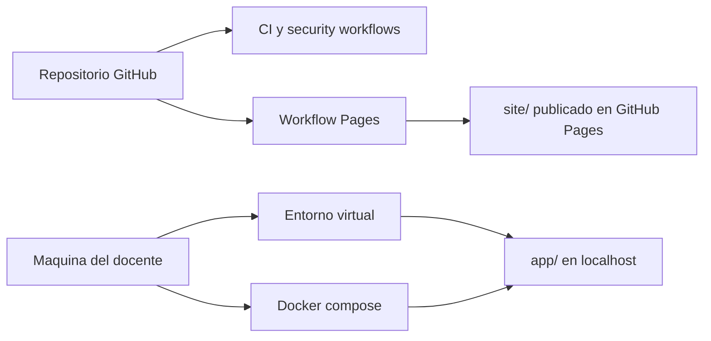

# Arquitectura del producto

> Vista de alto nivel del bootcamp, sus superficies, sus limites operativos y la relacion entre contenido, laboratorio y publicacion.

## Vision general

El producto se organiza en tres capas coordinadas:

- una capa pedagogica reusable;
- una capa operativa local para el laboratorio;
- una capa publica para alumnos e institucion.

## Mapa de alto nivel

## Flujo funcional del laboratorio

## Publicacion y despliegue

## Fronteras importantes

| Frontera | Decision actual | Motivo |
|---|---|---|
| Portal publico vs runner | separados | el alumno no necesita exposicion directa al runner |
| Vista institucional vs README | separados pero coherentes | una superficie vende la idea y la otra documenta el repo |
| Laboratorio vs internet abierta | local-first | el runner no esta endurecido para exposicion externa |
| PDFs vs docs canonicas | derivados | la fuente de verdad debe vivir en el repo |

## Componentes y responsabilidades

### `app/`

- renderiza la experiencia local de clase;
- sirve endpoints de clases, notebooks y ejecucion;
- agrega headers de seguridad y endpoints de salud;
- mantiene el runner como superficie local.

### `classes/`

- concentra el contenido modular de las sesiones;
- deja notebooks, ejercicios, slides y tareas;
- actua como base pedagogica reusable.

### `docs/`

- ordena la narrativa de producto;
- separa audiencias;
- documenta seguridad, operacion, entrevista y estandar.

### `site/`

- publica la superficie del alumno;
- permite crecimiento a una futura experiencia movil;
- evita que la unica entrada publica sea un README tecnico.

### `site/product/`

- presenta el producto como sistema;
- resume alcance, arquitectura, operacion y crecimiento;
- ayuda a evaluadores no tecnicos a entender valor y madurez.

## Trade-offs conscientes

- se privilegia claridad pedagogica por sobre multiusuario endurecido;
- se privilegia operacion local segura por sobre exposicion rapida a internet;
- se privilegia separacion de audiencias por sobre una sola portada gigantesca;
- se acepta que la ruta movil es roadmap y no funcionalidad actual.

## Camino de evolucion

Las mejoras naturales siguientes son:

1. taxonomia aun mas explicita entre cohortes, niveles y variantes de programa;
2. observabilidad mayor si el laboratorio evoluciona a multiusuario;
3. capa movil con seguimiento, progreso y notificaciones;
4. artefactos HTML adicionales para docs ejecutivas fuera del repo.
