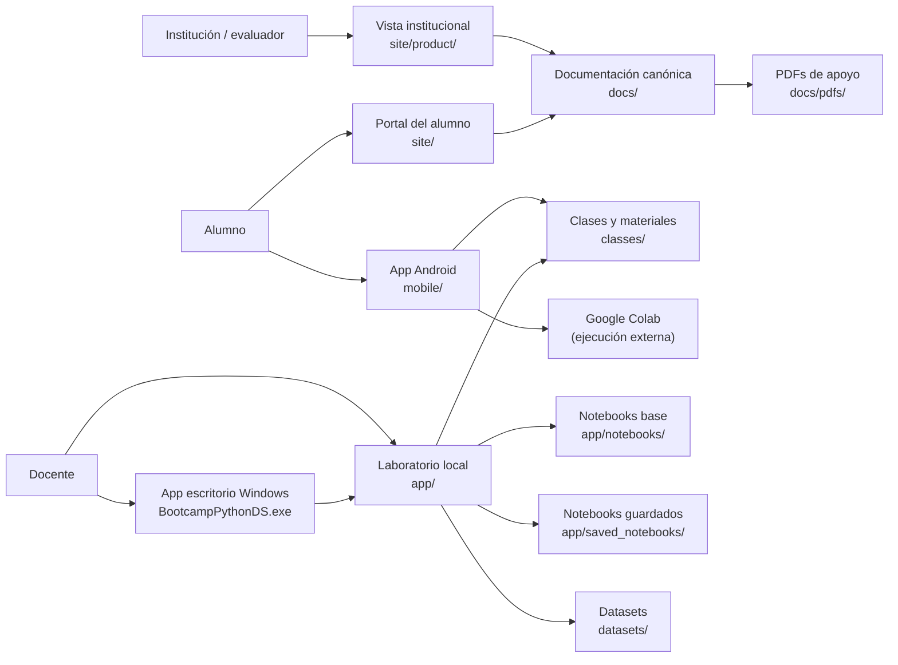
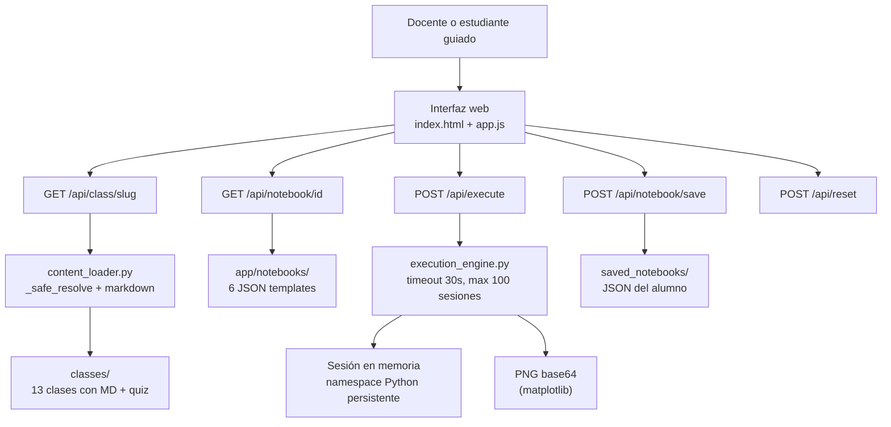
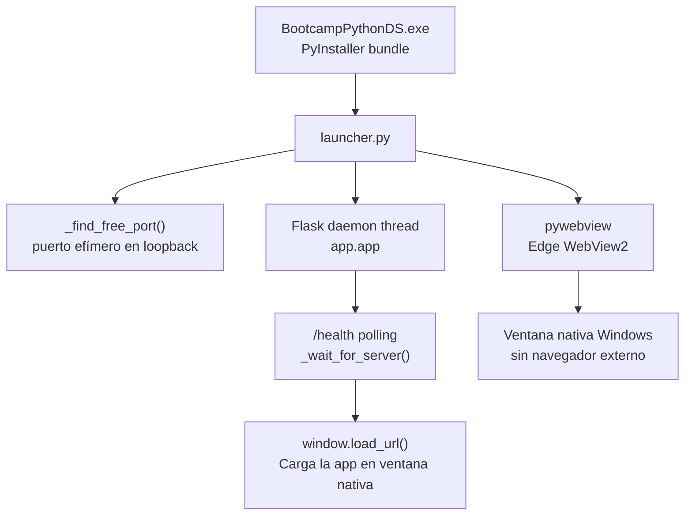
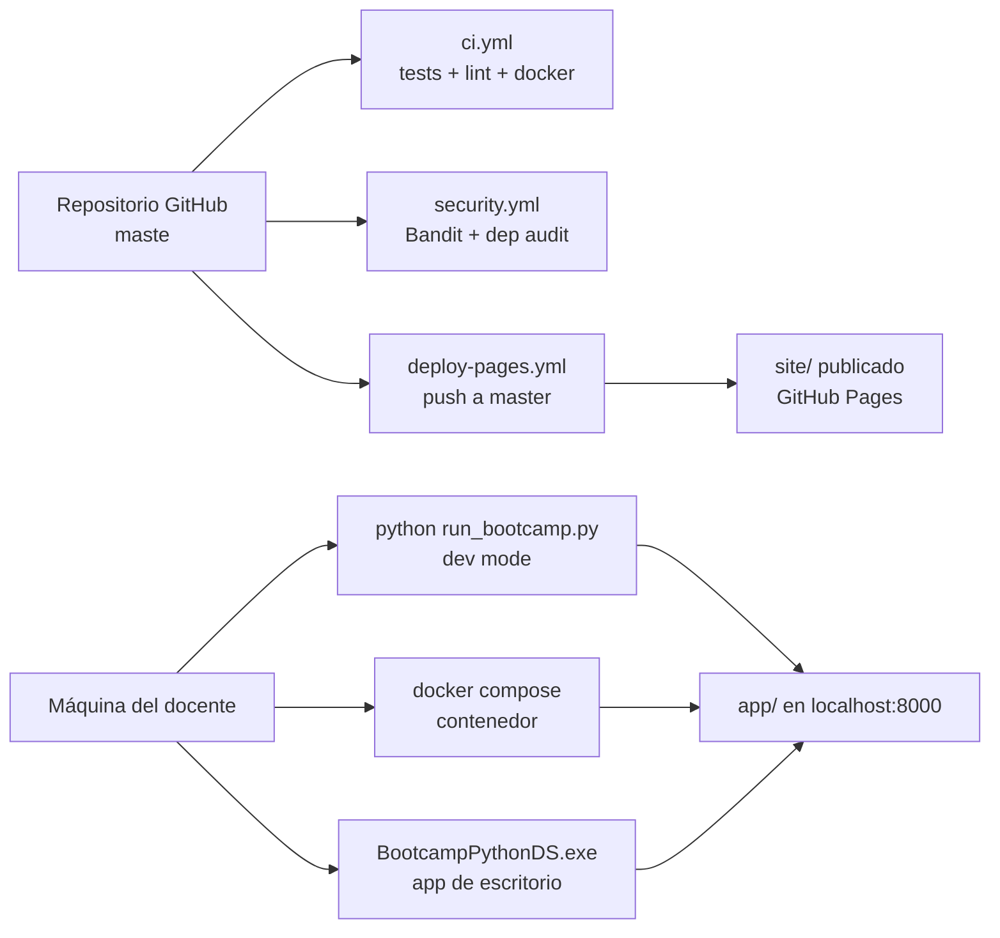

# 🏗️ Arquitectura del producto

> Vista de alto nivel del bootcamp, sus superficies, límites operativos y la relación entre contenido, laboratorio y publicación.

---

## Vision general

El producto se organiza en tres capas coordinadas:

- una **capa pedagógica reusable** (`classes/`, `datasets/`);
- una **capa operativa local** para el laboratorio (`app/`, `launcher.py`, `mobile/`);
- una **capa pública** para alumnos e institución (`site/`, GitHub Pages).

---

## Mapa de alto nivel

---

## Flujo funcional del laboratorio

---

## Flujo de la app de escritorio Windows

---

## Publicación y despliegue

---

## Fronteras importantes

| Frontera | Decisión actual | Motivo |
|---|---|---|
| Portal público vs runner | separados | el alumno no necesita exposición directa al runner |
| Vista institucional vs README | separados pero coherentes | una superficie vende la idea, la otra documenta el repo |
| Laboratorio vs internet abierta | local-first | el runner no está endurecido para exposición externa |
| PDFs vs docs canónicas | PDFs son derivados | la fuente de verdad vive en el repo, no en binarios |
| App de escritorio vs browser | pywebview (nativo) | evita dependencia del navegador instalado, experiencia controlada |
| Android vs ejecución nativa | Google Colab como backend | mantiene el APK liviano, sin runtime Python en el dispositivo |

---

## Componentes y responsabilidades

### `app/` — Laboratorio Flask

- renderiza la experiencia local de clase;
- sirve endpoints de clases, notebooks y ejecución;
- agrega headers de seguridad y endpoints de salud;
- mantiene el motor de ejecución con sesiones, timeout y captura de salida.

### `launcher.py` — Ventana nativa Windows

- abre una ventana Edge WebView2 sin navegador;
- gestiona el ciclo de vida de Flask (arranque, healthcheck, apagado);
- elige un puerto libre automáticamente para evitar conflictos.

### `classes/` — Curriculum modular

- concentra el contenido de las 13 sesiones;
- teoría, slides, ejercicios, tarea, notebook y soluciones por clase;
- clase 00 incluye quiz diagnóstico de 30 preguntas.

### `app/notebooks/` — Labs interactivos

- 6 templates JSON desde básicos Python hasta ML con pipelines;
- cargan en la interfaz web con celdas editables y ejecutables.

### `mobile/` — App Android

- Expo/React Native con contenido de las 12 clases embebido;
- integración con Google Colab para ejecución de código;
- seguimiento de progreso local con AsyncStorage.

### `site/` — Portales públicos

- `site/`: portal del alumno desplegado en GitHub Pages;
- `site/product/`: vista institucional con narrativa de producto;
- evita que la única entrada pública sea un README técnico.

### `docs/` — Documentación canónica

- ordena la narrativa de producto por audiencias;
- separa operación, seguridad, pedagogía y evaluación;
- documentos de entrevista y notas del maintainer en subcarpetas.

---

## Trade-offs conscientes

- se privilegia claridad pedagógica por sobre multiusuario endurecido;
- se privilegia operación local segura por sobre exposición rápida a internet;
- se privilegia separación de audiencias por sobre una sola portada gigantesca;
- se usa pywebview (Edge WebView2) en lugar de Electron para mantener bundle liviano;
- se acepta que la ruta móvil tiene APK debug como v1.0.0, producción es roadmap.

---

## Camino de evolución

Ver [ROADMAP.md](../ROADMAP.md) para el detalle completo. Las mejoras naturales de la arquitectura son:

1. autenticación básica para modo servidor local de aula;
2. observabilidad mayor si el laboratorio evoluciona a multiusuario;
3. app de escritorio para macOS y Linux (pywebview soporta ambas plataformas);
4. panel de progreso del alumno visible al instructor.
