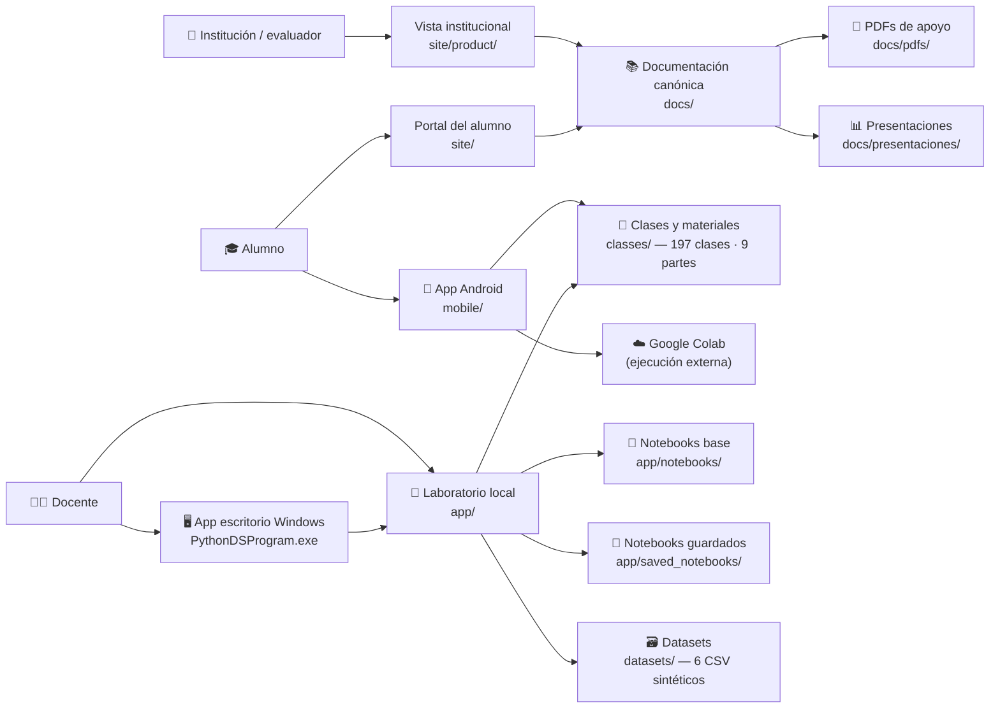
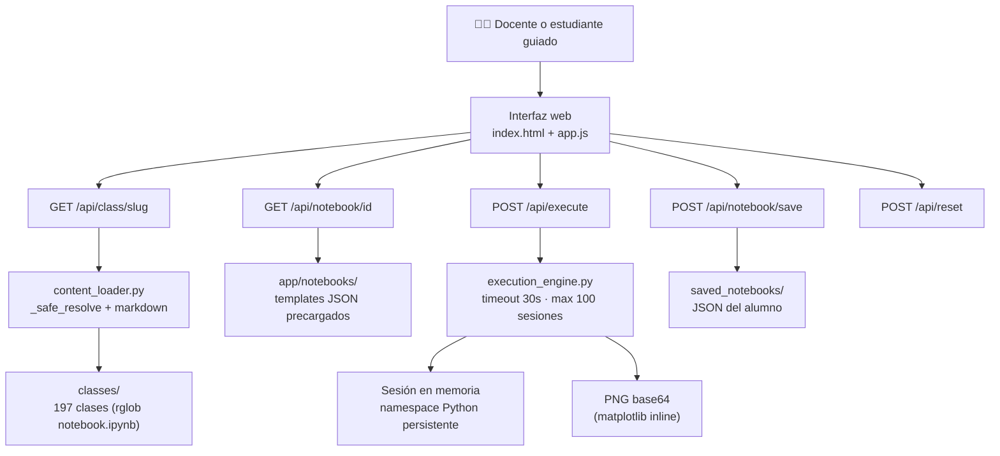
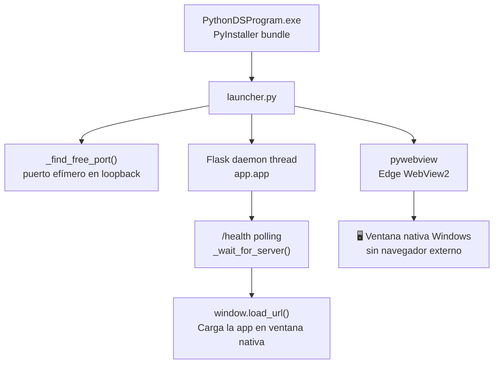
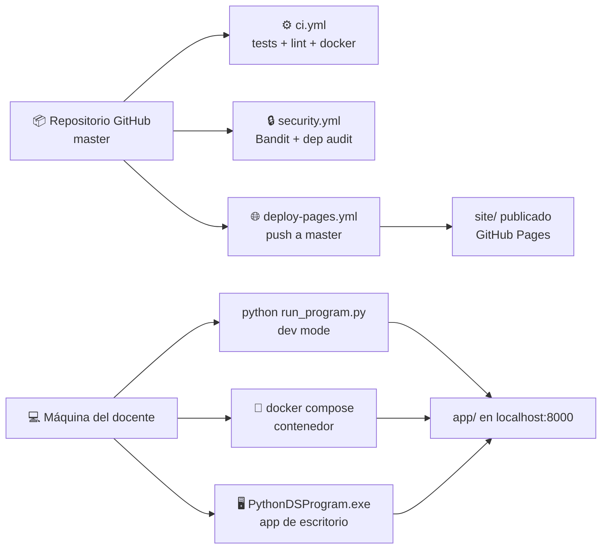

# 🏗️ Arquitectura del producto

> Vista de alto nivel del programa, sus superficies, límites operativos y la relación entre contenido, laboratorio y publicación.

---

## 🔭 Visión general

El producto se organiza en tres capas coordinadas:

- una **capa pedagógica reusable** (`classes/`, `datasets/`) — **197 clases en 9 partes** (scaffold; contenido en desarrollo por bloques);
- una **capa operativa local** para el laboratorio (`app/`, `launcher.py`, `mobile/`);
- una **capa pública** para alumnos e institución (`site/`, GitHub Pages).

---

## 🗺️ Mapa de alto nivel

```mermaid
graph LR
    INST["🏫 Institución / evaluador"] --> PRODUCT["Vista institucional\nsite/product/"]
    ALUM["🎓 Alumno"] --> PORTAL["Portal del alumno\nsite/"]
    ALUM --> MOBILE["📱 App Android\nmobile/"]
    DOC["👩‍🏫 Docente"] --> LAB["🧪 Laboratorio local\napp/"]
    DOC --> WIN["🖥️ App escritorio Windows\nPythonDSProgram.exe"]

    PRODUCT --> DOCS["📚 Documentación canónica\ndocs/"]
    PORTAL --> DOCS
    WIN --> LAB
    MOBILE --> CLASSES["📂 Clases y materiales\nclasses/ — 197 clases · 9 partes"]
    MOBILE --> COLAB["☁️ Google Colab\n(ejecución externa)"]
    LAB --> CLASSES
    LAB --> NOTEBOOKS["📓 Notebooks base\napp/notebooks/"]
    LAB --> SAVED["💾 Notebooks guardados\napp/saved_notebooks/"]
    LAB --> DATA["🗃️ Datasets\ndatasets/ — 6 CSV sintéticos"]
    DOCS --> PDFS["📄 PDFs de apoyo\ndocs/pdfs/"]
    DOCS --> PPTX["📊 Presentaciones\ndocs/presentaciones/"]
```

---

## 🔬 Flujo funcional del laboratorio

```mermaid
graph TD
    USER["👩‍💻 Docente o estudiante guiado"] --> UI["Interfaz web\nindex.html + app.js"]
    UI --> CLASSAPI["GET /api/class/slug"]
    UI --> NBAPI["GET /api/notebook/id"]
    UI --> EXECAPI["POST /api/execute"]
    UI --> SAVEAPI["POST /api/notebook/save"]
    UI --> RESETAPI["POST /api/reset"]

    CLASSAPI --> LOADER["content_loader.py\n_safe_resolve + markdown"]
    LOADER --> CLASSES["classes/\n197 clases (rglob notebook.ipynb)"]
    NBAPI --> TEMPLATES["app/notebooks/\ntemplates JSON precargados"]
    EXECAPI --> ENGINE["execution_engine.py\ntimeout 30s · max 100 sesiones"]
    ENGINE --> SESSION["Sesión en memoria\nnamespace Python persistente"]
    ENGINE --> FIGS["PNG base64\n(matplotlib inline)"]
    SAVEAPI --> SAVED["saved_notebooks/\nJSON del alumno"]
```

---

## 🖥️ Flujo de la app de escritorio Windows

```mermaid
graph TD
    EXE["PythonDSProgram.exe\nPyInstaller bundle"] --> LAUNCHER["launcher.py"]
    LAUNCHER --> PORT["_find_free_port()\npuerto efímero en loopback"]
    LAUNCHER --> FLASK["Flask daemon thread\napp.app"]
    LAUNCHER --> WV["pywebview\nEdge WebView2"]
    FLASK --> HEALTH["/health polling\n_wait_for_server()"]
    HEALTH --> LOAD["window.load_url()\nCarga la app en ventana nativa"]
    WV --> WIN["🖥️ Ventana nativa Windows\nsin navegador externo"]
```

---

## 🚀 Publicación y despliegue

```mermaid
graph LR
    REPO["📦 Repositorio GitHub\nmaster"] --> CI["⚙️ ci.yml\ntests + lint + docker"]
    REPO --> SEC["🔒 security.yml\nBandit + dep audit"]
    REPO --> PAGES["🌐 deploy-pages.yml\npush a master"]
    PAGES --> SITE["site/ publicado\nGitHub Pages"]

    LOCAL["💻 Máquina del docente"] --> VENV["python run_program.py\ndev mode"]
    LOCAL --> DOCKER["🐳 docker compose\ncontenedor"]
    LOCAL --> WINAPP["🖥️ PythonDSProgram.exe\napp de escritorio"]
    VENV --> LAB["app/ en localhost:8000"]
    DOCKER --> LAB
    WINAPP --> LAB
```

---

## 🧩 Componentes y responsabilidades

### `app/` — Laboratorio Flask

- renderiza la experiencia local de clase con acceso a las **197 clases** (descubrimiento por `rglob("notebook.ipynb")`);
- sirve endpoints de clases, notebooks y ejecución (`/api/class/<path:slug>`, `/api/notebook/`, `/api/execute`);
- agrega headers de seguridad y endpoints de salud (`/health`, `/ready`);
- mantiene el motor de ejecución con sesiones, timeout (30 s) y captura de salida.

### `launcher.py` — Ventana nativa Windows

- abre una ventana Edge WebView2 sin navegador del sistema;
- gestiona el ciclo de vida de Flask (arranque, healthcheck, apagado);
- elige un puerto libre automáticamente para evitar conflictos.

### `classes/` — Currículo modular

Concentra el contenido de las **197 clases** en 9 partes. Pauta derivada de Géron (Hands-On ML 3ª ed.), VanderPlas, Huyen, ISLP y Barocas/Hardt/Narayanan.

| Parte | Tema | Clases |
|---|---|---|
| 0 | Prerrequisitos: Python, NumPy, pandas, viz, SQL, NoSQL, APIs | 46 |
| 1 | Machine Learning clásico | 43 |
| 2 | Deep Learning (Keras, TF, CNN, RNN, Transformers, RL, despliegue) | 56 |
| 3 | Estadística inferencial y causal | 13 |
| 4 | MLOps en producción | 14 |
| 5 | Ingeniería de datos | 8 |
| 6 | Sistemas de recomendación | 7 |
| 7 | Ética, fairness, privacidad | 6 |
| 8 | Capstones | 4 |

Layout por clase: `classes/parte-N-slug/NNN-tema-slug/` con `README.md` (ficha) + `notebook.ipynb` (stub). Materiales opcionales (`teoria.md`, `slides.md`, `ejercicios.md`, `homework.md`, `soluciones.ipynb`, `quiz.json`, PDF, PPTX) se añaden cuando una clase madura.

### `app/notebooks/` — Labs interactivos

- templates JSON con celdas editables y ejecutables;
- desde Python básico hasta ML con pipelines;
- se guardan en `app/saved_notebooks/` con nombre y fecha.

### `mobile/` — App Android

- Expo/React Native — **pendiente migrar el contenido embebido al índice actual**;
- integración con Google Colab para ejecución de código;
- seguimiento de progreso local con AsyncStorage.

### `datasets/` — Datos sintéticos

| Dataset | Descripción |
|---|---|
| ventas_tienda.csv | Ventas multitienda con categorías y medios de pago |
| retencion_clientes.csv | Serie mensual de altas, bajas e ingresos |
| soporte_tickets.csv | Tickets por categoría, prioridad y canal |
| transporte.csv | Viajes con origen, destino y retrasos |
| estudiantes.csv | Registro académico con asistencia y evaluaciones |
| comentarios_productos.csv | Reseñas en español con etiqueta de sentimiento |

La asignación dataset → clase se hace al desarrollar el contenido pedagógico de cada clase.

### `site/` — Portales públicos

- `site/`: portal del alumno desplegado en GitHub Pages;
- `site/product/`: vista institucional con narrativa de producto;
- evita que la única entrada pública sea un README técnico.

### `docs/` — Documentación canónica

- ordena la narrativa de producto por audiencias;
- separa operación, seguridad, pedagogía y evaluación;
- PDFs y PPTX por clase en `docs/pdfs/classes/` y `docs/presentaciones/classes/` (se regeneran por bloques al madurar el contenido de cada parte);
- notas del maintainer en `docs/maintainer/`.

### `scripts/` — Automatización

| Script | Función |
|---|---|
| `generate_v2_curriculum.py` | genera la estructura de carpetas + stubs de las 197 clases (idempotente) |
| `generate_class_docs.py` | genera PDFs y PPTXs por clase (pendiente adaptar al recorrido anidado) |
| `generate_class_assets.py` | genera assets por clase (mismo estado) |
| `generate_interview_pdfs.py` | regenera PDFs de entrevista |
| `generate_extended_study_pdf.py` | regenera guía ampliada de estudio |
| `generar_pdf_documento.py` | generación genérica de PDFs |

---

## ⚖️ Fronteras importantes

| Frontera | Decisión actual | Motivo |
|---|---|---|
| Portal público vs runner | separados | el alumno no necesita exposición directa al runner |
| Vista institucional vs README | separados pero coherentes | una superficie vende la idea, la otra documenta el repo |
| Laboratorio vs internet abierta | local-first | el runner no está endurecido para exposición externa |
| PDFs vs docs canónicas | PDFs son derivados | la fuente de verdad vive en el repo, no en binarios |
| App de escritorio vs browser | pywebview (Edge WebView2) | evita dependencia del navegador instalado |
| Android vs ejecución nativa | Google Colab como backend | mantiene el APK liviano, sin runtime Python en el dispositivo |

---

## 🧠 Trade-offs conscientes

- se privilegia **claridad pedagógica** por sobre multiusuario endurecido;
- se privilegia **operación local segura** por sobre exposición rápida a internet;
- se privilegia **separación de audiencias** por sobre una sola portada gigantesca;
- se usa pywebview (Edge WebView2) en lugar de Electron para mantener bundle liviano;
- se acepta que la ruta móvil tiene APK debug — producción es roadmap.

---

## 🛣️ Camino de evolución

Ver [ROADMAP.md](../ROADMAP.md) para el detalle completo. Las mejoras naturales de la arquitectura son:

1. autenticación básica para modo servidor local de aula;
2. observabilidad mayor si el laboratorio evoluciona a multiusuario;
3. app de escritorio para macOS y Linux (pywebview soporta ambas plataformas);
4. panel de progreso del alumno visible al instructor;
5. build de producción firmado para la app Android.
