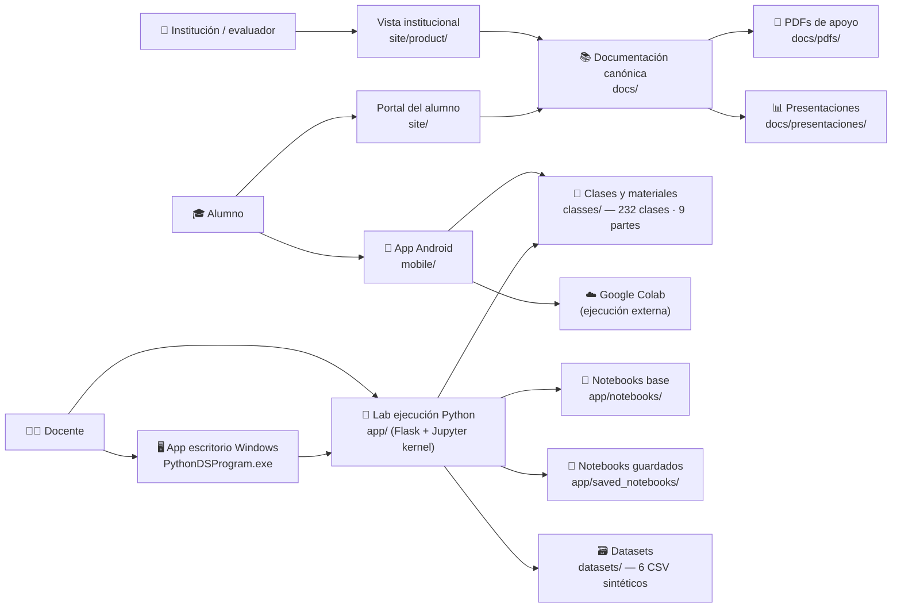
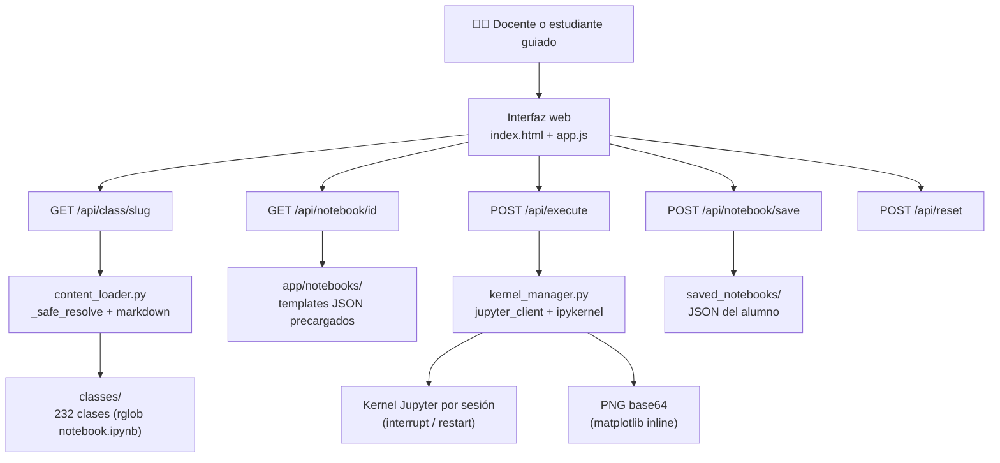
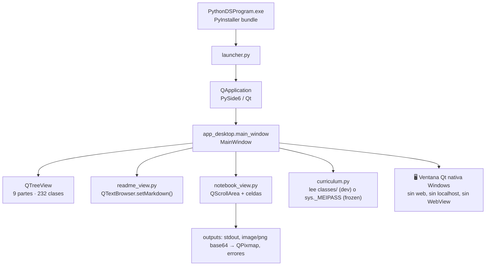
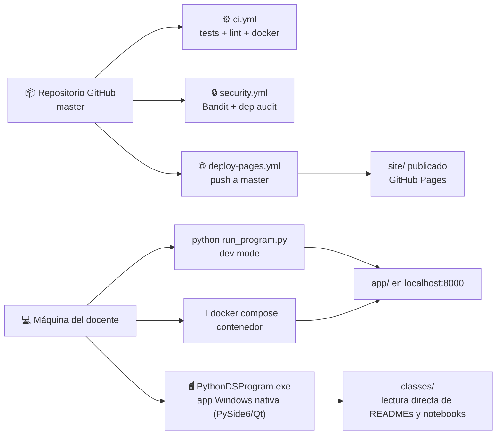

# 🏗️ Arquitectura del producto

### **Vista funcional con diagramas Mermaid de las superficies, capas y fronteras**

> 🗺️ Vista de alto nivel del programa, sus superficies, límites operativos y la relación entre contenido, laboratorio y publicación.

---

## 🔭 Visión general

El producto se organiza en tres capas coordinadas:

- una **capa pedagógica reusable** (`classes/`, `datasets/`) — **232 clases en 9 partes** (v3.8.1, numeración secuencial 001-232; 🎓 **232/232 clases · 232/232 notebooks ejecutables · cobertura 100% real** — el lab con kernel Jupyter ejecuta el 100% del currículo, modernizado 2024-2026 + 35 clases dedicadas a temas modernos + stack completo MLOps + data engineering + recomendadores + ética/fairness/privacidad + 4 capstones integradores tabular/NLP-series/visión/portafolio);
- una **capa operativa local** dividida en dos superficies independientes:
  - **App Windows nativa (PySide6)** — `launcher.py` + `app_desktop/` (Qt puro, sin web, sin localhost, sin WebView); es solo viewer del currículo (READMEs + notebooks con outputs renderizados).
  - **Laboratorio de ejecución Python (Flask + Jupyter kernel)** — `app/` (`python -m app.app`); herramienta separada para EJECUTAR código sobre los notebooks reales del currículo.
  - **App Android** (`mobile/`).
- una **capa pública** para alumnos e institución (`site/`, GitHub Pages).

---

## 🗺️ Mapa de alto nivel

```mermaid
graph LR
    INST["🏫 Institución / evaluador"] --> PRODUCT["Vista institucional\nsite/product/"]
    ALUM["🎓 Alumno"] --> PORTAL["Portal del alumno\nsite/"]
    ALUM --> MOBILE["📱 App Android\nmobile/"]
    DOC["👩‍🏫 Docente"] --> LAB["🧪 Lab ejecución Python\napp/ (Flask + Jupyter kernel)"]
    DOC --> WIN["🖥️ App escritorio Windows\nPythonDSProgram.exe"]

    PRODUCT --> DOCS["📚 Documentación canónica\ndocs/"]
    PORTAL --> DOCS
    WIN --> LAB
    MOBILE --> CLASSES["📂 Clases y materiales\nclasses/ — 232 clases · 9 partes"]
    MOBILE --> COLAB["☁️ Google Colab\n(ejecución externa)"]
    LAB --> CLASSES
    LAB --> NOTEBOOKS["📓 Notebooks base\napp/notebooks/"]
    LAB --> SAVED["💾 Notebooks guardados\napp/saved_notebooks/"]
    LAB --> DATA["🗃️ Datasets\ndatasets/ — 6 CSV sintéticos"]
    DOCS --> PDFS["📄 PDFs de apoyo\ndocs/pdfs/"]
    DOCS --> PPTX["📊 Presentaciones\ndocs/presentaciones/"]
```

---

## 🔬 Flujo funcional del laboratorio

```mermaid
graph TD
    USER["👩‍💻 Docente o estudiante guiado"] --> UI["Interfaz web\nindex.html + app.js"]
    UI --> CLASSAPI["GET /api/class/slug"]
    UI --> NBAPI["GET /api/notebook/id"]
    UI --> EXECAPI["POST /api/execute"]
    UI --> SAVEAPI["POST /api/notebook/save"]
    UI --> RESETAPI["POST /api/reset"]

    CLASSAPI --> LOADER["content_loader.py\n_safe_resolve + markdown"]
    LOADER --> CLASSES["classes/\n232 clases (rglob notebook.ipynb)"]
    NBAPI --> TEMPLATES["app/notebooks/\ntemplates JSON precargados"]
    EXECAPI --> ENGINE["kernel_manager.py\njupyter_client + ipykernel"]
    ENGINE --> SESSION["Kernel Jupyter por sesión\n(interrupt / restart)"]
    ENGINE --> FIGS["PNG base64\n(matplotlib inline)"]
    SAVEAPI --> SAVED["saved_notebooks/\nJSON del alumno"]
```

---

## 🖥️ Flujo de la app Windows nativa (PySide6)

```mermaid
graph TD
    EXE["PythonDSProgram.exe\nPyInstaller bundle"] --> LAUNCHER["launcher.py"]
    LAUNCHER --> QAPP["QApplication\nPySide6 / Qt"]
    QAPP --> MAIN["app_desktop.main_window\nMainWindow"]
    MAIN --> TREE["QTreeView\n9 partes · 232 clases"]
    MAIN --> README["readme_view.py\nQTextBrowser.setMarkdown()"]
    MAIN --> NB["notebook_view.py\nQScrollArea + celdas"]
    MAIN --> CURR["curriculum.py\nlee classes/ (dev) o sys._MEIPASS (frozen)"]
    NB --> OUT["outputs: stdout, image/png base64 → QPixmap, errores"]
    MAIN --> WIN["🖥️ Ventana Qt nativa Windows\nsin web, sin localhost, sin WebView"]
```

---

## 🚀 Publicación y despliegue

```mermaid
graph LR
    REPO["📦 Repositorio GitHub\nmaster"] --> CI["⚙️ ci.yml\ntests + lint + docker"]
    REPO --> SEC["🔒 security.yml\nBandit + dep audit"]
    REPO --> PAGES["🌐 deploy-pages.yml\npush a master"]
    PAGES --> SITE["site/ publicado\nGitHub Pages"]

    LOCAL["💻 Máquina del docente"] --> VENV["python run_program.py\ndev mode"]
    LOCAL --> DOCKER["🐳 docker compose\ncontenedor"]
    LOCAL --> WINAPP["🖥️ PythonDSProgram.exe\napp Windows nativa (PySide6/Qt)"]
    VENV --> LAB["app/ en localhost:8000"]
    DOCKER --> LAB
    WINAPP --> CLASSESDIR["classes/\nlectura directa de READMEs y notebooks"]
```

---

## 🧩 Componentes y responsabilidades

### `app/` — Laboratorio de ejecución Python (Flask shell + kernel Jupyter)

- **Flask shell** (`app/app.py`) sirve la SPA (`app/templates/index.html`) y enruta las API REST;
- **`app/kernel_manager.py`** gestiona kernels Jupyter reales vía `jupyter_client` + `ipykernel` (un kernel por sesión — soporta `execute`, `interrupt`, `restart`);
- **`app/notebook_loader.py`** descubre y lee los `classes/**/notebook.ipynb` reales del currículo (no genera notebooks desde templates) y marca `has_notebook: bool` por clase;
- rutas API: `/api/curriculum`, `/api/notebook/<slug>`, `/api/kernel/start`, `/api/kernel/<id>/execute`, `/api/kernel/<id>/interrupt`, `/api/kernel/<id>/restart`, `DELETE /api/kernel/<id>`;
- headers de seguridad (CSP estricto) + endpoints de salud (`/health`, `/ready`).

### `launcher.py` + `app_desktop/` — App Windows nativa (PySide6 / Qt)

- `launcher.py` arranca directamente `QApplication` y la `MainWindow` de `app_desktop` — **sin Flask, sin Edge WebView2, sin puerto local**;
- `app_desktop/` (8 módulos, ~1000 líneas): `main_window.py` (QMainWindow con QTreeView de las 9 partes + 232 clases, búsqueda en vivo, tabs README/Notebook, toolbar Abrir PDF/PPTX/Carpeta), `readme_view.py` (QTextBrowser con `setMarkdown()`), `notebook_view.py` (QScrollArea con widget por celda — markdown en QTextBrowser, code en QTextEdit oscuro, outputs PNG base64 → QPixmap), `curriculum.py` (adapter que reusa `app.notebook_loader` y funciona en dev y bundle PyInstaller vía `sys._MEIPASS`), `styles.py` (QSS light/dark);
- en el bundle frozen, los botones "Abrir PDF/PPTX" abren la URL raw del repo de GitHub (los PDFs/PPTX no van empaquetados → bundle slim de 274 MB).

### `classes/` — Currículo modular

Concentra el contenido de las **232 clases** en 9 partes (v3.8.1, numeración secuencial 001-232 — 🎓 **232 READMEs pedagógicos · 232 notebooks ejecutables · cobertura 100% real**, todas las clases corren en el laboratorio con kernel Jupyter). Pauta derivada de Géron (Hands-On ML 3ª ed.), VanderPlas, Huyen (Designing ML Systems), ISLP, Barocas/Hardt/Narayanan + Reis & Housley (Data Engineering), Kimball & Ross (Data Warehouse Toolkit), Aggarwal (Recommender Systems) + Suresh-Guttag 2021 (taxonomía sesgos), Hardt-Price-Srebro 2016 (equalized odds), Chouldechova 2017, Kleinberg 2017 (impossibility theorem), Dwork-Roth 2014 (privacidad diferencial), Abadi 2016 (DP-SGD), McMahan 2017 (FedAvg), Reglamentos UE 2016/679 y 2024/1689, Pineau 2021 (reproducibilidad), Mitchell 2019 (model cards), Gebru 2018 (datasheets) + **Capstones (P8)**: Hyndman & Athanasopoulos (Forecasting Principles & Practice 3ª ed.), timm/Lightning/Albumentations (visión transfer learning), MkDocs Material/Quarto (portafolio público) + papers seminales 2002-2026 (Flash Attention, LoRA, DPO, ControlNet, MCP, DoubleML, Synthetic Controls, Koren/Hu para MF, Burke para hybrids, CheckList para behavioral tests).

| Parte | Tema | Clases | Rango |
|---|---|---|---|
| 0 | Prerrequisitos: Python, NumPy, pandas, Polars, Parquet/Arrow/DuckDB, viz, SQL, NoSQL, APIs, async | 49 | 001-049 |
| 1 | Machine Learning clásico | 50 | 050-099 |
| 2 | Deep Learning (Keras, PyTorch+Lightning, CNN, RNN, Transformers, LLMs, multimodal, MCP/agentes, RL, ONNX/JAX, despliegue) | 75 | 100-174 |
| 3 | Estadística inferencial y causal | 19 | 175-193 |
| 4 | MLOps en producción | 14 | 194-207 |
| 5 | Ingeniería de datos | 8 | 208-215 |
| 6 | Sistemas de recomendación | 7 | 216-222 |
| 7 | Ética, fairness, privacidad | 6 | 223-228 |
| 8 | Capstones | 4 | 229-232 |

Layout por clase: `classes/parte-N-slug/NNN-tema-slug/` con `README.md` (ficha pedagógica con **📖 Definiciones**, **⚠️ Errores comunes** y **❓ FAQ** en las 232 clases) + `notebook.ipynb` ejecutable + `clase-NNN-...-guia-explicativa.pdf` + `clase-NNN-...-presentacion.pptx`.

### `app/notebooks/` — Labs interactivos

- templates JSON con celdas editables y ejecutables;
- desde Python básico hasta ML con pipelines;
- se guardan en `app/saved_notebooks/` con nombre y fecha.

### `mobile/` — App Android

- Expo/React Native — **232 clases embebidas**, generadas desde `classes/**/README.md`;
- integración con Google Colab para ejecución de código;
- seguimiento de progreso local con AsyncStorage.

### `datasets/` — Datos sintéticos

| Dataset | Descripción |
|---|---|
| ventas_tienda.csv | Ventas multitienda con categorías y medios de pago |
| retencion_clientes.csv | Serie mensual de altas, bajas e ingresos |
| soporte_tickets.csv | Tickets por categoría, prioridad y canal |
| transporte.csv | Viajes con origen, destino y retrasos |
| estudiantes.csv | Registro académico con asistencia y evaluaciones |
| comentarios_productos.csv | Reseñas en español con etiqueta de sentimiento |

La asignación dataset → clase se hace al desarrollar el contenido pedagógico de cada clase.

### `site/` — Portales públicos

- `site/`: portal del alumno desplegado en GitHub Pages;
- `site/product/`: vista institucional con narrativa de producto;
- evita que la única entrada pública sea un README técnico.

### `docs/` — Documentación canónica

- ordena la narrativa de producto por audiencias;
- separa operación, seguridad, pedagogía y evaluación;
- PDFs y PPTX por clase generados en `docs/pdfs/classes/` y `docs/presentaciones/classes/` (232+232), bundles por parte en `docs/pdfs/parts/` y `docs/presentaciones/parts/` (9+9), y unificados `docs/pdfs/curso-completo.pdf` + `docs/presentaciones/curso-completo.pptx`;
- notas del maintainer en `docs/maintainer/`.

### `scripts/` — Automatización

| Script | Función |
|---|---|
| `generate_v2_curriculum.py` | genera la estructura de carpetas + stubs de las 232 clases (idempotente) |
| `generate_class_assets_v3.py` | genera el PDF y PPTX por clase recorriendo la estructura anidada del currículo |
| `generate_part_bundles.py` | genera los bundles PDF/PPTX por parte (9+9) y los unificados `curso-completo.pdf` / `.pptx` |
| `generate_site_curriculum.py` | regenera `site/clases/` y copia PDFs/PPTX/notebooks a Pages |
| `generate_interview_pdfs.py` | regenera PDFs de entrevista |
| `generate_extended_study_pdf.py` | regenera guía ampliada de estudio |
| `generar_pdf_documento.py` | generación genérica de PDFs |

---

## ⚖️ Fronteras importantes

| Frontera | Decisión actual | Motivo |
|---|---|---|
| Portal público vs runner | separados | el alumno no necesita exposición directa al runner |
| Vista institucional vs README | separados pero coherentes | una superficie vende la idea, la otra documenta el repo |
| Laboratorio vs internet abierta | local-first | el runner no está endurecido para exposición externa |
| PDFs vs docs canónicas | PDFs son derivados | la fuente de verdad vive en el repo, no en binarios |
| App de escritorio vs browser | PySide6 / Qt nativo | sin web, sin localhost, sin WebView — un binario nativo real, no un wrapper de Flask en una ventana de navegador |
| Android vs ejecución nativa | Google Colab como backend | mantiene el APK liviano, sin runtime Python en el dispositivo |

---

## 🧠 Trade-offs conscientes

- se privilegia **claridad pedagógica** por sobre multiusuario endurecido;
- se privilegia **operación local segura** por sobre exposición rápida a internet;
- se privilegia **separación de audiencias** por sobre una sola portada gigantesca;
- se usa PySide6 / Qt nativo en lugar de pywebview o Electron — el binario es una app de escritorio real, sin HTTP local ni motor de navegador embebido;
- se acepta que la ruta móvil tiene APK debug publicado — release firmado de producción es roadmap.

---

## 🛣️ Camino de evolución

Ver [ROADMAP.md](../ROADMAP.md) para el detalle completo. Las mejoras naturales de la arquitectura son:

1. autenticación básica para modo servidor local de aula;
2. observabilidad mayor si el laboratorio evoluciona a multiusuario;
3. app de escritorio para macOS y Linux (PySide6 corre nativo en ambas plataformas);
4. panel de progreso del alumno visible al instructor;
5. build de producción firmado para la app Android.
