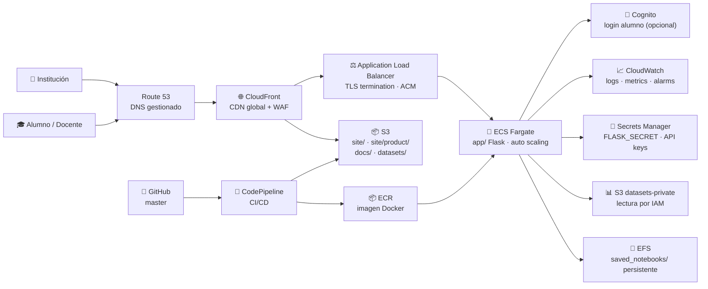
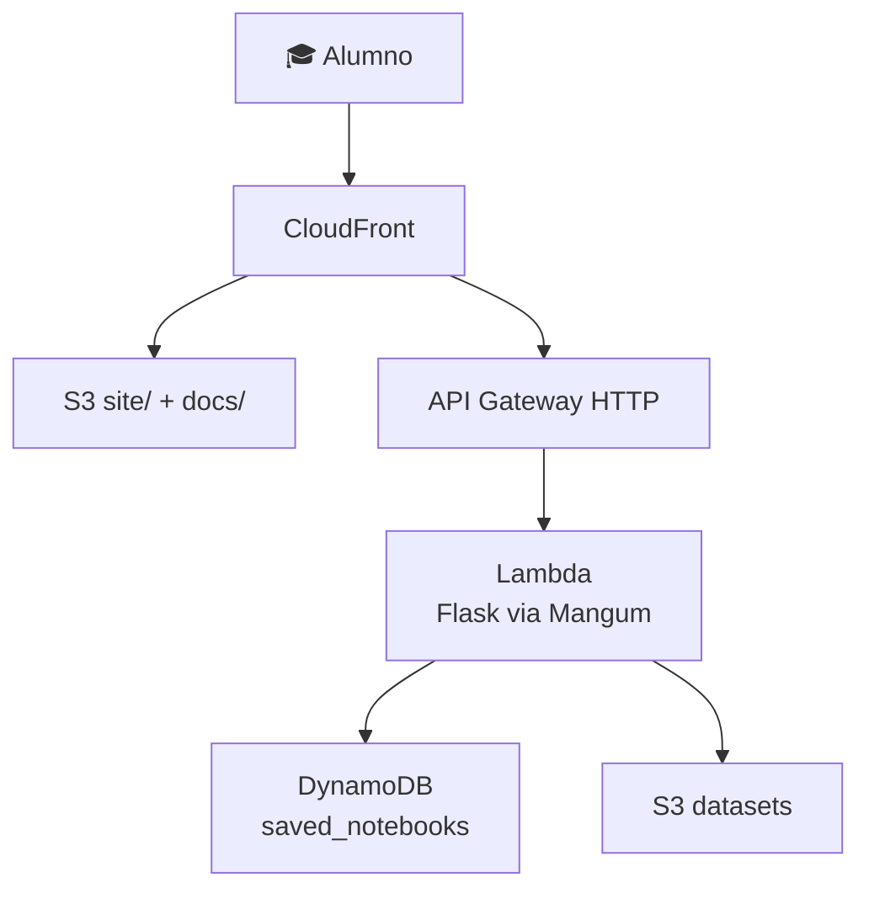
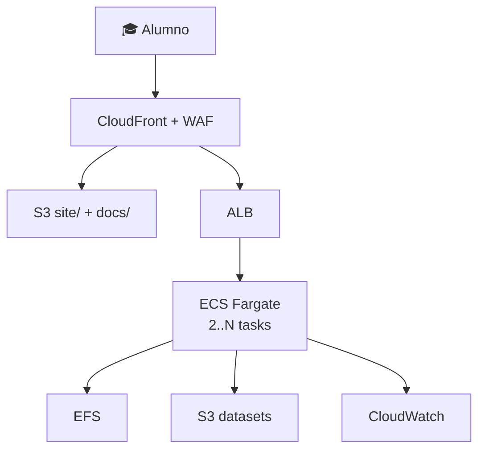
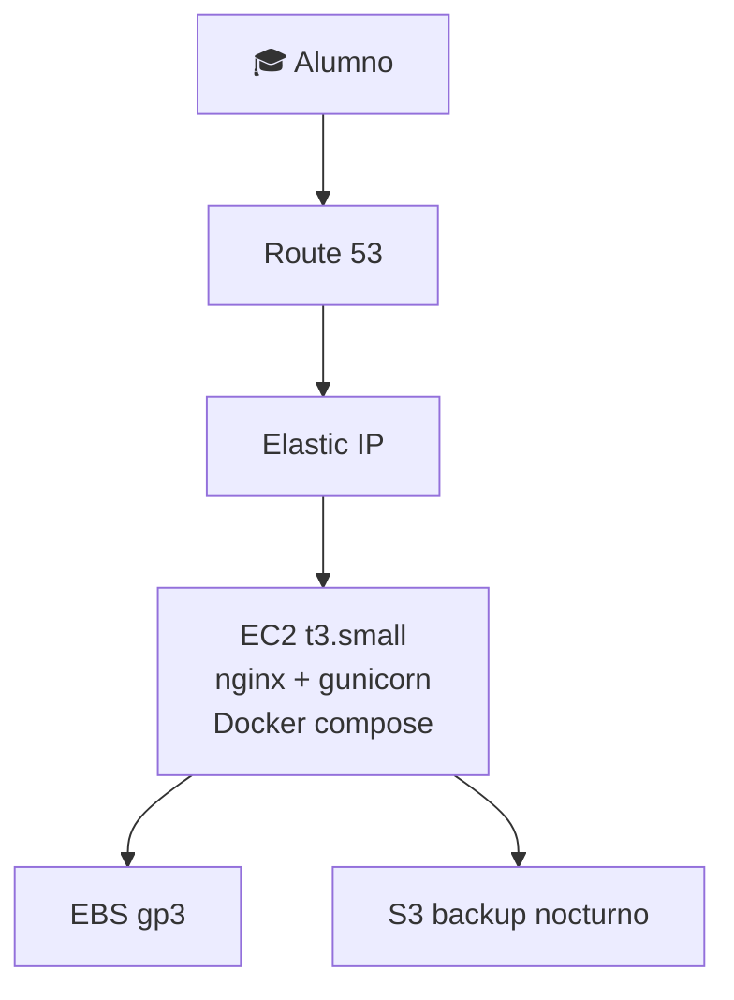
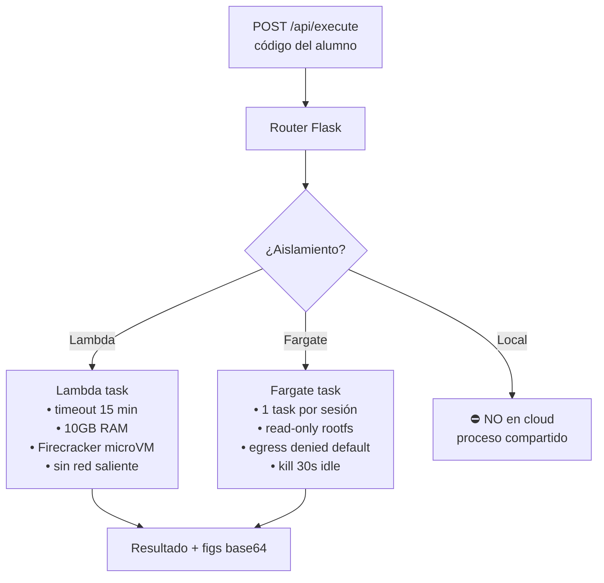
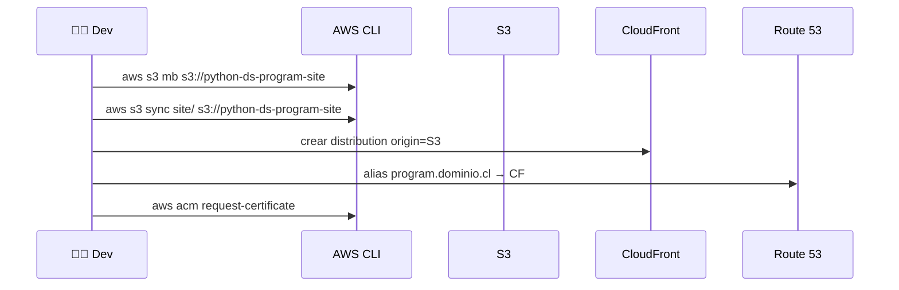

# ☁️ Migración a la nube — AWS

> Análisis profundo y guía operativa para llevar el programa desde el modelo **local-first** (laboratorio Flask + portal estático + apps de distribución) a una arquitectura nativa en **Amazon Web Services**, sin perder la postura de seguridad ni la separación de superficies.

---

## 🎯 Objetivo de este documento

Responder de forma ejecutable cuatro preguntas:

1. ¿Qué partes del repo deben migrarse y cuáles no?
2. ¿Qué tecnologías de AWS resuelven cada superficie y por qué?
3. ¿Cuál es el paso a paso para levantar el ambiente?
4. ¿Cuánto cuesta, qué riesgos hay y cómo se opera?

> Este documento extiende [`docs/despliegue-seguro-y-operacion.md`](despliegue-seguro-y-operacion.md) y [`docs/ARQUITECTURA_PRODUCTO.md`](ARQUITECTURA_PRODUCTO.md). No reemplaza el modelo local: lo complementa.

---

## 🧭 Contexto y postura

El producto hoy se ejecuta **local-first** por una razón explícita en [`SECURITY.md`](../SECURITY.md): el laboratorio (`app/`) ejecuta código Python arbitrario del alumno mediante `execution_engine.py`. Llevarlo a internet abierta sin capas adicionales sería irresponsable.

La migración a AWS no se trata de "subir el repo y listo": se trata de **partir el producto en superficies**, mover cada una a la tecnología adecuada y agregar las capas de aislamiento que la nube exige.

| Superficie | ¿Migrar? | Razón |
|---|---|---|
| Portal del alumno (`site/`) | ✅ Sí | estática, CDN-friendly, alto valor en disponibilidad global |
| Vista institucional (`site/product/`) | ✅ Sí | estática, mismo bucket que portal |
| Documentación (`docs/`, PDFs, PPTX) | ✅ Sí | estática, alto peso, beneficio CDN |
| Datasets (`datasets/`) | ✅ Sí | descargas públicas o privadas |
| Laboratorio Flask (`app/`) | ⚠️ Sí, con sandbox | requiere aislamiento de ejecución |
| App escritorio Windows | ❌ No | distribución por instalador, no necesita nube |
| App Android (`mobile/`) | ⚠️ Parcial | el APK no se aloja, pero el contenido remoto sí |
| Notebooks guardados (`saved_notebooks/`) | ✅ Sí | persistencia por alumno |

---

## 🗺️ Arquitectura objetivo (alto nivel)



---

## 🧱 Mapeo: superficie del repo → servicio AWS

| Superficie / artefacto | Servicio AWS principal | Alternativas | Motivo de la elección |
|---|---|---|---|
| `site/` y `site/product/` (HTML/JS/CSS) | **S3 + CloudFront** | AWS Amplify Hosting | S3+CF es el patrón canónico, barato y con control fino de cache/headers |
| `docs/pdfs/`, `docs/presentaciones/` | **S3 + CloudFront** | mismo bucket, prefijo distinto | objetos grandes — CDN reduce costo de egreso |
| `datasets/` (6 CSV) | **S3** (privado o público) | S3 Object Lambda para anonimizar al vuelo | tamaño chico, lecturas esporádicas |
| Laboratorio Flask (`app/`) | **ECS Fargate + ALB** | App Runner · EKS · Lambda+API Gateway | Fargate da aislamiento por tarea sin gestionar EC2; el código de alumno corre en contenedor efímero |
| Ejecución de código Python del alumno | **Fargate task efímera** o **Lambda + Firecracker** | EC2 con gVisor · Sandbox propio | Firecracker/Fargate dan aislamiento microVM real, no solo proceso |
| `saved_notebooks/` | **EFS** (montado en Fargate) | S3 + tagging por alumno · DynamoDB | EFS preserva la semántica de filesystem que usa hoy `app/` |
| Login de alumno (futuro) | **Cognito User Pools** | IAM Identity Center · Auth0 externo | nativo, integra con ALB y API Gateway |
| DNS y certificados | **Route 53 + ACM** | Cloudflare DNS + ACM | si el dominio no está aún en AWS, se delega NS |
| Secrets (Flask secret key, API keys) | **Secrets Manager** | SSM Parameter Store (más barato) | rotación automática para producción |
| Logs y métricas | **CloudWatch Logs + Metrics + Alarms** | OpenTelemetry → managed Grafana | nativo, sin agente extra |
| CI/CD desde `master` | **CodePipeline + CodeBuild + ECR** | GitHub Actions + OIDC a AWS | OIDC desde GitHub Actions evita guardar credenciales largas |
| Protección perimetral | **AWS WAF + Shield Standard** | CloudFront + WAFv2 reglas managed | bloquea OWASP Top 10 por defecto |
| Email (notificaciones) | **SES** | SNS para push interno | tarifa baja, dominio verificado |

---

## 🧩 Tres arquitecturas candidatas (con tradeoffs)

No hay una única respuesta correcta. Tres caminos viables, en orden creciente de robustez y costo:

### 🅰️ Opción A — **Serverless mínimo** (didáctico, tráfico bajo)



- **Pros:** factura $0 cuando nadie usa el sistema; escalado automático.
- **Contras:** Lambda tiene timeout 15 min (ok para docente, riesgoso para celdas pesadas); cold start; menor aislamiento entre invocaciones.
- **Cuándo elegirla:** demos, evaluación institucional, pilotos con < 50 alumnos no concurrentes.

### 🅱️ Opción B — **Contenedores gestionados** (recomendado por defecto)



- **Pros:** la imagen del [`Dockerfile`](../Dockerfile) ya existente se reutiliza; Fargate aísla cada task; auto scaling por CPU/RPS; estado en EFS si se necesita persistencia.
- **Contras:** costo base mensual aunque haya 0 usuarios (~50 USD).
- **Cuándo elegirla:** producción educativa real, 50–500 alumnos concurrentes, SLA modesto.

### ❓ Opción C — **EC2 + nginx + gunicorn** (el más barato si hay alguien que lo opere)



- **Pros:** ~10 USD/mes con instancia reservada; control total.
- **Contras:** parches, hardening, backups, certificados — todo manual; sin auto scaling.
- **Cuándo elegirla:** prueba de concepto con 1 institución, presupuesto cero, operador con experiencia Linux.

---

## 🔬 Ejecución segura del código del alumno

Esta es la decisión técnica más importante de toda la migración.



**Reglas no negociables al migrar:**

- el contenedor que ejecuta código del alumno **no** comparte proceso con el que sirve la UI;
- el rol IAM del executor **no** tiene permisos sobre S3, RDS, DynamoDB del producto — solo sobre su bucket de scratch;
- security group con egress `deny` a 0.0.0.0/0 (excepto endpoints explícitos);
- timeout duro de 30 segundos en `execution_engine.py` se mantiene, sumado al timeout del runtime;
- CloudWatch alarmas por uso anómalo de CPU > 80% sostenido, indicador de minería o loops maliciosos.

---

## 🪜 Paso a paso — levantar la Opción B (recomendada)

### 0️⃣ Fase 0 — Preparación (1 día)

1. Crear cuenta AWS dedicada al proyecto (no usar la personal).
2. Activar **MFA** en root, crear usuario IAM con rol `Administrator` solo para bootstrap.
3. Configurar **AWS Organizations** con cuenta de billing separada (opcional pero recomendado).
4. Instalar y configurar AWS CLI:
   ```bash
   aws configure
   aws sts get-caller-identity
   ```
5. Definir región principal (`us-east-1` recomendada por costo y servicios disponibles; `sa-east-1` São Paulo si el alumno está en Sudamérica y la latencia importa).

### 1️⃣ Fase 1 — Static hosting (medio día)



Comandos clave:

```bash
# 1. crear bucket privado
aws s3api create-bucket --bucket python-ds-program-site-prod --region us-east-1

# 2. subir contenido estático
aws s3 sync site/ s3://python-ds-program-site-prod/ --delete

# 3. solicitar certificado en us-east-1 (requerido por CloudFront)
aws acm request-certificate --domain-name program.tudominio.cl \
  --validation-method DNS --region us-east-1

# 4. crear distribution (preferible Terraform/CDK; aquí solo el placeholder)
aws cloudfront create-distribution --distribution-config file://cf.json
```

### 2️⃣ Fase 2 — Container del laboratorio (1 día)

```bash
# 1. login en ECR
aws ecr create-repository --repository-name pythonds-program-lab
aws ecr get-login-password | docker login --username AWS \
  --password-stdin <account>.dkr.ecr.us-east-1.amazonaws.com

# 2. build y push (usa el Dockerfile existente)
docker build -t pythonds-program-lab:v2.0.0-scaffold .
docker tag pythonds-program-lab:v2.0.0-scaffold <account>.dkr.ecr.us-east-1.amazonaws.com/pythonds-program-lab:v2.0.0-scaffold
docker push <account>.dkr.ecr.us-east-1.amazonaws.com/pythonds-program-lab:v2.0.0-scaffold
```

### 3️⃣ Fase 3 — ECS Fargate (1 día)

1. Crear cluster ECS Fargate (`python-ds-program-prod`).
2. Definir Task Definition con:
   - imagen ECR de Fase 2;
   - CPU 0.5 vCPU, memoria 1 GB (suficiente para el Flask actual);
   - rol IAM con políticas mínimas (`s3:GetObject` solo en `datasets/`, `secretsmanager:GetSecretValue` para FLASK_SECRET);
   - logs → CloudWatch group `/ecs/pythonds-program-lab`;
   - mount EFS en `/app/saved_notebooks`.
3. Crear Service con 2 tasks mínimo, Auto Scaling target = 70% CPU, max 8 tasks.
4. ALB en frente, target group health check `GET /health` cada 30s.
5. Listener 443 con certificado ACM, redirección de 80 a 443.

### 4️⃣ Fase 4 — DNS y CDN unificado (medio día)

- En CloudFront agregar segundo origin = ALB con path pattern `/api/*` y `/run/*`.
- Origin del path `/*` (default) sigue siendo S3.
- Comportamiento: `/api/*` con cache deshabilitado, forward de cookies y headers; `/*` con cache largo (1 año) e invalidación por deploy.

### ⚙️ Fase 5 — CI/CD (medio día)

Recomendación: **GitHub Actions con OIDC hacia AWS** (sin almacenar Access Keys).

```yaml
# .github/workflows/deploy-aws.yml (esqueleto)
name: Deploy AWS
on:
  push:
    branches: [master]
permissions:
  id-token: write
  contents: read
jobs:
  deploy:
    runs-on: ubuntu-latest
    steps:
      - uses: actions/checkout@v4
      - uses: aws-actions/configure-aws-credentials@v4
        with:
          role-to-assume: arn:aws:iam::<account>:role/GitHubDeployProgram
          aws-region: us-east-1
      - name: Sync site
        run: aws s3 sync site/ s3://python-ds-program-site-prod/ --delete
      - name: Invalidate CloudFront
        run: aws cloudfront create-invalidation --distribution-id $CF_ID --paths "/*"
      - name: Build & push container
        run: |
          docker build -t pythonds-program-lab .
          docker tag pythonds-program-lab:latest $ECR_URI:${{ github.sha }}
          docker push $ECR_URI:${{ github.sha }}
      - name: Update ECS service
        run: aws ecs update-service --cluster python-ds-program-prod --service lab --force-new-deployment
```

### 6️⃣ Fase 6 — Hardening (continuo)

- Activar **GuardDuty** ($ por GB analizado, ~5 USD/mes en este tamaño).
- Activar **AWS Config** con reglas managed (`s3-bucket-public-read-prohibited`, `iam-root-access-key-check`).
- WAF managed rule groups: `AWSManagedRulesCommonRuleSet`, `AWSManagedRulesKnownBadInputsRuleSet`.
- Tag de costos por superficie: `Project=python-ds-program`, `Surface=lab|site|docs`.
- Budgets alert al 50%, 80%, 100% del límite mensual.

---

## 💰 Costos estimados (USD / mes)

> Estimaciones a precio público en `us-east-1`, sin tier gratuito, redondeadas hacia arriba. La realidad oscila ±20%.

### 🎓 Escenario "demo institucional" — 50 alumnos / mes, no concurrentes

| Concepto | Servicio | Costo aprox. |
|---|---|---|
| Hosting estático | S3 (5 GB) + CloudFront (10 GB egress) | 2 |
| Laboratorio | Fargate 2 tasks × 0.5 vCPU × 720 h | 18 |
| ALB | 1 ALB + LCU bajos | 18 |
| EFS | 1 GB Standard | 0.30 |
| Route 53 | 1 zona + queries | 0.60 |
| ACM | gratis | 0 |
| CloudWatch | logs ingest 1 GB | 0.50 |
| Secrets Manager | 2 secrets | 0.80 |
| WAF | rules managed | 6 |
| **Subtotal Opción B** | | **~46 USD** |
| Misma carga en Opción A (serverless) | | **~5 USD** |
| Misma carga en Opción C (EC2 t3.small reservada) | | **~12 USD** |

### 🎓 Escenario "operación educativa" — 300 alumnos, picos concurrentes 30

| Concepto | Servicio | Costo aprox. |
|---|---|---|
| S3 + CloudFront (50 GB egress, descargas de PDFs) | | 8 |
| Fargate 2..6 tasks variable | | 60 |
| ALB + LCU medio | | 25 |
| EFS 10 GB + IO | | 5 |
| Route 53, ACM, Secrets | | 2 |
| CloudWatch + GuardDuty + Config | | 18 |
| WAF | | 8 |
| Egress total estimado | | 12 |
| **Total mensual aprox.** | | **~140 USD** |

### 🅰️ Escenario "demo cero usuarios" — Opción A serverless

- S3 + CloudFront sin tráfico: **< 1 USD**
- Lambda cero invocaciones: **0 USD**
- API Gateway sin tráfico: **0 USD**
- DynamoDB on-demand sin tráfico: **0 USD**
- **Total: < 1 USD/mes** mientras el sitio no se usa.

> 💡 **Truco de costos:** mantener el **portal estático en Opción A (S3+CF)** y solo levantar el laboratorio Fargate en horario de clase con un schedule (`cron` que escala el service a 0 fuera del horario). Reduce ~60% del costo del lab.

---

## 🔐 Postura de seguridad

| Riesgo | Control |
|---|---|
| Ejecución arbitraria de código del alumno | aislamiento por task Fargate, IAM mínimo, egress denied, timeout duro |
| Exposición de buckets | bucket policy `aws:SecureTransport=true`, Block Public Access, OAC desde CloudFront |
| Secrets en código | Secrets Manager + IAM, prohibido `.env` en imagen |
| Acceso indebido a la consola | MFA obligatorio, IAM Identity Center, sin Access Keys de larga duración |
| Inyección y ataques web | WAF con managed rules + rate limit por IP |
| Pérdida de datos | versionado en S3, backups EFS (AWS Backup) cada 24 h, retención 30 días |
| Costos descontrolados | Budgets + alarmas + Cost Anomaly Detection |
| Logs manipulados | CloudTrail multi-región a bucket separado con MFA Delete |

> Esta sección es complementaria a [`SECURITY.md`](../SECURITY.md). En la nube los riesgos no desaparecen — cambian de forma.

---

## 🚦 Operación día a día

| Tarea | Frecuencia | Herramienta |
|---|---|---|
| Deploy de cambios en `master` | por push | GitHub Actions OIDC |
| Smoke check `GET /health` | cada 30s | ALB target group |
| Revisión de logs de error | diaria | CloudWatch Logs Insights |
| Revisión de costos | semanal | Cost Explorer + Budgets |
| Patch del contenedor base | mensual | rebuild Dockerfile + push |
| Rotación de secrets | trimestral | Secrets Manager rotation |
| Restore drill (probar backup) | trimestral | AWS Backup → restore en cuenta dev |

---

## 🧨 Plan de rollback

Cada superficie tiene su mecanismo:

- **Sitio estático:** S3 está versionado. `aws s3api list-object-versions` + `restore-object-version` revierte HTML/CSS en segundos.
- **Laboratorio:** ECS conserva las últimas 10 task definitions. `aws ecs update-service --task-definition <previous>` revierte sin downtime.
- **DNS:** Route 53 con TTL 60s permite cambiar el alias en <2 minutos.
- **Datos del alumno:** AWS Backup con restore point-in-time de EFS.

> Regla: **nunca** se promueve a `master` sin haber probado el rollback en cuenta dev al menos una vez por release mayor.

---

## ❓ Preguntas frecuentes

**¿Por qué no Heroku, Render, Fly.io o Railway?**  
Son válidas para el laboratorio, pero el repo combina contenido estático masivo (PDFs, PPTXs), datasets, y la posibilidad futura de SageMaker/Bedrock para extender el módulo de ML. AWS unifica todo bajo una sola cuenta y un solo modelo de IAM.

**¿Y Google Cloud o Azure?**  
Equivalencias directas existen (Cloud Run ↔ Fargate, Cloud Storage ↔ S3, Vertex AI ↔ SageMaker). La elección de AWS aquí es por madurez de servicios educativos y por la integración con SES, Cognito y WAF en una sola región.

**¿Esto reemplaza la app de escritorio Windows?**  
No. La app Windows seguirá existiendo para aulas sin internet. La nube es para alumnos remotos, instituciones que prefieren web, y para evaluación abierta del producto.

**¿El APK Android se publica desde S3?**  
Se puede alojar el `.apk` en S3 + CloudFront para distribución directa, pero la ruta recomendada sigue siendo Play Store (cuando se publique). El contenido remoto que la app consume sí vive en S3+CloudFront.

**¿Cuánto tarda toda la migración?**  
Opción B completa: **3 a 5 días de trabajo enfocado** para un dev con experiencia AWS media. Sumar 1–2 semanas para hardening, observabilidad fina y pruebas de carga.

---

## 📚 Lecturas y referencias

- AWS Well-Architected Framework — pilares de operación, seguridad, confiabilidad, eficiencia, costo, sostenibilidad.
- [`docs/despliegue-seguro-y-operacion.md`](despliegue-seguro-y-operacion.md) — el modelo de despliegue actual del que esta migración parte.
- [`docs/ARQUITECTURA_PRODUCTO.md`](ARQUITECTURA_PRODUCTO.md) — superficies actuales y sus límites.
- [`SECURITY.md`](../SECURITY.md) — riesgos aceptados que la nube tiene que reabrir.
- [`RUNBOOK.md`](../RUNBOOK.md) — operación local que esta guía traduce a AWS.

---

## 🧭 Idea fuerza

Migrar a AWS no es un fin: es una **opción de distribución** que se justifica solo si hay alumnos remotos, evaluación institucional abierta o necesidad de escala. El producto sigue siendo el mismo — lo que cambia es el sustrato. La arquitectura propuesta preserva la separación de superficies y la postura de seguridad que ya define al repo, y agrega lo único que la nube exige: aislamiento estricto del código que se ejecuta en nombre del alumno.
