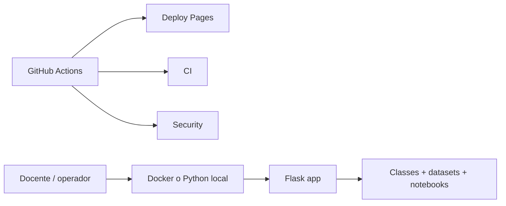

# Despliegue seguro y operacion del bootcamp

Documento de postura tecnica para explicar como se opera este repositorio hoy, que controles existen, que CI/CD ya esta disponible y que cambios harian falta para escenarios mas expuestos.

## 1. Postura actual

Este proyecto esta preparado para:

- laboratorio local;
- demostracion docente;
- revision institucional;
- despliegue de la capa publica estatica por GitHub Pages.

Este proyecto no debe venderse hoy como plataforma multiusuario expuesta a internet abierta. El runner de codigo sigue siendo una superficie local y controlada.

## 2. Modelos de despliegue

| Perfil | Superficie | Estado actual | Riesgo |
|---|---|---|---|
| local de aula | `app/` + `classes/` | recomendado | bajo si se usa en red controlada |
| publico estatico | `site/` | operativo por Pages | bajo |
| demo compartida endurecida | contenedor + proxy + auth | posible, no integrada aun | medio |
| internet abierta con runner | no recomendado hoy | fuera de alcance | alto |

## 3. Arquitectura operativa



## 4. Controles actuales

### Aplicacion

- validacion de slugs e identificadores;
- proteccion contra path traversal;
- limite de tamano de payload;
- limite de longitud de codigo;
- timeout de ejecucion;
- control y rotacion de sesiones;
- headers HTTP de seguridad;
- endpoints `GET /health` y `GET /ready`.

### Operacion local

- host y puerto configurables por entorno;
- `docker-compose.yml` enlazado a `127.0.0.1`;
- `docker-compose.prod.yml` con healthcheck y reinicio;
- volumen separado para notebooks guardados.

### Pipeline

- `ci.yml`: lint, tests y build de imagen;
- `security.yml`: `pip-audit` y `bandit`;
- `deploy-pages.yml`: publicacion del portal del alumno.

## 5. Quickstart operativo recomendado

### Python nativo

```powershell
$env:BOOTCAMP_HOST="127.0.0.1"
$env:BOOTCAMP_PORT="8000"
python run_bootcamp.py
```

### Docker local

```powershell
docker compose up --build
```

### Perfil mas serio con healthcheck

```powershell
docker compose -f docker-compose.prod.yml up -d --build
```

La aplicacion queda disponible en `http://127.0.0.1:8000`.

## 6. Checklist de preapertura

Antes de mostrar el producto o correr una clase:

1. verificar `pytest`;
2. verificar `ruff check .`;
3. abrir `GET /health`;
4. revisar que carguen una clase y un notebook;
5. comprobar que Pages o la vista estatica sigan publicando bien.

## 7. CI/CD ya disponible

Esto ya existe en el repo y no es teorico:

- pruebas automaticas en `push` y `pull_request`;
- lint con Ruff;
- build de imagen Docker en CI;
- escaneo de seguridad recurrente;
- despliegue de la landing del alumno por GitHub Pages.

Eso no equivale a una plataforma enterprise. Pero si demuestra disciplina de entrega y criterio de operacion.

## 8. Gaps conscientes hacia una exposicion mayor

| Necesidad | Estado |
|---|---|
| TLS terminado en proxy | pendiente |
| autenticacion de usuarios | pendiente |
| rate limiting | pendiente |
| observabilidad centralizada | pendiente |
| manejo formal de secretos | parcial por entorno, no completo |
| aislamiento fuerte del runner | pendiente |

## 9. Postura heredada del resto del portafolio

El patron consistente en tus repos fuertes se mantiene aqui:

- separar demo de operacion real;
- defaults locales por seguridad;
- dejar explicitos los limites actuales;
- documentar hardening en vez de vender humo;
- usar CI/CD como evidencia de criterio y no como adorno.

## 10. Si hubiera que exponerlo fuera de localhost

No hacerlo en directo. La secuencia responsable seria:

1. poner reverse proxy con TLS;
2. aislar el runner o deshabilitarlo segun escenario;
3. agregar autenticacion;
4. aplicar rate limit;
5. definir logs, monitoreo y retencion;
6. separar entorno demo de entorno de uso real.

## 11. Preguntas de seguridad que debes poder responder

- por que el runner no debe exponerse a internet abierta;
- que controles existen hoy y cuales no;
- que diferencia hay entre portal publico y backend local;
- por que GitHub Pages si puede ser publico mientras el runner no.

## 12. Regla final

La madurez tecnica de este repo no se demuestra fingiendo que todo esta listo para produccion. Se demuestra mostrando una base operativa, un pipeline visible y una frontera de seguridad bien comunicada.

## 13. Relacion con otros documentos

- [../SECURITY.md](../SECURITY.md)
- [../RUNBOOK.md](../RUNBOOK.md)
- [ARQUITECTURA_PRODUCTO.md](ARQUITECTURA_PRODUCTO.md)
- [portal-estudiante-y-app-movil.md](portal-estudiante-y-app-movil.md)
