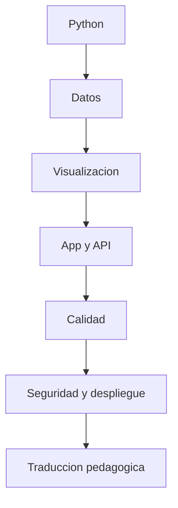

# 🧪 Preparación para desafío técnico

Guía integral para preparar el desafío técnico sin caer en la trampa de querer demostrar complejidad por encima de criterio. Este documento cruza contenido técnico, explicación, despliegue, seguridad y transferencia pedagógica.

## 1. Regla principal

En este tipo de desafío vale más:

- claridad;
- buen alcance;
- validación;
- explicación;
- decisiones defendibles.

Vale menos:

- complejidad innecesaria;
- sobreingenieria;
- mostrar demasiadas herramientas a la vez;
- una solución brillante pero dificil de sostener.

## 2. Mapa de dominios que debes manejar

## 3. Contenido técnico base

### Python

- tipos, listas, diccionarios y tuplas;
- condicionales, bucles y funciones;
- comprensiones;
- manejo de errores;
- imports y módulos;
- legibilidad, nombres y descomposicion.

### Análisis de datos

- `pandas.read_csv`;
- `head`, `info`, `describe`;
- seleccion y filtro de columnas;
- nulos y limpieza básica;
- `groupby`, agregaciones y ordenamiento;
- columnas derivadas;
- interpretacion de resultados.

### Visualización

- barras, líneas y dispersion;
- eleccion de gráfico según pregunta;
- legibilidad de ejes y títulos;
- lectura de patrones;
- explicación de hallazgos.

### Estadistica descriptiva

- media, mediana, conteo, porcentaje;
- distribucion simple;
- outliers básicos;
- diferencia entre descripcion y causalidad.

### Machine learning introductorio

Aunque la V1 no dependa de eso, conviene manejar:

- diferencia entre regresion y clasificacion;
- train/test split;
- features y target;
- overfitting básico;
- metricas simples;
- cuando no conviene usar ML.

## 4. Desarrollo de aplicaciones y APIs

Debes poder explicar:

- estructura minima de una app Flask;
- rutas GET y POST;
- `request`, `jsonify` y validaciónes;
- separacion entre contenido, lógica y ejecución;
- manejo de errores y códigos HTTP;
- por que `health` y `ready` ayudan a operar.

## 5. Calidad, pruebas y disciplina de entrega

En este repo ya existe una base visible. Debes poder hablar de:

- `pytest` como validación funcional;
- `ruff` para consistencia y calidad;
- GitHub Actions para CI;
- Docker build como verificacion de empaque.

Si te piden un cambio, la respuesta fuerte no es solo escribir código. Es mostrar como verificaste que no rompiste lo existente.

## 6. Seguridad y despliegue

### Lo minimo que debes manejar

- no exponer la app a internet por defecto;
- usar `127.0.0.1` como postura segura para local;
- validar payloads y entradas;
- bloquear path traversal;
- limitar longitud de código;
- usar timeouts en ejecución;
- mantener secretos fuera del repo;
- distinguir Pages público de runner local.

### Pregunta que puede aparecer

"Si esto creciera, ¿qué haría falta?"

Respuesta esperable:

- reverse proxy con TLS;
- autenticacion;
- rate limit;
- observabilidad;
- mejor aislamiento del runner;
- politicas de despliegue más estrictas.

## 7. Casos que podrían pedirte

| Tipo de desafío | Qué podría incluir | Qué debes mostrar |
|---|---|---|
| bugfix | corregir una función o ruta | reproduccion, fix y verificacion |
| ejercicio de datos | cargar CSV, limpiar y responder preguntas | orden de pasos e interpretacion |
| mejora de backend | agregar validación, endpoint o capa | alcance acotado y criterio de riesgo |
| revision de despliegue | Docker, CI o seguridad | diferencia entre local, demo y produccion |
| aterrizaje pedagógico | convertir solución en actividad | objetivo, secuencia y apoyo al estudiante |

## 8. Preguntas marco que debes poder contestar

### "¿Por qué elegiste esta solución?"

"Porque resuelve bien el problema real con una base clara, verificable y mantenible. Si el contexto despues pide más complejidad, la escalo sobre una solución sana."

### "¿Por qué no usaste algo más avanzado?"

"Porque primero quise asegurar una solución correcta y entendible. La complejidad adicional solo vale si agrega valor real."

### "¿Cómo lo enseñarías?"

"Lo dividiria en objetivo visible, ejemplo guiado, práctica corta y cierre con interpretacion."

### "¿Qué riesgo ves aquí?"

"El principal riesgo es confundir una demo local con una aplicacion lista para internet abierta. Si esto se expusiera más, pisaria primero proxy, TLS, auth y límites."

## 9. Checklist antes de entregar cualquier desafío

1. entender el objetivo exacto;
2. aclarar supuestos si hay ambiguedad;
3. definir el minimo correcto;
4. implementar con orden;
5. validar;
6. explicar tradeoffs y límites.

## 10. Entrenamiento recomendado para hoy

- resolver un CSV simple de principio a fin;
- explicar `pandas` en voz alta como si fuera una clase;
- practicar un bugfix pequeno y validar con tests;
- revisar endpoints, seguridad y despliegue del repo;
- ensayar el argumento de valor frente a cualquier tecnología.

## 11. Cruce con el resto del portafolio

Lo que se espera en un estandar alto, mirando tus otros repos, no es solo código. Es:

- documentación clara por audiencia;
- frontera honesta entre demo y produccion;
- CI/CD visible;
- seguridad explicita;
- capacidad de explicar arquitectura y operación.

Este desafío debe responder con esa misma madurez.

## 12. Documentos relacionados

- [../despliegue-seguro-y-operación.md](../despliegue-seguro-y-operacion.md)
- [proceso-seleccion-skillnest.md](proceso-seleccion-skillnest.md)
- [../GUIA_EVALUACION.md](../GUIA_EVALUACION.md)
- [../ARQUITECTURA_PRODUCTO.md](../ARQUITECTURA_PRODUCTO.md)
