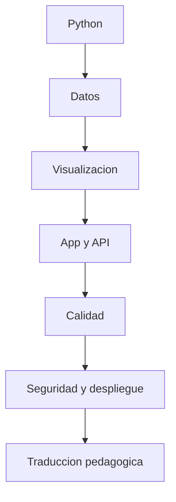

# 🧪 Preparacion para desafio tecnico

Guia integral para preparar el desafio tecnico sin caer en la trampa de querer demostrar complejidad por encima de criterio. Este documento cruza contenido tecnico, explicacion, despliegue, seguridad y transferencia pedagogica.

## 1. Regla principal

En este tipo de desafio vale mas:

- claridad;
- buen alcance;
- validacion;
- explicacion;
- decisiones defendibles.

Vale menos:

- complejidad innecesaria;
- sobreingenieria;
- mostrar demasiadas herramientas a la vez;
- una solucion brillante pero dificil de sostener.

## 2. Mapa de dominios que debes manejar

## 3. Contenido tecnico base

### Python

- tipos, listas, diccionarios y tuplas;
- condicionales, bucles y funciones;
- comprensiones;
- manejo de errores;
- imports y modulos;
- legibilidad, nombres y descomposicion.

### Analisis de datos

- `pandas.read_csv`;
- `head`, `info`, `describe`;
- seleccion y filtro de columnas;
- nulos y limpieza basica;
- `groupby`, agregaciones y ordenamiento;
- columnas derivadas;
- interpretacion de resultados.

### Visualizacion

- barras, lineas y dispersion;
- eleccion de grafico segun pregunta;
- legibilidad de ejes y titulos;
- lectura de patrones;
- explicacion de hallazgos.

### Estadistica descriptiva

- media, mediana, conteo, porcentaje;
- distribucion simple;
- outliers basicos;
- diferencia entre descripcion y causalidad.

### Machine learning introductorio

Aunque la V1 no dependa de eso, conviene manejar:

- diferencia entre regresion y clasificacion;
- train/test split;
- features y target;
- overfitting basico;
- metricas simples;
- cuando no conviene usar ML.

## 4. Desarrollo de aplicaciones y APIs

Debes poder explicar:

- estructura minima de una app Flask;
- rutas GET y POST;
- `request`, `jsonify` y validaciones;
- separacion entre contenido, logica y ejecucion;
- manejo de errores y codigos HTTP;
- por que `health` y `ready` ayudan a operar.

## 5. Calidad, pruebas y disciplina de entrega

En este repo ya existe una base visible. Debes poder hablar de:

- `pytest` como validacion funcional;
- `ruff` para consistencia y calidad;
- GitHub Actions para CI;
- Docker build como verificacion de empaque.

Si te piden un cambio, la respuesta fuerte no es solo escribir codigo. Es mostrar como verificaste que no rompiste lo existente.

## 6. Seguridad y despliegue

### Lo minimo que debes manejar

- no exponer la app a internet por defecto;
- usar `127.0.0.1` como postura segura para local;
- validar payloads y entradas;
- bloquear path traversal;
- limitar longitud de codigo;
- usar timeouts en ejecucion;
- mantener secretos fuera del repo;
- distinguir Pages publico de runner local.

### Pregunta que puede aparecer

"Si esto creciera, que haria falta?"

Respuesta esperable:

- reverse proxy con TLS;
- autenticacion;
- rate limit;
- observabilidad;
- mejor aislamiento del runner;
- politicas de despliegue mas estrictas.

## 7. Casos que podrian pedirte

| Tipo de desafio | Que podria incluir | Que debes mostrar |
|---|---|---|
| bugfix | corregir una funcion o ruta | reproduccion, fix y verificacion |
| ejercicio de datos | cargar CSV, limpiar y responder preguntas | orden de pasos e interpretacion |
| mejora de backend | agregar validacion, endpoint o capa | alcance acotado y criterio de riesgo |
| revision de despliegue | Docker, CI o seguridad | diferencia entre local, demo y produccion |
| aterrizaje pedagogico | convertir solucion en actividad | objetivo, secuencia y apoyo al estudiante |

## 8. Preguntas marco que debes poder contestar

### "Por que elegiste esta solucion?"

"Porque resuelve bien el problema real con una base clara, verificable y mantenible. Si el contexto despues pide mas complejidad, la escalo sobre una solucion sana."

### "Por que no usaste algo mas avanzado?"

"Porque primero quise asegurar una solucion correcta y entendible. La complejidad adicional solo vale si agrega valor real."

### "Como lo ensenarias?"

"Lo dividiria en objetivo visible, ejemplo guiado, practica corta y cierre con interpretacion."

### "Que riesgo ves aqui?"

"El principal riesgo es confundir una demo local con una aplicacion lista para internet abierta. Si esto se expusiera mas, pisaria primero proxy, TLS, auth y limites."

## 9. Checklist antes de entregar cualquier desafio

1. entender el objetivo exacto;
2. aclarar supuestos si hay ambiguedad;
3. definir el minimo correcto;
4. implementar con orden;
5. validar;
6. explicar tradeoffs y limites.

## 10. Entrenamiento recomendado para hoy

- resolver un CSV simple de principio a fin;
- explicar `pandas` en voz alta como si fuera una clase;
- practicar un bugfix pequeno y validar con tests;
- revisar endpoints, seguridad y despliegue del repo;
- ensayar el argumento de valor frente a cualquier tecnologia.

## 11. Cruce con el resto del portafolio

Lo que se espera en un estandar alto, mirando tus otros repos, no es solo codigo. Es:

- documentacion clara por audiencia;
- frontera honesta entre demo y produccion;
- CI/CD visible;
- seguridad explicita;
- capacidad de explicar arquitectura y operacion.

Este desafio debe responder con esa misma madurez.

## 12. Documentos relacionados

- [../despliegue-seguro-y-operacion.md](../despliegue-seguro-y-operacion.md)
- [proceso-seleccion-skillnest.md](proceso-seleccion-skillnest.md)
- [../GUIA_EVALUACION.md](../GUIA_EVALUACION.md)
- [../ARQUITECTURA_PRODUCTO.md](../ARQUITECTURA_PRODUCTO.md)
