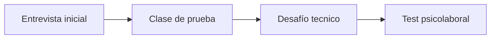

# 🧭 Proceso de seleccion Skillnest

Mapa de lectura para enfrentar el proceso completo sin improvisar ni regalar trabajo innecesario. Este documento conecta cada etapa con la evidencia real que ya existe en el repositorio.

## 1. Etapas confirmadas

1. entrevista inicial;
2. clase de prueba;
3. desafío técnico;
4. test psicolaboral.

## 2. Qué mira cada etapa

| Etapa | Lo que probablemente quieren ver | La evidencia que debes llevar |
|---|---|---|
| entrevista inicial | claridad, criterio, enfoque y ajuste al contexto | README, guía de evaluación, V1 escolar y narrativa del producto |
| clase de prueba | capacidad de explicar, contener y cerrar | herramientas pedagogicas, metodología y una demo corta |
| desafío técnico | dominio técnico y criterio de implementación | app local, notebooks, seguridad y documentación de despliegue |
| test psiclaboral | consistencia, responsabilidad y forma de trabajar | discurso coherente, límites sanos y orientación colaborativa |

## 3. Entrevista inicial

### Objetivo

Que quede claro que no estas mostrando solo contenido técnico. Estas mostrando una base de capacitación ya estructurada como producto.

### Apertura sugerida

"Prepare este repositorio como una muestra concreta de como diseño capacitaciones técnicas. No solo tiene contenido: tiene progresión de clases, notebooks, evaluación, guía docente, una app local para practicar y una superficie pública para estudiantes. Para una primera implementación escolar yo no mostraria todo al mismo tiempo; lo acotaría a una ruta inicial simple, medible y escalable."

### Lo que conviene dejar instalado

- sabes recortar con criterio;
- no compites contra una tecnología puntual;
- tu valor esta en la mediación y en la implementación;
- puedes empezar por una V1 sana y crecer despues.

## 4. Clase de prueba

### Qué demostrar

- objetivo visible;
- explicación breve;
- práctica guiada;
- chequeo de comprensión;
- cierre con interpretacion.

### Estructura recomendada para 15 a 20 minutos

1. contexto y objetivo;
2. ejemplo corto y visible;
3. práctica rápida;
4. pregunta de interpretacion;
5. cierre con aprendizaje esperado.

### Error comun que debes evitar

Querer mostrar todo lo que sabes en vez de mostrar como ensenas.

## 5. Desafío técnico

### Qué demostrar

- solución clara;
- validación de lo hecho;
- explicación de decisiones;
- criterio de seguridad y despliegue si corresponde;
- capacidad de aterrizar lo técnico a un contexto educativo.

### Regla de oro

Primero resolver bien. Despues sofisticar si aporta valor.

## 6. Test psiclaboral

No se trata de adivinar el perfil perfecto. Se trata de mostrar consistencia.

### Conviene transmitir

- responsabilidad;
- colaboracion;
- orden;
- adaptabilidad;
- capacidad de poner límites sanos.

### Conviene evitar

- sonar rigido o defensivo;
- intentar parecer perfecto;
- prometer disponibilidad ilimitada;
- negar dificultades reales del trabajo docente.

## 7. Hilo conductor para todo el proceso

> Mi valor no depende de una herramienta especifica. Depende de mi capacidad de traducir tecnología en aprendizaje real, con criterio, orden y una base que puede crecer sin rehacerse.

## 8. Documentos que debes dominar

- [../GUIA_EVALUACION.md](../GUIA_EVALUACION.md)
- [../implementación-v1-skillnest-san-nicolas.md](../implementación-v1-skillnest-san-nicolas.md)
- [../herramientas-pedagogicas-de-aula.md](../herramientas-pedagogicas-de-aula.md)
- [desafío-técnico-preparacion.md](desafío-tecnico-preparacion.md)
- [../despliegue-seguro-y-operación.md](../despliegue-seguro-y-operacion.md)
