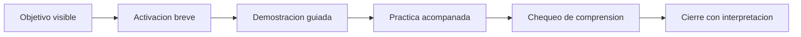

# 🧰 Herramientas pedagogicas de aula

Playbook de mediación para mostrar en entrevista, usar en clase de prueba y operar el bootcamp con criterio. El objetivo de este documento es bajar la pedagogia a decisiones concretas, observables y reutilizables.

## 💡 1. Idea fuerza

Una buena clase técnica no se mide solo por si el código corre. Se mide por si el estudiante:

- entiende que problema esta resolviendo;
- sabe por que uso cierta herramienta;
- puede variar una parte del ejercicio;
- interpreta el resultado con sus palabras.

## 🧱 2. Secuencia didáctica base

Esta secuencia funciona bien en clases cortas, medias y en talleres de prueba porque:

- reduce la ansiedad del inicio;
- evita explicar demasiado antes de hacer;
- deja evidencia de comprensión antes del cierre.

## 🛠 3. Caja de herramientas por momento de la clase

### Apertura

Objetivo: alinear al grupo y bajar el nivel de incertidumbre.

Herramientas:

- declarar que se aprendera hoy y para que sirve;
- mostrar una salida final simple antes del desarrollo;
- hacer una pregunta de entrada de baja exposicion;
- partir con una victoria rápida.

### Explicación

Objetivo: construir comprensión sin saturar.

Herramientas:

- una sola idea fuerte por bloque;
- ejemplo pequeno antes del caso completo;
- verbalizar el razonamiento, no solo el teclado;
- pedir prediccion antes de ejecutar.

### Práctica

Objetivo: transformar observacion en accion.

Herramientas:

- ejercicio base obligatorio;
- variacion guiada para consolidar;
- desafío opcional para quien termina antes;
- checkpoints de 15 a 20 minutos.

### Cierre

Objetivo: que el aprendizaje no quede solo en ejecución.

Herramientas:

- ticket de salida;
- conclusion escrita en lenguaje simple;
- pregunta de transferencia;
- mini recapitulacion de error comun y solución.

## 📋 4. Matriz de intervencion docente

| Situacion | Senal observable | Intervencion recomendada | Error a evitar |
|---|---|---|---|
| miedo a equivocarse | silencio, mirada pasiva, no ejecuta | dar un paso inicial muy acotado y validar el intento | exponerlo con una pregunta demasiado amplia |
| copia sin comprensión | pega código y no puede explicarlo | pedir que cambie una variable y prediga el resultado | corregir solo el código sin revisar la comprensión |
| frustracion por error | se detiene en un traceback | modelar lectura del error por partes | resolverle todo sin explicar el proceso |
| ritmos muy distintos | unos esperan, otros se pierden | definir minimo comun y reto opcional | avanzar solo al ritmo del grupo más rápido |
| baja participación | responden siempre los mismos | usar parejas, sondeos cortos y microcierres | convertir la clase en monologo |
| dependencia de tecnología | consulta todo antes de pensar | volver al objetivo y pedir hipótesis previa | prohibir la herramienta sin mediar su uso |

## ✨ 5. Cómo dar valor frente a cualquier tecnología

El valor docente no esta en competir con asistentes, buscadores o plataformas. Esta en ordenar la experiencia de aprendizaje.

### Lo que hace la tecnología

- entrega respuestas rapidas;
- sugiere código;
- muestra ejemplos;
- acelera busqueda de información.

### Lo que hace la mediación docente

- selecciona dificultad adecuada;
- secuencia el aprendizaje;
- detecta confusiones del grupo;
- convierte resultado en comprensión;
- regula el uso de tecnología según objetivo.

### Regla de aula sugerida

1. formular una hipótesis;
2. consultar la herramienta;
3. validar si sirve;
4. adaptar;
5. explicar.

## 👥 6. Herramientas para grupos con ritmos distintos

| Perfil del estudiante | Necesidad | Respuesta docente |
|---|---|---|
| muy inseguro | estructura y validación | pasos pequenos, preguntas cerradas, refuerzo de logro |
| intermedio | práctica con sentido | ejercicios base y comparacion de soluciones |
| rápido | reto y profundidad | desafío opcional, explicación a pares, extension del caso |

La clave no es hacer tres clases distintas. La clave es sostener un minimo comun visible y capas de extension bien dosificadas.

## 📌 7. Indicaciones pedagogicas que conviene declarar

- el error es parte del trabajo, no una senal de incapacidad;
- primero se entiende la pregunta, despues la herramienta;
- se valora justificar, no solo acertar;
- la tecnología se usa con criterio, no como reemplazo del proceso.

## 🚨 8. Problemas reales que pueden aparecer en clase

### Problema: no entienden para que sirve el contenido

Respuesta:

- conectar con una pregunta concreta;
- mostrar un resultado visible;
- volver a nombrar el objetivo en mitad de la clase.

### Problema: el curso se vuelve demasiado técnico muy rápido

Respuesta:

- bajar la cantidad de conceptos por bloque;
- usar ejemplos más pequenos;
- privilegiar lectura y modificacion antes que construcción desde cero.

### Problema: se apoyan demasiado en plantillas o asistentes

Respuesta:

- pedir prediccion antes de consultar;
- pedir adaptación posterior;
- pedir explicación oral o escrita de una parte crítica.

### Problema: se quedan pegados en errores minimos

Respuesta:

- modelar una rutina de depuracion;
- separar errores de sintaxis, datos y lógica;
- mostrar una corrección y luego devolver la tarea al estudiante.

## ✅ 9. Senales de una buena clase técnica

- el grupo puede nombrar el objetivo de la sesión;
- al menos una parte del curso se resuelve con autonomia;
- los errores sirven para aprender y no solo para frenar;
- el cierre incluye interpretacion y no solo "terminamos".

## 🎤 10. Frases utiles para entrevista o clase de prueba

### Sobre enfoque

"Mi foco no es solo que ejecuten código. Es que entiendan la lógica, puedan verificar resultados y ganen confianza para reutilizar lo aprendido."

### Sobre tecnología

"No compito contra ninguna tecnología. La ordeno pedagogicamente para que el estudiante no pierda criterio ni autonomia."

### Sobre manejo de aula

"Trabajo con un minimo comun claro, apoyo a quien se bloquea y retos breves para quien avanza más rápido."

## 🔗 11. Relación con otros documentos

- [metodología-docente.md](metodologia-docente.md)
- [instructor-guide.md](instructor-guide.md)
- [plan-evaluación.md](plan-evaluacion.md)
- [aula-ia-y-problemas-frecuentes.md](aula-ia-y-problemas-frecuentes.md)
