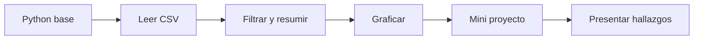

# 🏫 Implementación V1 para Skillnest / Colegio San Nicolas de Maipu

Documento de aterrizaje para convertir este repositorio en una primera implementación escolar concreta, acotada y defendible. La idea no es prometer "todo el bootcamp completo", sino mostrar que la base ya existe y que sabes recortarla con criterio.

## 1. Contexto confirmado

Datos entregados por Skillnest:

- programa: Bootcamp Python para Data Science;
- modalidad: presencial;
- establecimiento: Colegio San Nicolas de Maipu;
- dirección informada: Mateo de Toro y Zambrano 3016, Santiago, Maipu, Region Metropolitana;
- inicio: por confirmar;
- termino informado: 11 de diciembre de 2026;
- trabajo administrativo: 4 horas semanales.

Bloques horarios informados:

- miercoles de 12:15 a 13:45;
- jueves de 09:30 a 10:15;
- jueves de 10:35 a 11:20.

## 2. Observacion crítica sobre la carga horaria

Los bloques informados suman 180 minutos semanales. Eso equivale a:

- 4 horas pedagogicas de 45 minutos; o
- 3 horas cronologicas.

Eso no coincide con:

- "2 clases a la semana de 3 horas cada dia"; ni
- "6 horas pedagogicas semanales".

Esta inconsistencia debe aclararse en la entrevista. Mientras no exista confirmacion, la propuesta V1 conviene presentarla como modular y adaptable a bloques de 90 minutos.

## 3. Lo que ya resuelve el repo para una V1

- clase 0 diagnóstica + 12 clases modulares con materiales reutilizables;
- notebooks, soluciones y datasets;
- documentación docente y de evaluación;
- laboratorio local para demostracion;
- portal del alumno y capa institucional;
- CI/CD y postura operativa visible.

Eso significa que no partes desde cero. Partes desde una base que se puede recortar sin improvisar.

## 4. Criterio de recorte recomendado

Primera implementación escolar:

- menos temas;
- más profundidad en fundamentos;
- un dataset principal;
- evaluación simple y seguimiento visible;
- tecnología usada con criterio, no como show.

## 5. Promesa de aprendizaje para la V1

Al terminar la primera versión, el estudiante deberia poder:

- leer y modificar código simple en Python;
- cargar un CSV con pandas;
- limpiar datos básicos;
- construir una tabla resumen;
- hacer un gráfico sencillo;
- explicar un hallazgo con lenguaje claro.

## 6. Contenido recomendado para mostrar ahora

| Prioridad | Clase | Rol en la V1 |
|---|---|---|
| alta | `classes/01-python-fundamentos/` | entrada al lenguaje |
| alta | `classes/02-pandas-limpieza-datos/` | lectura y manipulacion básica |
| alta | `classes/03-visualizacion-exploratoria/` | primeras conclusiones desde datos |
| media | `classes/04-estadistica-descriptiva/` | interpretacion simple |
| alta | `classes/07-mini-proyecto-guiado/` | integración de habilidades |
| alta | `classes/08-presentacion-de-hallazgos/` | cierre comunicable |

## 7. Contenido que conviene dejar para fase 2

- `classes/05-visualizacion-con-matplotlib/`
- `classes/06-texto-fechas-y-transformaciones/`
- `classes/09-machine-learning-intro/`
- `classes/10-modelos-supervisados/`
- `classes/11-evaluacion-y-pipelines/`
- `classes/12-proyecto-final-y-cierre/`

No porque no sirvan, sino porque en una primera cohorte escolar pueden abrir demasiados frentes a la vez.

## 8. Dataset recomendado para la etapa inicial

### Principal

`datasets/ventas_tienda.csv`

Ventajas:

- facil de explicar;
- sirve para Python, pandas y gráficos;
- soporta preguntas concretas y hallazgos simples;
- incluye una sucursal Maipu que ayuda a aterrizar la narrativa.

### Secundario

`datasets/estudiantes.csv`

Uso recomendado:

- análisis descriptivo;
- asistencia y seguimiento;
- no usar como base de ML en la V1 hasta alinear completamente estructura y materiales.

## 9. Ruta minima viable

Esta ruta es suficiente para una primera implementación creible, medible y ejecutable.

## 10. Cómo usar las horas administrativas

Las 4 horas administrativas no deberian gastarse en regalar produccion infinita previa. Conviene orientarlas a:

- ajuste final de materiales según grupo;
- revision de asistencia y evidencias;
- comunicación con coordinacion;
- preparación de la siguiente sesión;
- retroalimentación corta y util.

## 11. Riesgos y mitigaciones

| Riesgo | Impacto | Mitigacion |
|---|---|---|
| horas reales no confirmadas | desalineacion del plan | pedir confirmacion antes de cerrar cronograma |
| grupo con base muy heterogenea | brecha de avance | minimo comun claro y desafío opcional |
| expectativa de demasiado contenido | sobrecarga | presentar V1 como ruta acotada y escalable |
| uso desordenado de tecnología | copia sin comprensión | reglas de uso, adaptación y explicación |
| pedir más trabajo previo sin acuerdo | desgaste y devaluacion | mostrar base existente y acotar personalización |

## 12. Qué demostrar en la reunión

- que sabes convertir un repo amplio en una implementación viable;
- que no sobredimensionas la primera entrega;
- que entiendes ritmo escolar, mediación y evaluación;
- que sabes diferenciar demo, piloto y despliegue real.

## 13. Qué no regalar en la entrevista

No conviene dejar instalada la idea de que haras, sin cierre formal:

- personalización total por colegio;
- rediseno completo del curriculum;
- desarrollo móvil completo;
- integraciones extras o despliegue abierto del runner.

El mensaje correcto es otro: la base ya existe, la V1 se puede activar con criterio, y el crecimiento posterior se disena con el alcance ya confirmado.

## 14. Mensaje recomendado para presentar esta V1

"No estoy proponiendo empezar por la versión más grande del repositorio. Estoy proponiendo una primera implementación escolar, clara y medible, montada sobre una base ya seria. Eso permite comenzar bien, evidenciar resultados y crecer despues sin rehacer el trabajo."

## 15. Relación con otros documentos

- [GUIA_EVALUACION.md](GUIA_EVALUACION.md)
- [plan-evaluación.md](plan-evaluacion.md)
- [metodología-docente.md](metodologia-docente.md)
- [entrevista/proceso-seleccion-skillnest.md](entrevista/proceso-seleccion-skillnest.md)
