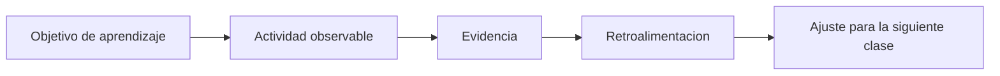

# 📏 Plan de evaluación

Plan de evaluación continua para una implementación inicial del bootcamp. Esta propuesta busca medir comprensión, aplicacion, interpretacion y progresión, no solo resultado final.

## 🧭 1. Principios de evaluación

- se evalúa proceso y producto;
- la evidencia se recoge en clase, notebooks y mini proyectos;
- la retroalimentación debe servir para la siguiente sesión;
- usar tecnología no invalida el trabajo si existe criterio y explicación;
- la evaluación tiene que ser legible para estudiantes y para institución.

## ❓ 2. Pregunta central

La pregunta no es "quien termino primero". La pregunta es:

> quien esta construyendo comprensión reutilizable y quien aun necesita mediación más guiada.

## 🔁 3. Ciclo de evaluación

## ⚖ 4. Propuesta de ponderacion

| Componente | Ponderación | Qué se observa |
|---|---|---|
| participación y ejercicios en clase | 20% | intento, avance, preguntas y correcciones |
| tareas breves | 20% | práctica fuera de clase con foco acotado |
| notebooks de trabajo | 25% | ejecución, cambios propios e interpretacion |
| mini proyecto integrador | 25% | aplicacion de herramientas sobre una pregunta concreta |
| presentación o reflexion final | 10% | capacidad de explicar hallazgos y decisiones |

## 📋 5. Evidencias por tipo de actividad

### En clase

- respuestas a preguntas de chequeo;
- cambios pequenos sobre ejemplos;
- resolución de ejercicio base;
- ticket de salida o conclusion corta.

### En notebooks

- orden de pasos;
- comentarios o notas propias;
- corrección de errores detectados;
- pequenas variaciones sobre el ejemplo.

### En proyecto o actividad integradora

- comprensión de la pregunta;
- uso pertinente de datos;
- tabla, resumen o gráfico coherente;
- conclusion clara.

## 📏 6. Rubrica simple y reusable

| Criterio | Logrado | En desarrollo | Inicial |
|---|---|---|---|
| comprensión conceptual | explica con seguridad que hace y por que | entiende una parte, pero mezcla conceptos | reconoce terminos, pero no los aplica bien |
| código y procedimiento | resuelve con pocos errores y corrige si aparece uno | necesita apoyo en varios pasos | depende casi por completo de la guía |
| lectura de resultados | interpreta y conecta con la pregunta | describe resultados, pero con poca precision | no logra pasar de la ejecución a la interpretacion |
| autonomia | puede variar una parte del ejercicio | progresa con apoyo cercano | se bloquea si cambia la consigna |
| comunicación | explica con lenguaje claro | explica parcialmente | le cuesta expresar que hizo |

## 💻 7. Cómo evaluar el uso de tecnología

Usar asistentes, buscadores o ayudas externas no debe medirse como trampa por defecto. Debe medirse como parte del proceso de trabajo.

### Uso aceptable

- consulta despues de pensar una hipótesis;
- adapta la respuesta recibida;
- puede explicar lo que dejo;
- detecta si la propuesta no coincide con el nivel de la clase.

### Uso problematico

- pega código sin comprenderlo;
- no puede modificar ni justificar;
- usa una solución que resuelve otra pregunta;
- se salta el objetivo pedagógico de la actividad.

## 💬 8. Retroalimentación recomendada

Buena retroalimentación en este bootcamp responde a cuatro preguntas:

1. que comprendio bien el estudiante;
2. que error o patron se repite;
3. cual es el ajuste minimo que lo haría avanzar;
4. que extension podría intentar si va más adelantado.

## 🚨 9. Senales de alerta temprana

| Senal | Interpretacion posible | Accion sugerida |
|---|---|---|
| termina muy rápido pero no explica | copia o automatismo sin comprensión | pedir adaptación y explicación |
| participa poco y evita ejecutar | inseguridad o miedo al error | bajar la entrada y validar progreso parcial |
| mezcla conceptos entre clases | sobrecarga cognitiva | reforzar objetivo y usar ejemplos más pequenos |
| no logra cerrar una actividad | falta de práctica guiada | dividir la tarea y hacer checkpoint intermedio |

## 🧾 10. Propuesta de reportabilidad para institución

Si la institución pide seguimiento, conviene reportar en un formato breve:

- asistencia;
- participación observable;
- evidencia de trabajo en notebook;
- logro general de la unidad;
- recomendacion de apoyo o extension.

Eso comunica mejor que una nota aislada y es más coherente con una primera implementación escolar.

## 📌 11. Regla operativa para una V1

La evaluación de la primera versión debe ser simple, clara y sostenible. Si el docente necesita un sistema excesivamente complejo para medir, la implementación pierde foco.

## 🔗 12. Relación con otros documentos

- [metodología-docente.md](metodologia-docente.md)
- [herramientas-pedagogicas-de-aula.md](herramientas-pedagogicas-de-aula.md)
- [instructor-guide.md](instructor-guide.md)
- [implementación-v1-skillnest-san-nicolas.md](implementación-v1-skillnest-san-nicolas.md)
