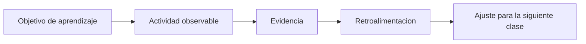

# Plan de evaluacion

Plan de evaluacion continua para una implementacion inicial del bootcamp. Esta propuesta busca medir comprension, aplicacion, interpretacion y progresion, no solo resultado final.

## 1. Principios de evaluacion

- se evalua proceso y producto;
- la evidencia se recoge en clase, notebooks y mini proyectos;
- la retroalimentacion debe servir para la siguiente sesion;
- usar tecnologia no invalida el trabajo si existe criterio y explicacion;
- la evaluacion tiene que ser legible para estudiantes y para institucion.

## 2. Pregunta central

La pregunta no es "quien termino primero". La pregunta es:

> quien esta construyendo comprension reutilizable y quien aun necesita mediacion mas guiada.

## 3. Ciclo de evaluacion

## 4. Propuesta de ponderacion

| Componente | Ponderacion | Que se observa |
|---|---|---|
| participacion y ejercicios en clase | 20% | intento, avance, preguntas y correcciones |
| tareas breves | 20% | practica fuera de clase con foco acotado |
| notebooks de trabajo | 25% | ejecucion, cambios propios e interpretacion |
| mini proyecto integrador | 25% | aplicacion de herramientas sobre una pregunta concreta |
| presentacion o reflexion final | 10% | capacidad de explicar hallazgos y decisiones |

## 5. Evidencias por tipo de actividad

### En clase

- respuestas a preguntas de chequeo;
- cambios pequenos sobre ejemplos;
- resolucion de ejercicio base;
- ticket de salida o conclusion corta.

### En notebooks

- orden de pasos;
- comentarios o notas propias;
- correccion de errores detectados;
- pequenas variaciones sobre el ejemplo.

### En proyecto o actividad integradora

- comprension de la pregunta;
- uso pertinente de datos;
- tabla, resumen o grafico coherente;
- conclusion clara.

## 6. Rubrica simple y reusable

| Criterio | Logrado | En desarrollo | Inicial |
|---|---|---|---|
| comprension conceptual | explica con seguridad que hace y por que | entiende una parte, pero mezcla conceptos | reconoce terminos, pero no los aplica bien |
| codigo y procedimiento | resuelve con pocos errores y corrige si aparece uno | necesita apoyo en varios pasos | depende casi por completo de la guia |
| lectura de resultados | interpreta y conecta con la pregunta | describe resultados, pero con poca precision | no logra pasar de la ejecucion a la interpretacion |
| autonomia | puede variar una parte del ejercicio | progresa con apoyo cercano | se bloquea si cambia la consigna |
| comunicacion | explica con lenguaje claro | explica parcialmente | le cuesta expresar que hizo |

## 7. Como evaluar el uso de tecnologia

Usar asistentes, buscadores o ayudas externas no debe medirse como trampa por defecto. Debe medirse como parte del proceso de trabajo.

### Uso aceptable

- consulta despues de pensar una hipotesis;
- adapta la respuesta recibida;
- puede explicar lo que dejo;
- detecta si la propuesta no coincide con el nivel de la clase.

### Uso problematico

- pega codigo sin comprenderlo;
- no puede modificar ni justificar;
- usa una solucion que resuelve otra pregunta;
- se salta el objetivo pedagogico de la actividad.

## 8. Retroalimentacion recomendada

Buena retroalimentacion en este bootcamp responde a cuatro preguntas:

1. que comprendio bien el estudiante;
2. que error o patron se repite;
3. cual es el ajuste minimo que lo haria avanzar;
4. que extension podria intentar si va mas adelantado.

## 9. Senales de alerta temprana

| Senal | Interpretacion posible | Accion sugerida |
|---|---|---|
| termina muy rapido pero no explica | copia o automatismo sin comprension | pedir adaptacion y explicacion |
| participa poco y evita ejecutar | inseguridad o miedo al error | bajar la entrada y validar progreso parcial |
| mezcla conceptos entre clases | sobrecarga cognitiva | reforzar objetivo y usar ejemplos mas pequenos |
| no logra cerrar una actividad | falta de practica guiada | dividir la tarea y hacer checkpoint intermedio |

## 10. Propuesta de reportabilidad para institucion

Si la institucion pide seguimiento, conviene reportar en un formato breve:

- asistencia;
- participacion observable;
- evidencia de trabajo en notebook;
- logro general de la unidad;
- recomendacion de apoyo o extension.

Eso comunica mejor que una nota aislada y es mas coherente con una primera implementacion escolar.

## 11. Regla operativa para una V1

La evaluacion de la primera version debe ser simple, clara y sostenible. Si el docente necesita un sistema excesivamente complejo para medir, la implementacion pierde foco.

## 12. Relacion con otros documentos

- [metodologia-docente.md](metodologia-docente.md)
- [herramientas-pedagogicas-de-aula.md](herramientas-pedagogicas-de-aula.md)
- [instructor-guide.md](instructor-guide.md)
- [implementacion-v1-skillnest-san-nicolas.md](implementacion-v1-skillnest-san-nicolas.md)
