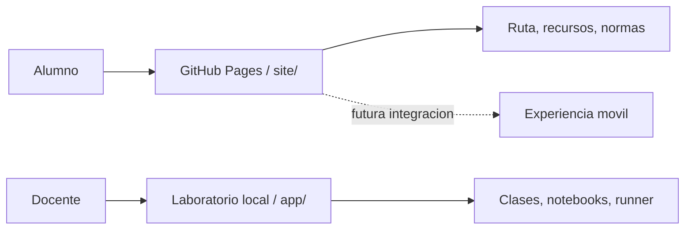

# 📱 Portal del alumno y ruta hacia app movil

Documento de producto para explicar por que existe una superficie publica separada del laboratorio local, cual es el enlace oficial para estudiantes y como evoluciona esta base hacia una experiencia movil sin sobredimensionar la madurez actual.

## 1. Objetivo

Separar claramente tres cosas:

- la experiencia publica del estudiante;
- la experiencia operativa del docente;
- la evolucion futura hacia movilidad y seguimiento.

Eso evita mezclar presentacion, aprendizaje y ejecucion de codigo en una sola capa.

## 2. Enlace oficial para estudiantes

Si este repositorio se publica desde `vladimiracunadev-create/python-data-science-bootcamp`, la URL esperada para alumnos es:

`https://vladimiracunadev-create.github.io/python-data-science-bootcamp/`

Ese es el enlace que conviene compartir por correo, QR, sala virtual o material impreso.

## 3. Que problema resuelve el portal del alumno

| Necesidad | Respuesta del portal |
|---|---|
| tener un punto de entrada simple | landing publica con informacion base |
| no depender del laboratorio local para todo | contenido estatico accesible por Pages |
| revisar desde celular | interfaz ligera y sin backend obligatorio |
| ordenar recursos y expectativas | ruta, normas y materiales visibles |

## 4. Arquitectura de superficies

## 5. Que queda en GitHub Pages

- presentacion del programa;
- ruta de aprendizaje;
- recursos publicos;
- reglas de trabajo;
- enlace oficial del curso;
- base de lectura en celular.

## 6. Que sigue viviendo en la app Flask

- catalogo dinamico de clases;
- notebooks interactivos;
- guardado de notebooks;
- ejecucion de codigo;
- sesiones y salidas generadas.

## 7. Regla de comunicacion importante

El portal del alumno no es toda la aplicacion. Es la puerta de entrada oficial para estudiantes. El laboratorio Flask sigue siendo el nucleo local de practica y demostracion.

## 8. Ruta movil realista

### Lo portable con poca friccion

- listado de clases;
- detalle de clase;
- recordatorios;
- checklist de avances;
- recursos publicos y avisos.

### Lo que requiere backend y mayor control

- ejecucion de codigo;
- guardado persistente por estudiante;
- progreso individual;
- sesiones autenticadas;
- seguimiento docente por alumno.

## 9. Roadmap de evolucion

| Fase | Entregable | Madurez esperada |
|---|---|---|
| fase 1 | GitHub Pages para estudiantes | operativa hoy |
| fase 2 | experiencia web movil con mas contenido y seguimiento | factible sobre la misma base |
| fase 3 | integracion con backend para funciones interactivas | requiere decisiones de auth y seguridad |
| fase 4 | app movil dedicada | solo si el programa lo justifica |

## 10. CI/CD de la superficie publica

La capa del portal ya tiene despliegue automatico por GitHub Actions:

- workflow: `.github/workflows/deploy-pages.yml`;
- build por push a `master` o `main`;
- deploy de la carpeta `site/` a GitHub Pages.

Antes de que ese deploy funcione, el repositorio debe tener GitHub Pages habilitado con `Source: GitHub Actions`.

## 11. Que deben usar los alumnos

El mensaje recomendado para estudiantes es simple:

1. entrar al portal oficial;
2. revisar la ruta de la clase;
3. seguir indicaciones del docente;
4. usar el laboratorio local o notebook cuando se indique;
5. volver al portal para recursos y continuidad.

## 12. Porque esta separacion agrega valor

- mejora la claridad para el estudiante;
- evita exponer el runner como si fuera un portal publico mas;
- permite crecer a movil sin rehacer la experiencia base;
- demuestra criterio de producto y no solo acumulacion de pantallas.

## 13. Archivos involucrados

- `site/index.html`
- `site/styles.css`
- `site/app.js`
- `site/assets/icon.svg`
- `.github/workflows/deploy-pages.yml`

## 14. Relacion con otros documentos

- [CATALOGO_PRODUCTO.md](CATALOGO_PRODUCTO.md)
- [ARQUITECTURA_PRODUCTO.md](ARQUITECTURA_PRODUCTO.md)
- [despliegue-seguro-y-operacion.md](despliegue-seguro-y-operacion.md)
