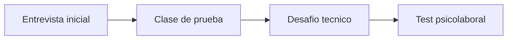

# Proceso de seleccion Skillnest

Mapa de lectura para enfrentar el proceso completo sin improvisar ni regalar trabajo innecesario. Este documento conecta cada etapa con la evidencia real que ya existe en el repositorio.

## 1. Etapas confirmadas

1. entrevista inicial;
2. clase de prueba;
3. desafio tecnico;
4. test psicolaboral.

## 2. Que mira cada etapa

| Etapa | Lo que probablemente quieren ver | La evidencia que debes llevar |
|---|---|---|
| entrevista inicial | claridad, criterio, enfoque y ajuste al contexto | README, guia de evaluacion, V1 escolar y narrativa del producto |
| clase de prueba | capacidad de explicar, contener y cerrar | herramientas pedagogicas, metodologia y una demo corta |
| desafio tecnico | dominio tecnico y criterio de implementacion | app local, notebooks, seguridad y documentacion de despliegue |
| test psiclaboral | consistencia, responsabilidad y forma de trabajar | discurso coherente, limites sanos y orientacion colaborativa |

## 3. Entrevista inicial

### Objetivo

Que quede claro que no estas mostrando solo contenido tecnico. Estas mostrando una base de capacitacion ya estructurada como producto.

### Apertura sugerida

"Prepare este repositorio como una muestra concreta de como diseno capacitaciones tecnicas. No solo tiene contenido: tiene progresion de clases, notebooks, evaluacion, guia docente, una app local para practicar y una superficie publica para estudiantes. Para una primera implementacion escolar yo no mostraria todo al mismo tiempo; lo acotaria a una ruta inicial simple, medible y escalable."

### Lo que conviene dejar instalado

- sabes recortar con criterio;
- no compites contra una tecnologia puntual;
- tu valor esta en la mediacion y en la implementacion;
- puedes empezar por una V1 sana y crecer despues.

## 4. Clase de prueba

### Que demostrar

- objetivo visible;
- explicacion breve;
- practica guiada;
- chequeo de comprension;
- cierre con interpretacion.

### Estructura recomendada para 15 a 20 minutos

1. contexto y objetivo;
2. ejemplo corto y visible;
3. practica rapida;
4. pregunta de interpretacion;
5. cierre con aprendizaje esperado.

### Error comun que debes evitar

Querer mostrar todo lo que sabes en vez de mostrar como ensenas.

## 5. Desafio tecnico

### Que demostrar

- solucion clara;
- validacion de lo hecho;
- explicacion de decisiones;
- criterio de seguridad y despliegue si corresponde;
- capacidad de aterrizar lo tecnico a un contexto educativo.

### Regla de oro

Primero resolver bien. Despues sofisticar si aporta valor.

## 6. Test psiclaboral

No se trata de adivinar el perfil perfecto. Se trata de mostrar consistencia.

### Conviene transmitir

- responsabilidad;
- colaboracion;
- orden;
- adaptabilidad;
- capacidad de poner limites sanos.

### Conviene evitar

- sonar rigido o defensivo;
- intentar parecer perfecto;
- prometer disponibilidad ilimitada;
- negar dificultades reales del trabajo docente.

## 7. Hilo conductor para todo el proceso

> Mi valor no depende de una herramienta especifica. Depende de mi capacidad de traducir tecnologia en aprendizaje real, con criterio, orden y una base que puede crecer sin rehacerse.

## 8. Documentos que debes dominar

- [GUIA_EVALUACION.md](GUIA_EVALUACION.md)
- [implementacion-v1-skillnest-san-nicolas.md](implementacion-v1-skillnest-san-nicolas.md)
- [herramientas-pedagogicas-de-aula.md](herramientas-pedagogicas-de-aula.md)
- [desafio-tecnico-preparacion.md](desafio-tecnico-preparacion.md)
- [despliegue-seguro-y-operacion.md](despliegue-seguro-y-operacion.md)
