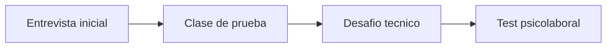

# Proceso de seleccion Skillnest

## Etapas confirmadas

1. Entrevista inicial.
2. Clase de prueba.
3. Desafio tecnico.
4. Test psicolaboral.

## Objetivo por etapa

| Etapa | Que quieren mirar | Que debes demostrar |
|---|---|---|
| Entrevista inicial | perfil, claridad, criterio, encaje | que tienes una base real, sabes adaptarte y entiendes el contexto |
| Clase de prueba | habilidades pedagogicas | que sabes ensenar con orden, ritmo y contencion |
| Desafio tecnico | dominio del area | que manejas Python, datos, criterios de implementacion y buenas practicas |
| Test psicolaboral | compatibilidad cultural | que trabajas con responsabilidad, colaboracion y criterio |

## Apertura sugerida para la entrevista inicial

Version de 60 a 90 segundos:

"Prepare este repositorio como una muestra concreta de como diseno capacitaciones tecnicas. No solo contiene contenido, sino estructura docente: progresion de clases, ejercicios, notebooks, evaluacion, guia del instructor y un entorno local para practicar. Para una primera implementacion escolar yo no mostraria todo de una vez; lo aterrizaria a una ruta inicial simple, medible y ejecutable. Mi valor no depende de una herramienta puntual, sino de poder traducir tecnologia en aprendizaje real, con criterio pedagogico y una base que despues puede crecer."

## Cierre sugerido para la entrevista inicial

"Me interesa aportar desde una base seria y reusable, no desde una promesa inflada. Si les hace sentido el enfoque, el siguiente paso ideal es confirmar horas reales, perfil del grupo y alcance esperado para ajustar la version inicial con precision."

## Como enfrentar la clase de prueba

- no intentar mostrar todo lo que sabes;
- demostrar progresion, claridad y manejo del grupo;
- usar un objetivo visible y una victoria rapida;
- incluir una mini practica guiada;
- cerrar con interpretacion y no solo ejecucion.

## Estructura recomendada para una clase de prueba de 15 a 20 minutos

1. Contexto y objetivo.
2. Ejemplo simple y visible.
3. Practica corta.
4. Pregunta de interpretacion.
5. Cierre con aprendizaje esperado.

## Como enfrentar el desafio tecnico

- primero entender bien el objetivo;
- preguntar supuestos si el enunciado esta ambiguo;
- empezar por una solucion clara antes que sofisticada;
- explicar decisiones tecnicas y pedagogicas;
- validar el resultado con una prueba o chequeo rapido;
- mostrar criterio de seguridad y despliegue si corresponde.

## Como enfrentar el test psicolaboral

- responder con consistencia, no intentando adivinar el "perfil perfecto";
- enfatizar orden, responsabilidad, adaptabilidad y trabajo colaborativo;
- no sobreactuar seguridad absoluta;
- mostrar que sabes poner limites sanos sin perder disposicion.

## Mensajes que deben quedar instalados durante todo el proceso

- tienes una base de capacitacion real, no improvisada;
- sabes ensenar y tambien disenar experiencias de aprendizaje;
- puedes partir con una version acotada y escalar despues;
- tu valor no compite contra una tecnologia: esta en la mediacion, el criterio y la implementacion.

## Riesgos que debes evitar

- sonar demasiado teorico;
- sobreprometer personalizacion antes de definir alcance;
- tratar de impresionar con complejidad innecesaria;
- entrar en una posicion defensiva frente a IA u otras herramientas;
- aceptar trabajo previo excesivo sin hablar de condiciones.
