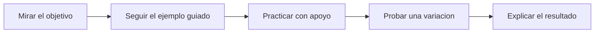

# Student Guide

Guia base para estudiantes que usan el bootcamp por primera vez. Este documento no reemplaza la clase: ordena expectativas, reduce ansiedad y explica como aprovechar el material sin depender de copiar pasos.

## 1. Que es este bootcamp

Este programa mezcla cuatro cosas:

- clases modulares de Python y Data Science;
- notebooks con ejercicios guiados;
- datasets para practicar;
- una ruta publica de apoyo para revisar recursos y recordatorios.

La meta no es memorizar comandos. La meta es que puedas leer un problema, probar una idea, interpretar un resultado y explicar lo que hiciste.

## 2. Como se aprende aqui



Cada clase tiene una logica simple:

1. entender para que sirve la herramienta;
2. ver un ejemplo corto;
3. practicar paso a paso;
4. corregir errores;
5. sacar una conclusion.

Si solo copias codigo, avanzas poco. Si modificas, preguntas y justificas, avanzas de verdad.

## 3. Que necesitas antes de empezar

### Minimo tecnico

- Python 3.10 o superior;
- navegador moderno;
- acceso para instalar dependencias al menos una vez;
- ganas de equivocarte y corregir sin bloquearte.

### Preparacion del entorno

#### Windows

```powershell
python -m venv .venv
.\.venv\Scripts\Activate.ps1
pip install -r requirements.txt
jupyter notebook
```

#### Linux / macOS

```bash
python3 -m venv .venv
source .venv/bin/activate
pip install -r requirements.txt
jupyter notebook
```

Si trabajas desde el laboratorio local del repo, el docente puede indicarte abrir `http://127.0.0.1:8000`.

## 4. Ruta recomendada para usar el material

| Paso | Que haces | Para que sirve |
|---|---|---|
| 1 | leer el `README.md` de la clase | entender objetivo, contexto y entregable |
| 2 | abrir el notebook correspondiente | seguir la ruta de practica |
| 3 | ejecutar celda por celda | ver cambios pequenos y no perder el hilo |
| 4 | resolver ejercicios antes de mirar soluciones | construir autonomia |
| 5 | escribir una conclusion breve | transformar codigo en aprendizaje |

## 5. Reglas de trabajo que te ayudan

- trabaja una idea a la vez;
- cambia valores pequenos y mira que ocurre;
- anota dudas concretas, no solo "no me funciona";
- guarda tus avances antes de experimentar de mas;
- si algo te sale, intenta explicarlo con tus palabras.

## 6. Como usar tecnologia a tu favor

Este bootcamp no se posiciona contra una tecnologia puntual. Puedes usar buscadores, videos, asistentes de IA, documentacion o notas externas. Lo importante es como las usas.

### Regla operativa

1. piensa primero que deberia pasar;
2. consulta la herramienta;
3. verifica si la respuesta sirve para tu objetivo;
4. adapta el resultado;
5. explica por que lo dejaste asi.

### Senales de buen uso

- usas la tecnologia para destrabarte, no para apagar tu criterio;
- cambias el codigo recibido y entiendes la diferencia;
- puedes explicar una linea clave;
- detectas cuando una respuesta se pasa de complejidad para la clase.

### Senales de mal uso

- pegas codigo sin leerlo;
- no sabes de donde salen las columnas, variables o graficos;
- la respuesta usa conceptos que aun no viste y no puedes justificar;
- si cambia el ejercicio, te quedas sin punto de partida.

## 7. Que se espera de ti en clase

| Se espera | No se espera |
|---|---|
| participar aunque no tengas todo resuelto | saber programar perfecto desde el dia uno |
| preguntar con contexto | esconder errores por verguenza |
| intentar antes de pedir la solucion completa | acertar siempre al primer intento |
| corregir y volver a probar | trabajar en silencio sin mostrar bloqueos |

## 8. Como pedir ayuda de forma util

Cuando te bloquees, intenta decir:

- que estabas intentando hacer;
- que linea o paso te genero el problema;
- que mensaje de error viste;
- que probaste antes de pedir apoyo.

Eso ayuda a que la clase avance contigo y no por encima tuyo.

## 9. Problemas frecuentes y salida rapida

| Problema | Revision rapida |
|---|---|
| no abre el notebook | revisar entorno virtual y dependencias |
| un archivo no se encuentra | confirmar carpeta actual y nombre del archivo |
| aparece un error raro en Python | leer la ultima linea del mensaje con calma |
| un grafico no sale como esperabas | revisar columnas, tipos de datos y orden del codigo |
| no entiendes una solucion | volver al objetivo y pedir que la expliquen por bloques |

Tambien puedes usar:

```bash
python examples/validate_bootcamp.py
```

## 10. Como se vera tu progreso

Vas bien cuando puedes:

- leer un CSV y revisar sus primeras filas;
- filtrar o agrupar datos sin perderte;
- construir un grafico simple;
- explicar un hallazgo en lenguaje claro;
- corregir un error pequeno con cada vez menos ayuda.

## 11. Si usas el portal del alumno

El enlace oficial esperado para estudiantes es:

`https://vladimiracunadev-create.github.io/python-data-science-bootcamp/`

Ese portal sirve para:

- revisar la ruta del bootcamp;
- encontrar recursos base;
- entender normas de trabajo;
- seguir una version ligera desde celular.

El portal no reemplaza el laboratorio ni los notebooks. Es la entrada ordenada al curso.

## 12. Regla final

Tu objetivo no es "hacer que corra". Tu objetivo es entender que pregunta respondiste, con que datos trabajaste y que significa el resultado.

## 13. Documentos relacionados

- [metodologia-docente.md](metodologia-docente.md)
- [instructor-guide.md](instructor-guide.md)
- [plan-evaluacion.md](plan-evaluacion.md)
- [herramientas-pedagogicas-de-aula.md](herramientas-pedagogicas-de-aula.md)
- [portal-estudiante-y-app-movil.md](portal-estudiante-y-app-movil.md)
